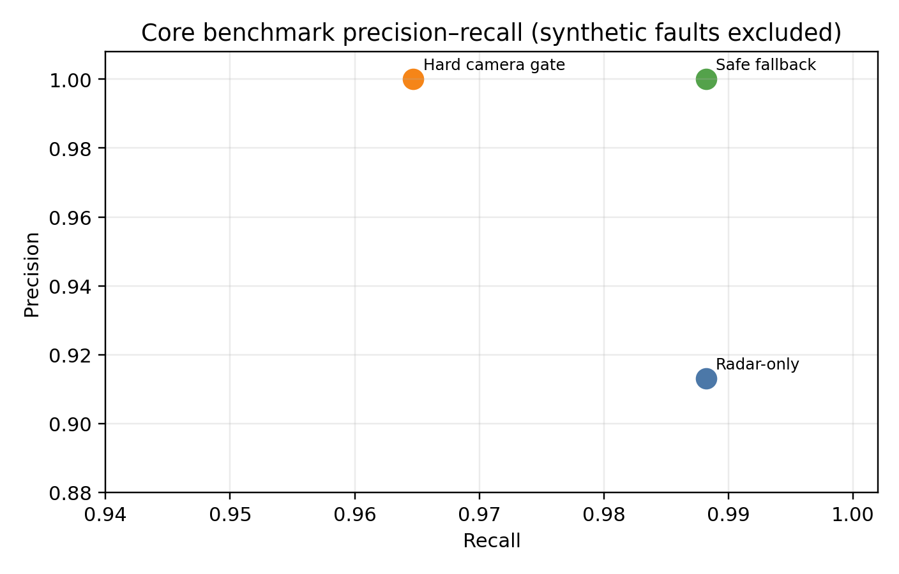
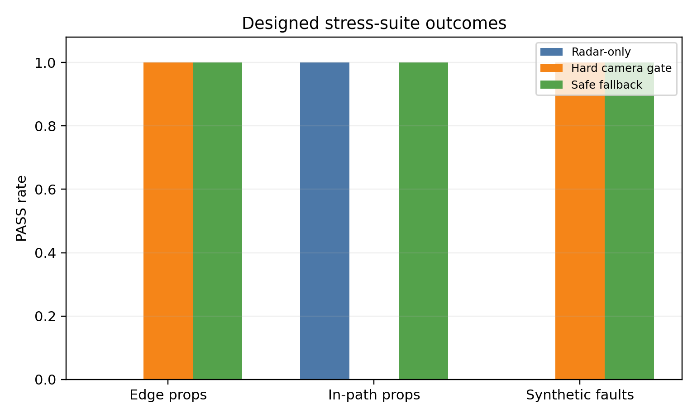
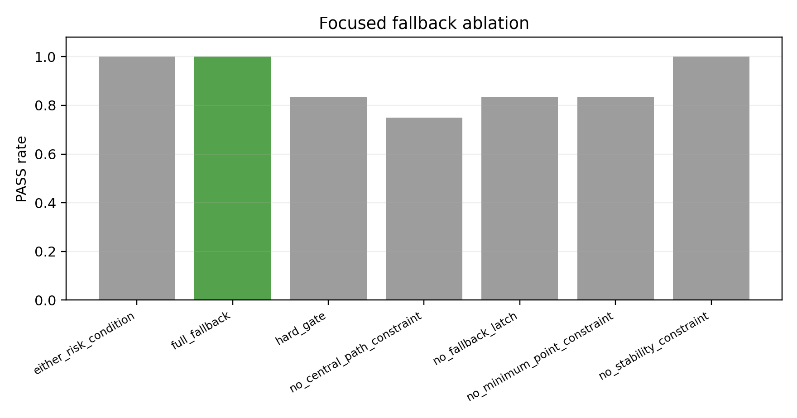
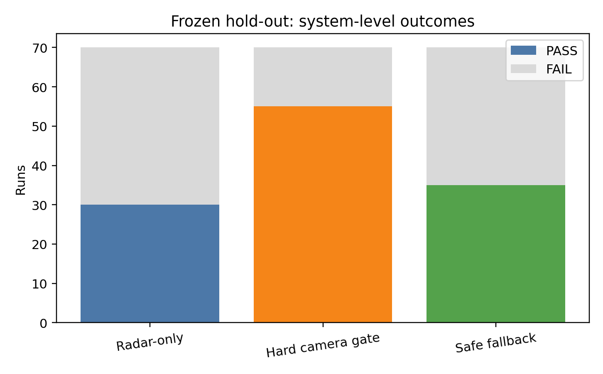
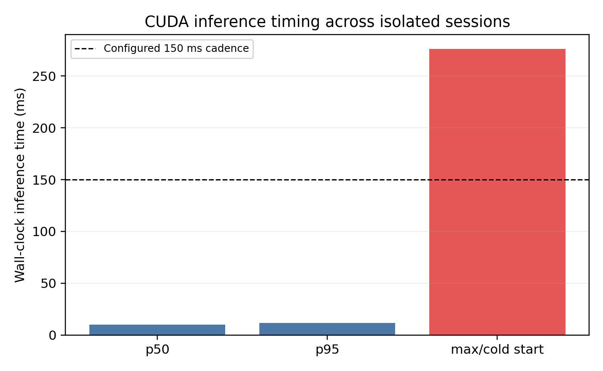

# Chương 4. Kiểm Thử Và Đánh Giá

Chương này trình bày các kịch bản kiểm thử, tiêu chí pass/fail, kết quả cuối
cùng của hệ thống staged PID và các giới hạn tìm được. Khác với Chương 3, chương
này không tập trung vào cách huấn luyện mô hình hay xây dựng thuật toán, mà tập
trung trả lời câu hỏi: hệ thống hoạt động tốt trong dải nào, không đạt ở đâu và
kết quả có đáng tin cậy không.

Để tránh hiểu nhầm rằng mọi kịch bản đều có cùng ý nghĩa, kết quả kiểm thử trong
đồ án được chia thành hai lớp. Lớp thứ nhất là các kịch bản trong dải thiết kế,
dùng để xác nhận hệ thống đạt mục tiêu ban đầu. Lớp thứ hai là các kịch bản
stress test, cố tình tăng tốc độ, giảm khoảng cách hoặc tạo tình huống khó để
tìm giới hạn hệ thống. Vì vậy, các trường hợp không đạt ở stress test không được
xem là phủ định kết quả chính, mà là bằng chứng xác định vùng hoạt động an toàn
của hệ thống.

## 4.1. Thiết Kế Kịch Bản Và Cách Chia Nhóm Đánh Giá

Kịch bản được chia theo nhóm car-to-car:

- `clear_road`: đường trống, kiểm tra phanh nhầm;
- `ccrs`: xe phía trước đứng yên;
- `ccrm`: xe phía trước chạy chậm hơn;
- `ccrb`: xe phía trước phanh gấp;
- `cut_in`: xe làn bên nhập làn trước ego;
- `cut_out`: xe phía trước rời làn;
- `adjacent_vehicle`: xe làn bên, kiểm tra chọn sai mục tiêu;
- `curve_cases`: đường cong, kiểm tra hành lang dự kiến;
- `multi_actor`: nhiều xe, kiểm tra chọn đúng mục tiêu.

Các kịch bản này lấy cảm hứng từ cách đánh giá AEB car-to-car của NCAP, đặc
biệt các tình huống xe phía trước đứng yên, xe phía trước chạy chậm hơn và xe
phía trước phanh gấp. Ngoài ra, dự án bổ sung cut-in, adjacent lane, multi-actor
và curve để tìm giới hạn thuật toán trong môi trường CARLA.

Tiêu chí đánh giá:

- kịch bản nguy hiểm: đạt nếu AEB can thiệp và không va chạm;
- kịch bản không nguy hiểm: đạt nếu không phanh nhầm;
- trường hợp tốc độ/khoảng cách quá khó được giữ lại để xác định giới hạn hệ thống.

**Bảng 4.1: Hai lớp kịch bản kiểm thử trong đồ án.**

| Lớp kiểm thử | Mục đích | Điều kiện điển hình | Cách diễn giải kết quả |
|---|---|---|---|
| Dải thiết kế | Chứng minh hệ thống đạt mục tiêu đồ án | Cao tốc, chỉ ô tô, thời tiết lý tưởng, chủ yếu 50-80 km/h, khoảng cách đủ hợp lý | Cần đạt ổn định; đây là kết quả chính để kết luận hệ thống hoàn thành mục tiêu |
| Stress test/tìm giới hạn | Tìm biên hoạt động của hệ thống | Tốc độ 95-110 km/h, gap rất ngắn, xe trước phanh gấp, cut-in gần, nhiều xe hoặc xe làn bên | Có thể có pass/fail; fail giúp xác định giới hạn chứ không phải lỗi của toàn bộ hệ thống |

Kết quả không nên được hiểu đơn giản là "càng nhiều pass càng tốt". Với một hệ
thống kỹ thuật, các trường hợp fail ở vùng ngoài phạm vi thiết kế cũng có giá
trị vì chúng chỉ ra biên hoạt động. Do đó, đồ án tách hai nhóm: bộ test mục tiêu
dùng để chứng minh hệ thống hoạt động tốt trong dải mong muốn, và bộ test giới
hạn dùng để xem khi tăng tốc độ hoặc giảm khoảng cách thì hệ thống bắt đầu thất
bại ở đâu.

## 4.2. Kết Quả Đánh Giá Cuối Cùng Với Staged PID

Bộ đánh giá cuối cùng dùng:

- nhận thức môi trường/hợp nhất dữ liệu: camera YOLO ONNX + quy trình xử lý đối tượng radar;
- phanh: `staged_pid`;
- cấu hình kịch bản: `configs/scenarios/suites/system_limit_extended_sweep.yaml`;
- nhật ký dữ liệu: gói minh chứng cuối `final_evidence_staged_pid_20260628`;
- video minh họa, log chi tiết và biểu đồ: lưu tại liên kết trong Phụ lục A.

**Bảng 4.2: Kết quả tổng quan của staged PID trên 66 kịch bản.**

| Tổng số trường hợp | Đạt | Không đạt | Thiếu kết quả | Tỷ lệ đạt |
|---:|---:|---:|---:|---:|
| 66 | 63 | 3 | 0 | 95.45% |

**Bảng 4.3: Kết quả theo dải thiết kế và nhóm stress test.**

| Nhóm đánh giá | Số trường hợp | Đạt | Không đạt | Nhận xét |
|---|---:|---:|---:|---|
| Dải thiết kế | 38 | 38 | 0 | Dải vận tốc ưu tiên 50-80 km/h, hệ thống hoạt động ổn định |
| Stress test/tìm giới hạn | 28 | 25 | 3 | Mở rộng tới 95-110 km/h hoặc cut-in khó để tìm biên hoạt động |

Kết quả cần được đọc theo hai tầng. Trong dải thiết kế, hệ thống đạt 38/38 trường
hợp, tức là đạt mục tiêu chính của đồ án. Khi mở rộng sang stress test, hệ thống
đạt 25/28 trường hợp và không đạt 3 trường hợp. Nhóm stress test không dùng để
kết luận hệ thống "đạt" hay "không đạt" toàn bộ, mà dùng để xác định biên: ở tốc
độ cao, khoảng cách quá ngắn hoặc cut-in quá gần, AEB bắt đầu không còn đủ thời
gian/quãng đường để tránh va chạm.

## 4.3. Kết Quả Theo Nhóm Scenario

Các bảng heatmap dưới đây trộn cả dải thiết kế và stress test để thấy rõ biên
hoạt động. Các hàng 50-80 km/h hoặc gap hợp lý thường thuộc dải thiết kế; các
hàng 95-110 km/h, gap 20 m hoặc cut-in ở tốc độ cao được xem là stress test.

**Bảng 4.4: Heatmap kết quả CCRb - xe trước phanh gấp.**

| Speed \ Gap | 20 m | 30 m | 40 m | 50 m | 60 m | 80 m |
|---|---|---|---|---|---|---|
| 50 km/h | Đạt | Đạt | Đạt | Đạt | Đạt | Đạt |
| 65 km/h | Đạt | Đạt | Đạt | Đạt | Đạt | Đạt |
| 80 km/h | Đạt | Đạt | Đạt | Đạt | Đạt | Đạt |
| 95 km/h | **Va chạm** | Đạt | Đạt | Đạt | Đạt | Đạt |
| 110 km/h | **Va chạm** | Đạt | Đạt | Đạt | Đạt | Đạt |

**Bảng 4.5: Heatmap kết quả CCRm - xe trước chạy chậm hơn.**

| Ego/Target \ Gap | 20 m | 30 m | 40 m | 50 m | 60 m | 80 m |
|---|---|---|---|---|---|---|
| 60/30 km/h | Đạt | Đạt | Đạt | Đạt | Đạt | Đạt |
| 80/50 km/h | Đạt | Đạt | Đạt | Đạt | Đạt | Đạt |
| 100/70 km/h | Đạt | Đạt | Đạt | Đạt | Đạt | Đạt |
| 110/80 km/h | Đạt | Đạt | Đạt | Đạt | Đạt | Đạt |

**Bảng 4.6: Heatmap kết quả cut-in - xe cắt làn vào trước ego.**

| Ego/Target \ Gap | 25 m | 35 m | 45 m | 60 m |
|---|---|---|---|---|
| 60/40 km/h | Đạt | Đạt | Đạt | Đạt |
| 80/50 km/h | Đạt | Đạt | Đạt | Đạt |
| 100/60 km/h | **Va chạm** | Đạt | Đạt | Đạt |

**Bảng 4.7: Một số trường hợp đại diện theo nhóm kiểm thử.**

| Nhóm | Lớp kiểm thử | Hai kịch bản đại diện | Trạng thái | Tốc độ khi bắt đầu phanh | Khoảng cách khi bắt đầu phanh | Khoảng cách nhỏ nhất | Nhận xét |
|---|---|---|---|---:|---:|---:|---|
| Đường trống | Dải thiết kế | `clear_road_80` | Đạt | -- | -- | -- | Ego chạy 80 km/h, không có mục tiêu nguy hiểm và không phanh nhầm |
| Xe làn bên | Dải thiết kế | `adjacent_stationary_80` | Đạt | -- | -- | -- | Có xe đứng yên làn bên, hệ thống không chọn nhầm target |
| CCRs | Dải thiết kế | `ccrs_80` | Đạt | 69.72 km/h | 32.12 m | 7.70 m | Xe đứng yên cùng làn, ego dừng an toàn |
| CCRs | Dải thiết kế | `ccrs_60_gap_200` | Đạt | 60.30 km/h | 25.34 m | 7.06 m | Xe đứng yên cách xa 200 m, hệ thống chỉ phanh khi vào vùng nguy hiểm |
| CCRm | Dải thiết kế | `ccrm_80_50_gap_20` | Đạt | 78.36 km/h | 18.97 m | 14.45 m | Xe trước chạy chậm hơn, chênh lệch tốc độ vừa phải nên còn dư khoảng cách |
| CCRm | Stress test | `ccrm_110_80_gap_20` | Đạt | 108.00 km/h | 18.96 m | 15.01 m | Dù tốc độ cao, relative speed chỉ khoảng 30 km/h nên vẫn kiểm soát được |
| CCRb | Dải thiết kế | `ccrb_80_gap_20` | Đạt | 79.92 km/h | 18.56 m | 1.96 m | Xe trước phanh gấp trong dải mục tiêu, AEB tránh va chạm |
| CCRb | Stress test | `ccrb_95_gap_20` | Không đạt | 94.90 km/h | 18.56 m | 0.013 m | Tốc độ cao, gap 20 m không đủ cho tình huống xe trước phanh gấp |
| Cut-in | Dải thiết kế | `cutin_80_50_gap_25` | Đạt | 79.92 km/h | 10.46 m | 5.51 m | Xe nhập làn, radar và YOLO xác nhận đủ sớm để phanh |
| Cut-in | Stress test | `cutin_100_60_gap_25` | Không đạt | 99.90 km/h | 7.26 m | 0.48 m | Xe nhập làn quá gần ở tốc độ cao, nằm ngoài vùng hoạt động tốt |
| Đường cong | Dải thiết kế | `curve_ccrs_65` | Đạt | 56.12 km/h | 23.17 m | 4.07 m | Xe đứng yên cùng làn trên đường cong, hành lang dự đoán vẫn chọn đúng target |
| Đường cong | Dải thiết kế | `curve_adjacent_stationary_65` | Đạt | -- | -- | -- | Xe đứng yên làn bên trên đường cong, không phanh nhầm |
| Nhiều xe | Dải thiết kế | `multi_adjacent_decoy_65` | Đạt | 63.49 km/h | 20.49 m | 13.48 m | Có xe mồi làn bên, hệ thống chọn xe chậm cùng làn |
| Nhiều xe | Dải thiết kế | `multi_two_leads_80` | Đạt | 70.70 km/h | 26.38 m | 8.19 m | Có hai xe cùng làn, hệ thống chọn xe gần đang chạy chậm |

## 4.4. Phân Tích Các Trường Hợp Đại Diện

Mỗi nhóm kiểm thử được chọn hai trường hợp đại diện: một trường hợp thể hiện
hệ thống hoạt động đúng trong dải mục tiêu và một trường hợp kiểm tra biên hoặc
dễ gây nhầm mục tiêu. Các biểu đồ trong mục này được tạo từ log từng tick, gồm
lệnh phanh `brake_cmd`, vận tốc ego, khoảng cách bumper gap và TTC. Màu nền trong
biểu đồ tương ứng các giai đoạn SAFE, WARNING, BRAKE, HOLD_STOP hoặc RELEASE.

### 4.4.1. Xe Đứng Yên Cùng Làn

`ccrs_80` kiểm tra trường hợp ego chạy khoảng 80 km/h tới xe đứng yên cùng làn.
AEB bắt đầu phanh khi vận tốc ego còn 69,72 km/h, bumper gap khoảng 32,12 m và
TTC nhỏ nhất ghi nhận khoảng 1,22 s. Khoảng cách nhỏ nhất còn 7,70 m nên đây là
một trường hợp đạt rõ ràng trong dải mục tiêu.

**Hình 4.1: Biểu đồ phanh PID của trường hợp xe đứng yên cùng làn `ccrs_80`.**

`ccrs_60_gap_200` dùng khoảng cách ban đầu 200 m để kiểm tra hệ thống có phanh
sớm quá hay không. Kết quả cho thấy ego vẫn chạy ổn định cho tới khi radar target
đi vào vùng nguy hiểm; AEB bắt đầu phanh tại gap 25,34 m và dừng với khoảng cách
nhỏ nhất 7,06 m. Trường hợp này chứng minh thuật toán không phanh chỉ vì thấy xe
ở rất xa phía trước, mà cần target thỏa điều kiện TTC/khoảng cách dừng.

**Hình 4.2: Biểu đồ phanh PID của trường hợp xe đứng yên từ xa `ccrs_60_gap_200`.**

### 4.4.2. Xe Phía Trước Chạy Chậm Hơn

Với `ccrm_80_50_gap_20`, ego chạy khoảng 80 km/h còn xe trước chạy khoảng 50 km/h.
Hệ thống phanh ngay khi gap còn 18,97 m, nhưng vì vận tốc tương đối không quá
lớn nên khoảng cách nhỏ nhất vẫn còn 14,45 m. Điều này cho thấy chỉ xét tốc độ
ego là chưa đủ; relative speed đóng vai trò rất quan trọng.

**Hình 4.3: Biểu đồ phanh PID của trường hợp xe trước chạy chậm hơn `ccrm_80_50_gap_20`.**

`ccrm_110_80_gap_20` là trường hợp tốc độ ego cao hơn, nhưng xe trước cũng chạy
nhanh. Dù ego gần 108 km/h tại thời điểm phanh, khoảng cách nhỏ nhất vẫn còn
15,01 m. Kết quả này hợp lý vì nguy cơ va chạm phụ thuộc vào tốc độ đóng lại
giữa hai xe, không chỉ phụ thuộc vận tốc tuyệt đối của ego.

**Hình 4.4: Biểu đồ phanh PID của stress test xe trước chạy chậm hơn `ccrm_110_80_gap_20`.**

### 4.4.3. Xe Phía Trước Phanh Gấp

`ccrb_80_gap_20` là tình huống khó nhưng vẫn nằm trong dải vận tốc mục tiêu. Hai
xe ban đầu cùng chạy khoảng 80 km/h, xe phía trước phanh gấp sau 1,5 s. AEB bắt
đầu phanh tại gap 18,56 m, TTC nhỏ nhất 0,62 s và dừng còn 1,96 m. Khoảng cách
dừng khá sát, nhưng không có va chạm nên được xem là đạt.

**Hình 4.5: Biểu đồ phanh PID của trường hợp CCRb đạt `ccrb_80_gap_20`.**

`ccrb_95_gap_20` dùng cùng gap 20 m nhưng tăng tốc độ lên 95 km/h. Hệ thống vẫn
phanh mạnh, tuy nhiên khoảng cách nhỏ nhất chỉ còn 0,013 m và CARLA ghi nhận va
chạm. Đây là case quan trọng để chỉ ra biên hệ thống: với xe trước phanh gấp,
gap 20 m chỉ phù hợp tới khoảng 80 km/h; khi lên 95 km/h cần gap lớn hơn, ít
nhất khoảng 30 m theo sweep hiện tại.

**Hình 4.6: Biểu đồ phanh PID của trường hợp CCRb không đạt `ccrb_95_gap_20`.**

### 4.4.4. Xe Cắt Làn Vào Trước Ego

Cut-in khó hơn CCRm vì target ban đầu nằm ở làn bên, sau đó mới đi vào hành lang
dự đoán của ego. Ở `cutin_80_50_gap_25`, ego chạy khoảng 80 km/h, xe cắt làn
chạy khoảng 50 km/h. Khi xe cắt làn đủ gần đường đi dự kiến, hệ thống bắt đầu
phanh tại gap 10,46 m và tránh va chạm với khoảng cách nhỏ nhất 5,51 m.

**Hình 4.7: Biểu đồ phanh PID của trường hợp cut-in đạt `cutin_80_50_gap_25`.**

Trong `cutin_100_60_gap_25`, ego chạy gần 100 km/h, target cắt làn với gap ban
đầu tương tự. Do target chỉ trở thành nguy hiểm sau khi đi vào làn ego, thời gian
phản ứng thực tế ngắn hơn nhiều so với CCRm. AEB bắt đầu phanh ở gap 7,26 m,
nhưng không còn đủ quãng đường để tránh va chạm. Đây là một giới hạn tự nhiên
của hệ thống một camera + một radar trong mô phỏng.

**Hình 4.8: Biểu đồ phanh PID của trường hợp cut-in không đạt `cutin_100_60_gap_25`.**

### 4.4.5. Đường Cong Và Xe Làn Bên

Hai case đường cong dùng để kiểm tra vai trò của quỹ đạo dự đoán. Trong
`curve_ccrs_65`, xe đứng yên nằm cùng làn trên đoạn cong. Nếu chỉ dùng FOV radar,
target có thể bị lẫn với lan can hoặc vật thể ở mép đường. Thuật toán hành lang
dự đoán giúp giữ target cùng hướng đi, hệ thống phanh tại gap 23,17 m và dừng
còn 4,07 m.

**Hình 4.9: Biểu đồ phanh PID của trường hợp xe cùng làn trên đường cong `curve_ccrs_65`.**

Ngược lại, `curve_adjacent_stationary_65` đặt xe đứng yên ở làn bên trên đường
cong. Đây là tình huống dễ gây phanh nhầm vì radar vẫn nhìn thấy vật thể phía
trước. Kết quả cho thấy `brake_cmd` luôn bằng 0, trạng thái AEB giữ NORMAL và
không có va chạm. Điều này chứng minh quỹ đạo dự đoán đã loại được mục tiêu
không nằm trên đường đi của ego.

**Hình 4.10: Biểu đồ phanh PID của trường hợp xe làn bên trên đường cong `curve_adjacent_stationary_65`.**

### 4.4.6. Nhiều Xe Trong Vùng Quét

`multi_adjacent_decoy_65` có một xe mồi ở làn bên và một xe chậm cùng làn. Nếu
chọn target chỉ theo khoảng cách gần nhất, hệ thống có thể chọn sai xe làn bên.
Kết quả cho thấy radar target match với hazard 100%, AEB phanh tại gap 20,49 m
và khoảng cách nhỏ nhất còn 13,48 m.

**Hình 4.11: Biểu đồ phanh PID của trường hợp nhiều xe có xe mồi làn bên `multi_adjacent_decoy_65`.**

`multi_two_leads_80` đặt hai xe cùng làn phía trước ego. Hệ thống phải chọn xe
gần hơn đang chạy chậm làm target chính. Kết quả phanh tại gap 26,38 m, khoảng
cách nhỏ nhất còn 8,19 m, không va chạm. Hai case này cho thấy bước gom cụm,
theo dõi object và chọn target theo TTC/khoảng cách đã hoạt động đúng trong môi
trường nhiều đối tượng.

**Hình 4.12: Biểu đồ phanh PID của trường hợp hai xe cùng làn `multi_two_leads_80`.**

## 4.5. So Sánh Các Phương Án Phanh

**Bảng 4.8: So sánh các phương án phanh trong quá trình phát triển.**

| Phương án phanh | Đặc điểm | Ưu điểm | Hạn chế | Vai trò trong đồ án |
|---|---|---|---|---|
| Binary brake | Khi nguy hiểm thì phanh 1.0 | Dễ cài đặt, dễ kiểm chứng | Gắt, dễ nhấp nhả hoặc dừng thiếu tự nhiên | Mốc ban đầu để kiểm tra pipeline |
| Staged fixed brake | Chia mức SAFE/WARNING/SOFT/HARD/EMERGENCY với lực phanh cố định | Dễ giải thích theo logic thực tế | Lực phanh chưa thích ứng tốt với khoảng cách/tốc độ | Bước trung gian để kiểm tra nhiều tầng rủi ro |
| PID v1/v2 | Tính lực phanh liên tục từ sai số khoảng cách | Êm hơn binary, có thể tinh chỉnh | Nếu thiếu tầng rủi ro dễ nhả/phanh chưa đúng ngữ cảnh | Thử nghiệm điều khiển liên tục |
| Staged PID | Chia tầng rủi ro rồi dùng PID trong từng tầng | Cân bằng giữa dễ giải thích, giảm phanh nhầm và tránh va chạm | Còn cần tuning sâu về độ êm/jerk | Phương án chính hiện tại |

Kết quả cuối cùng chọn staged PID vì phương án này gần với cách suy nghĩ của
một hệ thống AEB thực tế hơn: không chỉ có "phanh hoặc không phanh", mà có cảnh
báo, phanh nhẹ, phanh mạnh, phanh khẩn cấp và nhả phanh khi nguy cơ không còn.

## 4.6. Phân Tích Trường Hợp Không Đạt Và Giới Hạn

**Bảng 4.9: Các trường hợp không đạt và giới hạn hệ thống.**

| Kịch bản | Va chạm | Khoảng cách nhỏ nhất | Nhận xét |
|---|---:|---:|---|
| `ccrb_95_gap_20` | **Có** | 0.0134 m | Xe trước phanh gấp, tốc độ cao, khoảng cách đầu nhỏ |
| `ccrb_110_gap_20` | **Có** | 0.0806 m | Vượt dải vận tốc/khoảng cách an toàn của hệ thống |
| `cutin_100_60_gap_25` | **Có** | 0.4763 m | Xe nhập làn ở tốc độ cao và khoảng cách đầu nhỏ |

Các trường hợp không đạt này cho thấy staged PID hiện tại hoạt động tốt ở dải
50-80 km/h, và vẫn xử lý được nhiều trường hợp 95-110 km/h nếu khoảng cách ban
đầu đủ lớn. Tuy nhiên, ở tốc độ cao kèm khoảng cách đầu nhỏ, thời gian phản ứng
và quãng đường phanh không còn đủ. Đây là giới hạn hợp lý của hệ thống, giống
cách các hệ thống AEB thực tế cũng chỉ đảm bảo trong một dải vận tốc/điều kiện
nhất định.

Một điểm cần lưu ý khi đọc kết quả là `maximum_abs_jerk_mps3` trong CARLA có thể
rất lớn do đạo hàm gia tốc theo từng tick bị nhiễu số và do mô hình va chạm/tiếp
xúc trong simulator. Vì vậy đồ án dùng jerk như chỉ báo tương đối để so sánh các
phiên bản phanh, không xem giá trị tuyệt đối trong CARLA là giá trị tương đương
xe thật.

## 4.7. Video Minh Họa Và Kết Quả Lưu Trữ

Video được ghi trực tiếp từ khung hình Pygame bằng bộ ghi nội bộ, tránh lỗi video
đen do quay màn hình ngoài. Trong bản báo cáo nộp chính thức, video, log chi
tiết và biểu đồ được lưu trong một thư mục Google Drive chung ở Phụ lục A.

**Hình 4.13: Ảnh đại diện video minh họa cuối cùng.**

**Bảng 4.10: Danh sách video minh họa dự kiến đưa vào phụ lục.**

| Kịch bản | Ý nghĩa | Nơi lưu |
|---|---|---|
| `clear_road_50` | Đường trống 50 km/h, không phanh nhầm | Thư mục Drive chung ở Phụ lục A |
| `ccrs_80_gap_30` | Xe đứng yên phía trước, phanh thành công | Thư mục Drive chung ở Phụ lục A |
| `ccrb_95_gap_20` | Xe trước phanh gấp, trường hợp giới hạn/va chạm | Thư mục Drive chung ở Phụ lục A |
| `cutin_80_50_gap_25` | Xe cắt làn, hệ thống xử lý thành công | Thư mục Drive chung ở Phụ lục A |
| `cutin_100_60_gap_25` | Xe cắt làn, trường hợp giới hạn/va chạm | Thư mục Drive chung ở Phụ lục A |

## 4.8. Nhận Xét Về Độ Tin Cậy Kết Quả

Kết quả đánh giá định lượng dựa trên nhật ký mô phỏng, gồm trạng thái va chạm,
khoảng cách nhỏ nhất, TTC, vận tốc tại thời điểm phanh, lệnh phanh và trạng thái
AEB. Video chỉ dùng để minh họa trực quan. Khi phần hiển thị Pygame chỉ đạt
17-18 FPS, phần mô phỏng vẫn chạy theo tick 20 Hz nếu synchronous mode được bật.

CARLA server đôi khi không ổn định khi chạy nhiều kịch bản liên tục. Để giảm
ảnh hưởng này, dự án bổ sung reload/restart world/server giữa các lần chạy và
ưu tiên đọc nhật ký dữ liệu sau từng kịch bản. Đây là hạn chế thực nghiệm cần
ghi rõ khi báo cáo.

Một số yếu tố có thể ảnh hưởng tới độ tin cậy gồm: sai khác giữa radar CARLA và
radar thật, chất lượng mô hình động học của xe trong simulator, độ ổn định FPS
hiển thị, nhiễu đồ họa của camera và sai khác giữa kịch bản mô phỏng với đường
thật. Để giảm các yếu tố này, dự án sử dụng synchronous mode cho kiểm thử, log
chi tiết từng tick, biểu đồ phanh, video minh họa và lặp lại nhiều nhóm kịch bản.
Tuy nhiên, kết quả vẫn cần được diễn giải là kết quả mô phỏng, chưa phải kết quả
kiểm định trên xe thật.

## 4.9. Đánh Giá Tái Lập Kết Quả

Một kết quả đơn lẻ có thể đến từ yếu tố ngẫu nhiên của simulator. Vì vậy, bản
đánh giá bổ sung chạy lại bộ kịch bản chính nhiều lần với cùng cấu hình và kiểm
tra xem kết quả pass/fail, va chạm và phanh có ổn định hay không. Tất cả các lần
chạy tái lập đều dùng `--control-mode physics`, `--reload-world-every 0` và ghi
log từng tick để có thể phân tích lại.

**Bảng 4.11: Kết quả tái lập full-suite 66 kịch bản với repeat x5.**

| Cấu hình | Runs | PASS | FAIL | Collision | Mixed | Missing |
|---|---:|---:|---:|---:|---:|---:|
| Camera-gated fusion | 330 | 315 | 15 | 15 | 0 | 0 |
| Radar-only | 330 | 315 | 15 | 15 | 0 | 0 |

Kết quả cho thấy full-suite 66 kịch bản lặp x5 cho cùng số PASS/FAIL và cùng số
va chạm giữa hai cấu hình. Trên bộ kịch bản này, cả hai đều phanh 330/330 lần
và có 15 lần va chạm ở các kịch bản stress tốc độ cao. Do đó, bộ full-suite
không đủ để phân biệt radar-only và fusion, mà cần các bộ kiểm thử false-positive
ở Mục 4.11.

Để kiểm tra biên hoạt động có ổn định hay không, các kịch bản biên được chạy
lặp 10 lần:

**Bảng 4.12: Kết quả boundary probe với repeat x10.**

| Kịch bản | Kết quả |
|---|---|
| `ccrb_80_gap_20` | 10/10 PASS |
| `ccrb_95_gap_20` | 10/10 va chạm |
| `ccrb_95_gap_30` | 10/10 PASS |
| `ccrb_110_gap_20` | 10/10 va chạm |

Các boundary probe cho kết quả tuyệt đối (0/10 hoặc 10/10), không có kịch bản
mixed. Điều này cho thấy biên hoạt động của hệ thống trong điều kiện deterministic
physics là ổn định, ngoại trừ một ngoại lệ `cut_out_late_65_35` được phân tích ở
Mục 4.13.

**Bảng 4.13: Kết quả negative regression với repeat x5.**

| Cấu hình | Runs | PASS | FAIL | Negative runs | False brake |
|---|---:|---:|---:|---:|---:|
| Fusion (fusion_regression) | 125 | 125 | 0 | 35 | 0 |
| Radar-only (radar_only_regression) | 145 | 141 | 4 | 60 | 0 |
| Fusion (radar_only_regression) | 145 | 140 | 5 | 60 | 0 |

Trong các kịch bản negative (không nguy hiểm), cả radar-only lẫn fusion đều
không ghi nhận phanh nhầm. Điểm khác biệt duy nhất là `cut_out_late_65_35`:
radar-only bỏ lỡ 4/5 lần, fusion bỏ lỡ 5/5 lần. Trường hợp này được phân tích
riêng ở Mục 4.13.

## 4.10. So Sánh Định Lượng Radar-Only Và Camera-Gated Fusion

Để đánh giá vai trò của camera gate một cách công bằng, hai cấu hình được chạy
với cùng harness, cùng bộ kịch bản, cùng bộ điều khiển staged PID và cùng số
lần lặp. Tiêu chí ở mức quyết định phanh được quy về ma trận nhầm lẫn: kịch bản
nguy hiểm (`expected_brake=true`) cần phanh, kịch bản không nguy hiểm
(`expected_brake=false`) cần không phanh.

**Bảng 4.14: Ma trận nhầm lẫn radar-only vs camera-gated fusion.**

| Cấu hình | TP | FP | TN | FN | Precision | Recall | F1 |
|---|---:|---:|---:|---:|---:|---:|---:|
| Radar-only | 421 | 40 | 60 | 4 | 0.913 | 0.991 | 0.950 |
| Camera-gated fusion | 410 | 0 | 100 | 15 | 1.000 | 0.965 | 0.982 |

Ma trận này được gộp từ các bộ paired gồm: full-suite 66 (330 runs), negative
regression (85 positive + 60 negative), false-positive vật lý v2 (40 non-hazard)
và non-vehicle ngay giữa làn (10 hazard). Ba nhận xét chính:

- Fusion đạt precision tuyệt đối (1.000): không phanh nhầm trong bất kỳ kịch
  bản non-hazard nào, loại bỏ toàn bộ 40 phanh nhầm của radar-only.
- Radar-only có recall cao hơn (0.991 so với 0.965): chỉ bỏ lỡ `cut_out_late_65_35`,
  trong khi fusion bỏ lỡ thêm 10 vật cản không phải ô tô ngay giữa làn.
- F1 tổng: fusion 0.982, radar-only 0.950 trong bộ dữ liệu có gắn nhãn này.

**Bảng 4.15: Độ trễ kích hoạt phanh của fusion so với radar-only trên full-suite 66.**

| Chỉ số | Giá trị |
|---|---:|
| Chênh lệch trung bình `first_brake_s` (fusion − radar) | +4.5 ms |
| Trung vị chênh lệch | 0.0 ms |
| Chênh lệch lớn nhất | 250 ms (một kịch bản cut-in) |

Kết quả cho thấy trong synchronous simulation, camera gate không làm tăng đáng
kể thời điểm kích hoạt phanh trên mục tiêu ô tô đã được xác nhận: trung vị chênh
lệch là 0 ms. Số liệu này không suy rộng thành độ trễ phản ứng trên xe thật.

## 4.11. Kiểm Thử False-Positive Và Giới Hạn Camera Gate

Để chứng minh camera gate thực sự có giá trị, cần tạo các kịch bản mà radar
chọn nhầm một vật thể không phải ô tô. Hai hướng được dùng: inject synthetic
radar point trên đường trống (fault injection), và spawn vật thể CARLA thật gần
mép đường (physical).

**Bảng 4.16: Kết quả false-positive vật lý với props gần mép đường, repeat x5.**

| Cấu hình | Runs | PASS | False brake | Collision |
|---|---:|---:|---:|---:|
| Radar-only | 40 | 0 | 40 | 0 |
| Camera-gated fusion | 40 | 40 | 0 | 0 |

Bộ physical v2 gồm `static.prop.barrel`, `static.prop.box01`,
`static.prop.trashcan01`, `static.prop.streetbarrier` đặt ở mép đường (offset
1.30--1.50 m). Radar-only chọn các return này làm mục tiêu
AEB và phanh nhầm 40/40 lần; fusion chặn phanh 40/40 lần vì YOLO không xác nhận
bounding box ô tô tại vị trí chiếu của mục tiêu radar. Với bộ cone v1 bổ sung,
radar-only cũng phanh nhầm 10/10 còn fusion 0/10. Với synthetic radar point,
radar-only phanh nhầm 30/30 còn fusion 0/30.

**Bảng 4.17: Kết quả limitation non-vehicle ngay giữa làn, repeat x5.**

| Cấu hình | Runs | PASS | Collision | Missed brake |
|---|---:|---:|---:|---:|
| Radar-only | 10 | 10 | 0 | 0 |
| Camera-gated fusion | 10 | 0 | 10 | 10 |

Ngược lại, khi đặt `static.prop.box01` hoặc `static.prop.barrel` ngay giữa làn
đường, đây là vật cản nguy hiểm thực sự. Radar-only phanh từ chính radar return
và dừng an toàn 10/10 (khoảng cách nhỏ nhất khoảng 0.85 m). Fusion vì chỉ xác
nhận lớp `car` nên chặn toàn bộ lệnh phanh và va chạm 10/10. Đây là giới hạn bản
chất của camera gate: nó là cơ chế giảm phanh nhầm, không phải cơ chế tránh vật
cản tổng quát.

## 4.12. Ablation Bộ Điều Khiển Phanh

Để kiểm chứng lựa chọn staged PID không phải tùy tiện, bộ điều khiển được so
sánh với binary brake trên cùng full-suite 66, cùng perception fusion, cùng
repeat x5. Hai cấu hình chỉ khác `brake_mode`.

**Bảng 4.18: Ablation bộ điều khiển binary vs staged_pid.**

| Bộ điều khiển | Runs | PASS | FAIL | Collision |
|---|---:|---:|---:|---:|
| binary | 330 | 310 | 20 | 20 |
| staged_pid | 330 | 315 | 15 | 15 |

Khác biệt duy nhất ở `ccrb_110_gap_30`: binary va chạm 5/5, staged_pid đạt 5/5.
Nguyên nhân nằm ở ngưỡng khoảng cách dừng. Ở chế độ PID, phanh theo khoảng cách
kích hoạt khi `distance_margin <= pid_target_margin_m = 4.0 m`; ở chế độ binary,
nhánh margin này bị tắt nên chỉ phanh khi margin đã về dưới 0 m. Trên tình huống
110 km/h với xe trước phanh gấp ở gap 30 m, staged_pid phanh sớm hơn khoảng
0.10 s (2.25 s so với 2.35 s) và tránh được va chạm. Vì vậy, staged PID được
giữ làm phương án chính.

## 4.13. Phân Tích Độ Nhạy Và Trường Hợp Biên

Camera gate có một tham số `confirmation_hold_s` quy định khoảng thời gian giữ
lệnh phanh sau lần xác nhận YOLO gần nhất. Để kiểm tra tham số này có nhạy hay
không, hệ thống được chạy lại với `confirmation_hold_s` bằng 0.10, 0.35, 0.70
và 1.00 s trên 8 kịch bản đại diện, repeat x5.

**Bảng 4.19: Độ nhạy theo `confirmation_hold_s`.**

| hold_s (s) | TP | FP | TN | FN | Precision | Recall |
|---|---:|---:|---:|---:|---:|---:|
| 0.10 | 16 | 0 | 20 | 4 | 1.000 | 0.800 |
| 0.35 | 15 | 0 | 20 | 5 | 1.000 | 0.750 |
| 0.70 | 15 | 0 | 20 | 5 | 1.000 | 0.750 |
| 1.00 | 15 | 0 | 20 | 5 | 1.000 | 0.750 |

False brake giữ nguyên bằng 0 ở mọi giá trị hold, vì YOLO không bao giờ xác
nhận vật thể không phải ô tô. Nguồn FN duy nhất là `cut_out_late_65_35` và không
phụ thuộc hold time. Một TP tăng thêm ở hold 0.10 là do biến thiên ngẫu nhiên
theo từng run của kịch bản biên này, không phải hiệu ứng hệ thống của hold time.
Do đó `confirmation_hold_s = 0.35 s` là lựa chọn an toàn, không nằm ở vùng nhạy
cảm.

Về `cut_out_late_65_35`, phân tích log từng tick cho thấy đây là trường hợp biên
về ngưỡng hành lang ngang, không phải lỗi camera gate. Xe phía trước bắt đầu rời
làn từ 0.8 s; vị trí ngang của nó vượt ngưỡng `pid_target_margin_max_lateral_m =
0.95 m` (rồi `max_lateral_offset_m = 1.25 m`) gần đúng thời điểm margin khoảng
cách dừng chạm ngưỡng phanh. Chênh lệch ngang khoảng 0.28 m ở đúng frame tới hạn
quyết định phanh hay không. Radar-only có 1/5 lần phanh (run 5), fusion 0/5 lần
nhưng ở lần đó camera vẫn `fusion_confirmed`, tức gate không chặn. Do đó, kịch
bản này nên được trình bày như một độ nhạy timing của hành lang ngang, không nên
coi là bằng chứng camera gate gây hồi quy.

## 4.14. Final GPU Campaign Ba Chính Sách

Sau khi triển khai radar emergency fallback, cấu hình được khóa tại tag
`safe-fallback-eval-v1`. Master campaign chạy 47 jobs, 2.461 scenario-runs và
639 server sessions. Tất cả 474 fusion CUDA sessions ghi nhận active
`CUDAExecutionProvider`, tổng 74.928 inference và không có inference error.
Không run nào bị bỏ do lỗi kỹ thuật.

Để giữ khả năng so sánh với phân tích v2, bảng chính loại suite synthetic fault
injection khỏi confusion matrix; suite này được báo cáo riêng. Nhãn dương là
`expected_brake=true`, prediction dương là AEB thực sự kích hoạt phanh.

**Bảng 4.20: Core benchmark ba chính sách, không tính synthetic fault injection.**

| Chính sách | Runs | TP | FP | TN | FN | Precision (95% Wilson CI) | Recall (95% Wilson CI) | Collision |
|---|---:|---:|---:|---:|---:|---:|---:|---:|
| Radar-only | 525 | 420 | 40 | 60 | 5 | 0,913 (0,884–0,936) | 0,988 (0,973–0,995) | 15 |
| Hard camera gate | 525 | 410 | 0 | 100 | 15 | 1,000 (0,991–1,000) | 0,965 (0,943–0,979) | 25 |
| Safe fallback | 525 | 420 | 0 | 100 | 5 | 1,000 (0,991–1,000) | 0,988 (0,973–0,995) | 15 |

**Hình 4.14: Precision-recall trên core benchmark không tính synthetic fault.**

Trên core suite được thiết kế, safe fallback kết hợp precision của hard gate và
recall của radar-only: phục hồi 10/10 lượt box/barrel giữa làn, vẫn chặn 40/40
edge props, và không làm thay đổi outcome full66/regression. Khi cộng 30
synthetic faults bốn điểm, radar-only có thêm 30 FP, hard gate và safe fallback
đều chặn 30/30. Kết quả toàn core của safe fallback là TP=420, FP=0, TN=130,
FN=5; 5 FN vẫn thuộc `cut_out_late_65_35`.

Paired status trên 555 core runs cho thấy safe fallback cải thiện 70 lượt so với
radar-only và không hồi quy; cải thiện 10 lượt so với hard gate và không hồi
quy. Tuy nhiên đây là paired outcome trong suite đã biết, chưa phải kết luận
tổng quát; frozen hold-out ở Mục 4.17 cho kết quả khác.

**Hình 4.15: PASS rate trên edge props, in-path props và synthetic faults.**

## 4.15. Ablation Và Sensitivity Của Fallback

Focused development suite gồm 12 named scenarios, mỗi scenario lặp hai lần.
Hard gate và các phiên bản loại bỏ từng điều kiện được so với fallback đầy đủ.

**Bảng 4.21: Ablation radar emergency fallback.**

| Biến thể | PASS/Runs | Failure có hệ thống |
|---|---:|---|
| Full fallback | 24/24 | Không |
| Hard gate | 20/24 | 4 central box/barrel |
| Không central-path constraint | 18/24 | 6 edge-prop false brakes |
| Không minimum-point constraint | 20/24 | 4 synthetic four-point false brakes |
| Không stability/confidence constraint | 24/24 | Không phân biệt trên focused suite |
| TTC OR margin thay vì AND | 24/24 | Không phân biệt trên focused suite |
| Không latch | 20/24 | 4 central box/barrel do nhả phanh sớm |

**Hình 4.16: PASS rate của focused fallback ablation.**

Ablation cung cấp bằng chứng trực tiếp cho ba thành phần: central-path constraint
giảm edge FP, point threshold chặn weak synthetic faults và latch ngăn release
sớm. Hai điều kiện stability và risk conjunction chưa tạo khác biệt trong focused
suite vì các track được inject tồn tại liên tục và đã có risk mạnh; do đó không
nên tuyên bố ablation đã chứng minh độc lập mọi rule.

One-factor sensitivity dùng sáu scenario đại diện. Nominal đạt 12/12. Khi giảm
minimum points từ 6 xuống 4, synthetic trung tâm phanh nhầm 2/2; khi tăng
stability từ 3 lên 4 frame hoặc siết TTC từ 1,10 xuống 0,90 s, box giữa làn bị
bỏ 2/2. Các thay đổi path 0,45/0,85 m, margin -1/-3 m, confidence 0,50/0,90 và
TTC 1,30 s không đổi outcome subset. Điều này cho thấy point/stability/TTC có
trade-off rõ, không chứng minh tất cả threshold đều tối ưu.

## 4.16. Perturbation Robustness Và Camera Degradation

Perturbation suite gồm 20 named conditions thay đổi ±2 km/h ego speed, ±1 m
gap, ±0,1 s cut-in timing và vị trí box ±0,15 m; mỗi điều kiện lặp ba lần.

| Chính sách | PASS/Runs | Collision | Named scenario FAIL |
|---|---:|---:|---:|
| Radar-only | 57/60 | 3 | 1/20 (`box gap=19 m`) |
| Hard gate | 45/60 | 15 | 5/20 (toàn bộ box) |
| Safe fallback | 54/60 | 6 | 2/20 (`box gap=19/21 m`) |

Safe fallback cải thiện mạnh so với hard gate nhưng không khôi phục toàn bộ box
perturbations. Việc nominal gap 20 m đạt còn 19 và 21 m không đạt cho thấy kết
quả physical prop chịu ảnh hưởng không đơn điệu bởi số radar return, thời điểm
track confirm và hình học bounding box; đây là dấu hiệu không nên khái quát từ
hai props core.

Trong detector-disabled degradation test (10 scenarios ×3), hard gate đạt
12/30 và không phanh ở toàn bộ sáu nhóm hazard vehicle/central-prop. Safe
fallback đạt 24/30, phanh đúng ở 18/18 labelled positives nhưng vẫn collision
6 lượt tại `ccrs_65` và `ccrb_65` vì emergency override xảy ra muộn. Như vậy,
fallback tạo graceful degradation về brake recall nhưng không bảo đảm đủ
stopping margin khi camera mất hoàn toàn.

## 4.17. Frozen Hold-Out

Hold-out gồm 14 named scenarios ×5, chạy cuối và không dùng để tuning. Bảy
scenario dương gồm shopping cart, bench, traffic warning ở giữa quỹ đạo và bốn
vehicle appearances mới; bảy scenario âm gồm hai edge props và năm high-support
synthetic ghosts 6–10 điểm.

**Bảng 4.23: Kết quả frozen hold-out.**

| Chính sách | PASS/70 | TP | FP | TN | FN | Precision | Recall | Collision |
|---|---:|---:|---:|---:|---:|---:|---:|---:|
| Radar-only | 30 | 30 | 25 | 10 | 5 | 0,545 | 0,857 | 15 |
| Hard camera gate | 55 | 25 | 0 | 35 | 10 | 1,000 | 0,714 | 15 |
| Safe fallback | 35 | 30 | 20 | 15 | 5 | 0,600 | 0,857 | 15 |

**Hình 4.17: PASS/FAIL trên frozen hold-out.**

Safe fallback không chiếm ưu thế so với hard gate trên hold-out. Bốn ghost
trung tâm/offset 0,50 m thỏa các rule nên gây 20/25 false brakes; ghost offset
0,75 m bị chặn. Đồng thời cả ba chính sách đều va chạm 15/15 lượt của ba props
mới: shopping cart chỉ tạo tối đa hai path candidates và không hình thành track;
bench/traffic warning tạo track nhưng BRAKE quá muộn. Bốn vehicle appearances
mới đều đạt với safe fallback, nhưng kết quả props cho thấy radar detectability
và timing là giới hạn ngoài camera classification.

Paired system status giữa hard gate và safe fallback có 35 cùng PASS, 15 cùng
FAIL và 20 lượt chỉ hard gate PASS; không có lượt hold-out chỉ safe fallback
PASS. Vì vậy, claim cuối phải là: fallback phục hồi core non-vehicle cases nhưng
đánh đổi precision khi radar ghost đủ mạnh; không được gọi là giải pháp tránh
vật cản tổng quát.

## 4.18. CUDA Timing, Đơn Vị Phân Tích Và Threats To Validity

**Bảng 4.24: CUDA inference và tính toàn vẹn campaign.**

| Chỉ số | Giá trị |
|---|---:|
| CUDA sessions | 474 |
| Inference calls | 74.928 |
| Inference errors | 0 |
| Session-median p50/p95 | 9,95/11,53 ms |
| Weighted mean | 11,56 ms |
| Maximum | 276,10 ms |
| Calls >150 ms | 474 |

**Hình 4.18: Steady-state và cold-start CUDA inference timing.**

Mỗi isolated process có đúng một cold-start 246–276 ms; sau warm-up, session
p95 tối đa 16,50 ms. Việc report cả outlier thay vì loại bỏ giúp phân biệt
steady-state throughput với startup behavior. Vì simulation đồng bộ chờ
processing, các số này không chứng minh deadline trên ECU/xe thật.

Wilson interval trong Bảng 4.20 mô tả tỷ lệ run-level nhưng các repeat của cùng
scenario có tương quan. Do đó báo cáo kèm `scenario_consistency.csv`: core không
có mixed outcome trong full66 và các failure chính lặp nhất quán; perturbation
và hold-out được diễn giải theo named scenario. Sample prior được thiết kế chủ
động, nên precision/F1 aggregate không phải ước lượng prevalence ngoài đường.
Các threats còn lại gồm một map, một ego blueprint, radar CARLA không mô phỏng
đầy đủ multipath, detector học từ ảnh synthetic và chưa có HIL/xe thật.
