# Xây Dựng Hệ Thống Phanh Khẩn Cấp Tự Động AEB Trên CARLA 0.9.11

> Bản thảo báo cáo full dạng Markdown. File này được viết để sau này chuyển sang
> `.docx` theo mẫu của Trường Cơ khí - Đại học Bách khoa Hà Nội. Công thức được
> viết bằng cú pháp LaTeX trong Markdown; tên hình và tên bảng được ghi sẵn để
> khi đưa sang Word có thể chuyển sang Caption tự động.

## Thông Tin Bìa Dự Kiến

- Trường: Đại học Bách khoa Hà Nội
- Đơn vị: Trường Cơ khí
- Trường Công nghệ Thông tin và Truyền thông
- Chuyên ngành: Kỹ thuật ô tô số
- Tên đề tài: Xây dựng hệ thống phanh khẩn cấp tự động AEB trên CARLA
- Sinh viên thực hiện: Mai Việt Hoàng
- Mã số sinh viên: 20241333E
- Giáo viên hướng dẫn: PGS. TS. Phạm Đức An
- Địa điểm, thời gian: Hà Nội, 2026

## Lời Cảm Ơn

Trong quá trình thực hiện đồ án, em xin gửi lời cảm ơn tới các thầy cô trong
Trường Cơ khí và Trường Công nghệ Thông tin và Truyền thông, Đại học Bách khoa Hà Nội đã trang bị kiến thức nền tảng về kỹ
thuật ô tô, hệ thống điều khiển và mô phỏng. Em cũng xin cảm ơn giảng viên
hướng dẫn đã định hướng nội dung nghiên cứu, góp ý trong quá trình xây dựng mô
phỏng và đánh giá hệ thống. Các kết quả trong đồ án được thực hiện trên nền tảng
CARLA 0.9.11, kết hợp với các công cụ Python, YOLO và các tài liệu tham khảo về
ADAS/AEB mã nguồn mở.

## Tóm Tắt Nội Dung Đồ Án

Đồ án xây dựng một hệ thống phanh khẩn cấp tự động AEB (Autonomous Emergency
Braking) trong môi trường mô phỏng CARLA 0.9.11. Xe ego được chọn là Tesla Model
3, di chuyển chủ yếu trên cao tốc Town04. Hệ thống sử dụng một camera RGB đặt
sau kính lái và một radar đặt ở mũi xe. Dữ liệu radar được xử lý ở mức đối tượng:
từ các điểm radar rời rạc, hệ thống lọc nhiễu, gom cụm, theo dõi qua nhiều khung hình
và chọn mục tiêu nguy hiểm. Camera kết hợp mô hình YOLO26n để phát hiện xe trong
ảnh. Hợp nhất dữ liệu camera-radar được dùng để xác nhận mục tiêu trước khi tính TTC,
khoảng cách dừng và quyết định cảnh báo/phanh.

Hệ thống được kiểm thử bằng các kịch bản car-to-car trên cao tốc, lấy cảm hứng
từ cấu trúc đánh giá AEB của NCAP như xe phía trước đứng yên, xe phía trước chạy
chậm hơn, xe phía trước phanh gấp và một số tình huống mở rộng như xe cắt làn.
Bộ điều khiển phanh cuối cùng sử dụng staged PID, tức chia rủi ro thành nhiều
tầng và điều khiển lực phanh liên tục trong từng tầng. Kết quả đánh giá được
tách thành hai lớp: dải thiết kế mong muốn và nhóm stress test tìm giới hạn. Hệ
thống đạt 38/38 trường hợp trong dải thiết kế; với nhóm stress test, hệ thống
đạt 25/28 trường hợp. Tổng cộng hệ thống đạt 63/66 kịch bản, tương đương
95,45%. Các trường hợp không đạt được giữ lại để xác định giới hạn hoạt động của
hệ thống, tránh làm sai lệch nhận xét đánh giá.

## Mục Lục

> Khi chuyển sang Word, mục này nên được tạo lại bằng Table of Contents tự động
> của file mẫu.

- Chương 1. Tổng quan đề tài và bài toán AEB
- Chương 2. Thiết lập môi trường mô phỏng
- Chương 3. Triển khai thuật toán AEB
- Chương 4. Kiểm thử và đánh giá
- Chương 5. Kết luận và hướng phát triển
- Tài liệu tham khảo
- Phụ lục

## Danh Mục Hình Vẽ

> Khi chuyển sang Word, các dòng `Hình x.y` nên đổi sang Caption để Word tự tạo
> danh mục hình vẽ.

- Hình 1.1: Minh họa bài toán AEB car-to-car trên cao tốc.
- Hình 1.2: Logo CARLA.
- Hình 2.1: Vị trí camera và radar trên Tesla Model 3 theo góc nhìn cạnh.
- Hình 2.2: Tầm phủ camera và radar theo góc nhìn từ trên xuống.
- Hình 2.3: Giao diện minh họa cuối cùng gồm 3 màn hình.
- Hình 3.1: Kiến trúc chức năng của hệ thống AEB.
- Hình 3.2: Nguyên lý radar ô tô FMCW ở mức khái niệm.
- Hình 3.3: Quy trình xử lý radar từ mức điểm đo đến mức đối tượng.
- Hình 3.4: Mô hình TTC và khoảng cách dừng giữa ego và mục tiêu.
- Hình 3.5: Ví dụ ảnh validation có nhãn bounding box trong quá trình huấn luyện YOLO26n.
- Hình 3.6: Kết quả huấn luyện YOLO26n.
- Hình 3.7: Nguyên lý hợp nhất dữ liệu camera-radar bằng phép chiếu hình học.
- Hình 3.8: Hành lang quỹ đạo dự đoán dùng để lọc mục tiêu radar.
- Hình 3.9: Máy trạng thái AEB nhiều tầng.
- Hình 4.1: Biểu đồ phanh PID của trường hợp xe đứng yên cùng làn.
- Hình 4.2: Biểu đồ phanh PID của trường hợp xe đứng yên từ xa.
- Hình 4.3: Biểu đồ phanh PID của trường hợp xe trước chạy chậm hơn.
- Hình 4.4: Biểu đồ phanh PID của stress test xe trước chạy chậm hơn.
- Hình 4.5: Biểu đồ phanh PID của trường hợp CCRb đạt.
- Hình 4.6: Biểu đồ phanh PID của trường hợp CCRb không đạt.
- Hình 4.7: Biểu đồ phanh PID của trường hợp cut-in đạt.
- Hình 4.8: Biểu đồ phanh PID của trường hợp cut-in không đạt.
- Hình 4.9: Biểu đồ phanh PID của trường hợp xe cùng làn trên đường cong.
- Hình 4.10: Biểu đồ phanh PID của trường hợp xe làn bên trên đường cong.
- Hình 4.11: Biểu đồ phanh PID của trường hợp nhiều xe có xe mồi làn bên.
- Hình 4.12: Biểu đồ phanh PID của trường hợp hai xe cùng làn.
- Hình 4.13: Ảnh đại diện video minh họa cuối cùng.

## Danh Mục Bảng

- Bảng 1.1: Lý do lựa chọn CARLA 0.9.11 cho đồ án.
- Bảng 1.2: Phạm vi và giả thiết của đồ án.
- Bảng 1.3: Các nguồn tham khảo chính cho hướng thiết kế AEB.
- Bảng 1.4: Liên hệ giữa nhóm kiểm thử của đồ án và nhóm tình huống NCAP.
- Bảng 2.1: Cấu hình máy và môi trường thực nghiệm.
- Bảng 2.2: So sánh các cảm biến thường dùng trong ADAS/AEB.
- Bảng 2.3: Một số cấu hình cảm biến tham khảo từ hệ thống ADAS/AEB thương mại.
- Bảng 2.4: So sánh thông số cảm biến tham khảo và cấu hình trong đồ án.
- Bảng 2.5: Cấu hình camera trong đồ án.
- Bảng 2.6: Cấu hình radar trong đồ án.
- Bảng 3.1: Quy trình phát triển hệ thống AEB trong đồ án.
- Bảng 3.2: Các module chính trong mã nguồn.
- Bảng 3.3: Các file mã nguồn và cấu hình chính.
- Bảng 3.4: Các hằng số chính trong xử lý dữ liệu radar.
- Bảng 3.5: Các biến và hằng số trong công thức TTC/khoảng cách dừng.
- Bảng 3.6: Thống kê bộ dữ liệu v7 same-lane.
- Bảng 3.7: Cấu hình fine-tune YOLO26n.
- Bảng 3.8: Kết quả đánh giá YOLO26n trong lần fine-tune cuối.
- Bảng 3.9: Các hằng số chính trong hợp nhất dữ liệu camera-radar.
- Bảng 3.10: Các hằng số chính trong dự đoán quỹ đạo ego.
- Bảng 3.11: So sánh các chế độ phanh trong đồ án.
- Bảng 3.12: Các hằng số chính của thuật toán staged PID.
- Bảng 4.1: Hai lớp kịch bản kiểm thử trong đồ án.
- Bảng 4.2: Kết quả tổng quan của staged PID trên 66 kịch bản.
- Bảng 4.3: Kết quả theo dải thiết kế và nhóm stress test.
- Bảng 4.4: Heatmap kết quả CCRb.
- Bảng 4.5: Heatmap kết quả CCRm.
- Bảng 4.6: Heatmap kết quả cut-in.
- Bảng 4.7: Một số trường hợp đại diện theo nhóm kiểm thử.
- Bảng 4.8: So sánh các phương án phanh trong quá trình phát triển.
- Bảng 4.9: Các trường hợp không đạt và giới hạn hệ thống.
- Bảng 4.10: Danh sách video minh họa cuối cùng.
- Bảng 5.1: Tổng hợp kết quả kiểm thử cuối cùng của hệ thống staged PID.
- Bảng 5.2: Hạn chế hiện tại và hướng xử lý dự kiến.

# Chương 1. Tổng Quan Đề Tài Và Bài Toán AEB

## 1.1. Tổng Quan Về ADAS Và AEB

Trong nhiều năm, an toàn ô tô chủ yếu được nhìn nhận qua các hệ thống an toàn
bị động như khung hấp thụ lực, túi khí, dây đai an toàn và vùng biến dạng. Các
hệ thống này phát huy tác dụng sau khi va chạm đã xảy ra. Tuy nhiên, cùng với sự
phát triển của cảm biến, xử lý tín hiệu và điều khiển điện tử trên xe, xu hướng
an toàn hiện đại không chỉ dừng ở việc giảm hậu quả va chạm mà còn hướng tới
việc phát hiện sớm nguy cơ và chủ động tránh va chạm. Đây là cơ sở ra đời và
phát triển của ADAS (Advanced Driver Assistance Systems).

ADAS là nhóm hệ thống hỗ trợ người lái bằng cách quan sát môi trường xung quanh
xe, đánh giá rủi ro và đưa ra cảnh báo hoặc can thiệp điều khiển khi cần thiết.
Các chức năng thường gặp trong ADAS gồm cảnh báo va chạm phía trước, ga tự động
thích ứng, cảnh báo lệch làn, hỗ trợ giữ làn, giám sát điểm mù, nhận diện biển
báo và phanh khẩn cấp tự động. Trong đó, AEB (Autonomous/Automatic Emergency
Braking) là một trong những chức năng quan trọng nhất vì hệ thống không chỉ cảnh
báo cho người lái mà còn có thể trực tiếp tác động lên hệ thống phanh khi nhận
thấy va chạm sắp xảy ra.

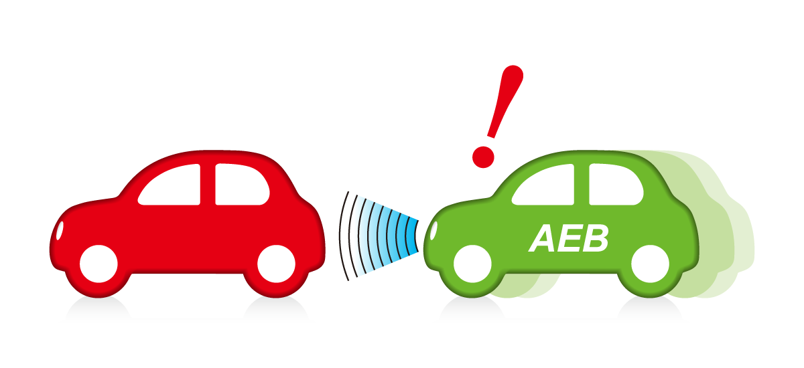

**Hình 1.1: Minh họa bài toán AEB car-to-car trên cao tốc.**

Về mặt thương mại, AEB không còn là một ý tưởng nghiên cứu xa rời thực tế. Nhiều
hãng xe lớn đã đưa AEB vào các gói hỗ trợ lái của mình, ví dụ như Toyota Safety
Sense, Honda Sensing, Mercedes-Benz Active Brake Assist, Volvo City Safety,
Nissan Safety Shield, Tesla Autopilot/Active Safety và các hệ thống tương tự của
Hyundai, Kia, BMW, Audi hoặc Volkswagen. Tên gọi và mức độ can thiệp có thể khác
nhau giữa các hãng, nhưng ý tưởng chung đều là dùng camera, radar hoặc tổ hợp
nhiều cảm biến để phát hiện xe phía trước, người đi bộ hoặc vật cản, sau đó cảnh
báo và phanh nếu người lái không phản ứng kịp. Điều này cho thấy AEB là một chủ
đề có tính ứng dụng cao, phù hợp để nghiên cứu trong đồ án về xe thông minh.

Tầm quan trọng của AEB cũng được thể hiện qua các chương trình đánh giá an toàn
và quy định kỹ thuật. Euro NCAP đưa các công nghệ an toàn chủ động như AEB vào
nhóm đánh giá Safety Assist, còn NHTSA tại Hoa Kỳ đã ban hành quy định yêu cầu
AEB trở thành trang bị tiêu chuẩn trên xe con và xe tải nhẹ trong lộ trình mới.
Nói cách khác, AEB đang chuyển dần từ một tính năng cao cấp thành một chức năng
an toàn cơ bản trên ô tô hiện đại. Vì vậy, việc hiểu nguyên lý hoạt động, xây
dựng pipeline cảm biến-quyết định-điều khiển và đánh giá giới hạn của AEB là một
nội dung có ý nghĩa cả về học thuật lẫn thực tiễn.

Trong bài toán car-to-car trên cao tốc, AEB phải giải quyết nhiều vấn đề liên
tiếp. Trước hết, hệ thống cần nhận biết có xe phía trước hay không. Tiếp theo,
hệ thống phải xác định xe đó có nằm trên đường đi dự kiến của ego hay chỉ là xe
ở làn bên, lan can, biển báo hoặc nhiễu từ môi trường. Sau đó, hệ thống cần ước
lượng khoảng cách, vận tốc tương đối, thời gian tới va chạm TTC và khoảng cách
dừng cần thiết. Cuối cùng, bộ điều khiển phải quyết định cảnh báo, phanh nhẹ,
phanh mạnh hay phanh khẩn cấp. Nếu phanh quá muộn, va chạm vẫn xảy ra; nếu phanh
quá nhạy, xe có thể phanh nhầm trong tình huống không nguy hiểm. Đây chính là
điểm khiến AEB trở thành một bài toán kỹ thuật thú vị: không chỉ cần nhận diện
đúng đối tượng, mà còn cần đánh giá đúng rủi ro và điều khiển phanh hợp lý.

Thử nghiệm AEB trực tiếp trên xe thật có nhiều rào cản. Một bài thử nghiêm túc
cần xe thử, bãi thử, mục tiêu giả có khả năng va chạm an toàn, thiết bị đo, quy
trình đảm bảo an toàn và nhân lực vận hành. Các thử nghiệm ở tốc độ cao hoặc cố
tình tạo tình huống gần va chạm cũng tiềm ẩn rủi ro lớn. Ngoài ra, để so sánh
các thuật toán, cần lặp lại cùng một kịch bản nhiều lần với điều kiện ban đầu
gần như giống nhau, điều này không dễ thực hiện ngoài đời. Vì vậy, mô phỏng là
bước phù hợp để nghiên cứu ban đầu: có thể tạo nhiều tình huống, thay đổi tham
số có kiểm soát, ghi lại dữ liệu chi tiết và tìm giới hạn hệ thống trước khi
nghĩ tới thử nghiệm thực tế.

## 1.2. Giới Thiệu Về CARLA

CARLA là một môi trường mô phỏng mã nguồn mở được phát triển cho nghiên cứu xe
tự hành và ADAS. Dự án CARLA được khởi nguồn từ Computer Vision Center (CVC) tại
Universitat Autònoma de Barcelona, với mục tiêu cung cấp một nền tảng mở cho
phát triển, huấn luyện và đánh giá hệ thống lái tự động. CARLA cho phép tạo thế
giới giao thông, sinh xe ego và xe mục tiêu, gắn cảm biến như camera/radar/LiDAR,
điều khiển actor, thiết lập bản đồ, thay đổi điều kiện môi trường, thu dữ liệu,
ghi log và tạo nhãn chuẩn từ simulator. Những khả năng này phù hợp với mục tiêu
của đồ án vì hệ thống cần vừa có cảm biến mô phỏng, vừa có kịch bản kiểm thử,
vừa có dữ liệu để huấn luyện YOLO và đánh giá thuật toán phanh.


**Hình 1.2: Logo CARLA.**

CARLA được sử dụng rộng rãi trong cộng đồng nghiên cứu xe tự hành vì mã nguồn mở,
có Python API, có hệ sinh thái đi kèm như ScenarioRunner, ROS bridge, leaderboard
và nhiều ví dụ cảm biến/điều khiển. Với đồ án sinh viên, CARLA có ưu điểm quan
trọng là có thể chạy cục bộ, quan sát trực tiếp bằng giao diện đồ họa, tự viết
kịch bản và truy cập dữ liệu cảm biến mà không cần bãi thử thật. Đây là lý do
CARLA thường được dùng để thử nghiệm các thuật toán nhận thức môi trường, lập kế
hoạch chuyển động, điều khiển xe, thu dữ liệu huấn luyện và đánh giá ADAS.

Trong đồ án này, CARLA 0.9.11 được chọn vì đây là phiên bản đang được cài đặt và
vận hành ổn định trong môi trường thực nghiệm, tương thích với PythonAPI, ví dụ
`manual_control.py` và hệ sinh thái script hiện có. Việc sử dụng một phiên bản
ổn định giúp tập trung vào bài toán AEB thay vì mất thời gian xử lý khác biệt
API giữa các phiên bản CARLA mới hơn. Đồ án không đặt mục tiêu so sánh các phiên
bản simulator, mà tập trung xây dựng một pipeline AEB có thể quan sát, kiểm thử
và đánh giá được trong phạm vi mô phỏng.

Ở thời điểm thực hiện báo cáo, CARLA có các nhánh phát triển mới hơn, trong đó
nhánh 0.9.x vẫn được sử dụng cho các nghiên cứu dựa trên Unreal Engine 4; tài
liệu tải về chính thức hiện liệt kê 0.9.16 là bản phát hành mới của nhánh này.
Bên cạnh đó, CARLA 0.10.0 đã chuyển sang Unreal Engine 5.5 với chất lượng hình
ảnh và tài sản mô phỏng mới hơn. Tuy nhiên, việc nâng phiên bản simulator có thể
kéo theo thay đổi Python API, phiên bản Python, Unreal Engine, asset và cách
build/chạy server. Vì vậy, với đồ án này, chọn CARLA 0.9.11 là lựa chọn thực tế:
đủ chức năng camera/radar/vehicle control, chạy được trên máy hiện có và phù hợp
với mục tiêu xây dựng thuật toán AEB thay vì nghiên cứu hạ tầng simulator.

**Bảng 1.1: Lý do lựa chọn CARLA 0.9.11 cho đồ án.**

| Tiêu chí | Nhận xét |
|---|---|
| Tính ổn định | Đã cài đặt và chạy ổn định trên máy thực nghiệm |
| Tương thích code mẫu | Phù hợp với `PythonAPI/examples/manual_control.py`, nền tảng giao diện ban đầu của đồ án |
| Hỗ trợ cảm biến | Có camera RGB, radar, collision sensor và actor control |
| Đồng bộ mô phỏng | Có thể chạy bước thời gian cố định để ghi log và đánh giá kịch bản |
| Chi phí triển khai | Không cần build lại CARLA/Unreal Engine, tiết kiệm thời gian cho đồ án |
| Giới hạn | Không phải phiên bản mới nhất; chất lượng đồ họa và API không bằng các bản mới |

## 1.3. Mục Tiêu, Phạm Vi Và Giả Thiết

Mục tiêu tổng quát của đồ án là xây dựng một hệ thống AEB ở mức mô phỏng có đầy
đủ các khối chính của một pipeline ADAS: cảm biến, nhận thức môi trường, hợp
nhất dữ liệu, đánh giá rủi ro, điều khiển phanh và đánh giá kết quả. Hệ thống
không chỉ dừng ở việc viết một đoạn code phanh khi gặp vật cản, mà hướng tới một
quy trình có thể quan sát, kiểm thử, ghi log, so sánh và giải thích được.

Các mục tiêu cụ thể gồm:

- cấu hình xe ego Tesla Model 3;
- gắn camera sau kính lái và radar ở mũi xe;
- xử lý radar từ các điểm đo rời rạc thành mục tiêu ở mức đối tượng;
- dùng YOLO để nhận diện xe trong ảnh camera;
- kết hợp dữ liệu camera-radar để xác nhận mục tiêu nguy hiểm;
- tính TTC, khoảng cách dừng và quyết định mức rủi ro;
- điều khiển phanh bằng nhiều chế độ, trong đó staged PID là phương án chính;
- xây dựng kịch bản kiểm thử, nhật ký dữ liệu, biểu đồ và video minh họa;
- xác định dải hoạt động tốt và các giới hạn của hệ thống.

Về mặt học thuật, đồ án tập trung vào việc hiểu và triển khai các khái niệm cốt
lõi của AEB như TTC, khoảng cách dừng, xử lý nhiễu radar, chọn mục tiêu phía
trước, hợp nhất camera-radar và điều khiển phanh nhiều tầng. Về mặt kỹ thuật,
đồ án cần tạo ra một dự án có cấu trúc rõ ràng để có thể tiếp tục mở rộng sang
thu dữ liệu, huấn luyện mô hình, đánh giá nhiều kịch bản và cải tiến thuật toán
phanh trong tương lai.

Đồ án tập trung vào bài toán nhỏ nhưng rõ ràng: AEB cho tình huống car-to-car
trên cao tốc trong môi trường lý tưởng.

**Bảng 1.2: Phạm vi và giả thiết của đồ án.**

| Thành phần | Phạm vi hiện tại |
|---|---|
| Simulator | CARLA 0.9.11 |
| Map chính | Town04, môi trường cao tốc |
| Ego vehicle | `vehicle.tesla.model3` |
| Đối tượng xét | Ô tô phía trước ego |
| Tình huống chính | Clear road, xe trước đứng yên, xe trước chạy chậm, xe trước phanh gấp, xe cắt làn |
| Thời tiết | Lý tưởng, chưa xét mưa/sương mù/đêm tối |
| Cảm biến | 1 camera RGB, 1 radar phía trước; trạng thái ego/IMU dùng làm cảm biến phụ |
| Dải vận tốc ưu tiên | 50-80 km/h |
| Mục tiêu mở rộng | Sweep đến 100-110 km/h để tìm giới hạn |

Phạm vi này phù hợp với một đồ án mô phỏng: đủ để thể hiện quy trình xử lý ADAS/AEB
từ cảm biến đến điều khiển, nhưng vẫn kiểm soát được số biến gây nhiễu.

Việc giới hạn bài toán vào car-to-car trên cao tốc là có chủ đích. Nếu mở rộng
ngay sang người đi bộ, xe máy, đường đô thị, giao lộ, thời tiết xấu hoặc ánh sáng
ban đêm, số biến cần xử lý sẽ tăng rất nhanh và khó đánh giá nguyên nhân sai
lệch. Với bài toán hiện tại, hệ thống có thể tập trung vào các vấn đề nền tảng:
radar có chọn đúng xe phía trước không, camera có xác nhận đúng xe không, fusion
có ghép đúng mục tiêu không, TTC/khoảng cách dừng có phản ánh đúng rủi ro không
và bộ phanh có can thiệp hợp lý trong dải vận tốc mong muốn hay không.

Một điểm quan trọng khác là đồ án không đặt mục tiêu chứng minh hệ thống đạt mức
an toàn của xe thương mại. Các thử nghiệm trong CARLA chỉ giúp đánh giá thuật
toán trong môi trường mô phỏng, với giả thiết cảm biến, mô hình động học và điều
kiện đường tương đối lý tưởng. Do đó, kết quả cần được hiểu như bằng chứng kỹ
thuật trong phạm vi đồ án, không thay thế kiểm thử thực tế hoặc chứng nhận an
toàn chính thức.

## 1.4. Nguồn Tham Khảo Và Hướng Tiếp Cận

Đồ án không sao chép trực tiếp thuật toán của một kho mã nguồn nào, nhưng tham khảo tư
duy thiết kế từ các hệ thống ADAS/tự hành như Autoware, openpilot, Apollo và
CARLA examples. Điểm chung của các hệ thống này là không quyết định phanh trực
tiếp từ một phát hiện đơn lẻ. Dữ liệu cảm biến thường đi qua các tầng trung gian:

```text
phát hiện -> gom cụm/theo dõi/đối tượng -> dự đoán rủi ro -> điều khiển
```

**Bảng 1.3: Các nguồn tham khảo chính cho hướng thiết kế AEB.**

| Nguồn | Ý tưởng chính | Cách áp dụng trong đồ án |
|---|---|---|
| Autoware | Xét vật cản nằm trên đường đi dự kiến, dùng khoảng cách dừng | Dùng hành lang dự kiến thay vì toàn bộ quạt radar |
| openpilot | Theo dõi radar kết hợp với đối tượng dẫn đường từ camera | Theo dõi radar và dùng camera để xác nhận mục tiêu |
| Apollo | Nhận thức môi trường và hợp nhất dữ liệu ở mức đối tượng | Chuẩn hóa `RadarObject`/`FusedTarget` trước khi ra quyết định |
| CARLA examples | Điều khiển thủ công, cảm biến, điều khiển actor | Mở rộng giao diện điều khiển thủ công và kịch bản trong CARLA |

Autoware là một nền tảng phần mềm mã nguồn mở cho xe tự hành, trong đó nhiều
module an toàn không chỉ xét vật thể gần nhất mà xét vật thể có nằm trên đường
đi dự kiến của ego hay không. Đây là ý tưởng quan trọng đối với AEB, vì radar
phía trước có thể thấy cả lan can, xe làn bên hoặc vật thể ngoài quỹ đạo. Nếu chỉ
tính TTC từ mọi điểm radar, hệ thống sẽ dễ phanh nhầm. Vì vậy, đồ án học theo
tư duy "chỉ xét vật thể liên quan tới đường đi dự kiến".

openpilot và Apollo đại diện cho hướng hệ thống thực tế hơn: dữ liệu cảm biến
được đưa về các đối tượng có trạng thái, được theo dõi theo thời gian và sau đó
mới dùng cho lập kế hoạch/điều khiển. Điều này dẫn tới quyết định thiết kế của
đồ án: radar không chỉ là tập điểm rời rạc, YOLO không chỉ là các bounding box
độc lập, mà cả hai cần được đưa về mức `RadarObject` và `FusedTarget` trước khi
ra quyết định phanh.

CARLA examples, đặc biệt là `manual_control.py`, được dùng như nền tảng giao
diện và điều khiển ban đầu. Cách làm này giúp giữ nguyên cảm giác điều khiển xe
trong CARLA, sau đó mở rộng thêm màn hình camera, radar bird-eye, YOLO/fusion,
kịch bản tự động, log và video. Nhờ vậy, dự án vừa có thể minh họa trực quan,
vừa có thể chạy kiểm thử định lượng.

Từ đó, hướng làm của đồ án là:

1. Làm radar-only ổn định trước.
2. Chuyển điểm đo radar thành danh sách đối tượng.
3. Huấn luyện YOLO cho môi trường CARLA.
4. Dùng hợp nhất dữ liệu để xác nhận mục tiêu.
5. Điều khiển phanh theo nhiều tầng thay vì chỉ phanh nhị phân.

## 1.5. Liên Hệ Với Tiêu Chuẩn Đánh Giá NCAP

NCAP (New Car Assessment Programme) là nhóm các chương trình đánh giá an toàn
xe mới, trong đó Euro NCAP là một trong những hệ thống có ảnh hưởng lớn tại châu
Âu và được tham khảo rộng rãi trên thế giới. Khác với các yêu cầu pháp lý tối
thiểu, NCAP thường đưa ra các bài đánh giá bổ sung để so sánh mức độ an toàn giữa
các mẫu xe, bao gồm cả an toàn bị động và an toàn chủ động. Vì vậy, điểm số NCAP
có ảnh hưởng lớn tới hình ảnh thương mại của xe và thúc đẩy các hãng trang bị
nhiều công nghệ ADAS hơn [10].

Trong Euro NCAP, AEB thuộc nhóm Safety Assist và được đánh giá bằng các tình
huống có kiểm soát. Mục tiêu của các bài thử không chỉ là xem xe có phanh hay
không, mà còn xem hệ thống có tránh được va chạm hoặc giảm tốc độ va chạm trong
các điều kiện vận tốc/khoảng cách khác nhau hay không. Điều này rất phù hợp với
tư duy đánh giá trong đồ án: không chỉ chạy một vài minh họa trực quan, mà cần
chạy nhiều kịch bản để tìm dải hoạt động tốt và giới hạn hệ thống [10], [11].

Các kịch bản kiểm thử trong đồ án được xây dựng dựa trên tinh thần của các bài
đánh giá AEB car-to-car trong NCAP, đặc biệt là nhóm tình huống xe ego tiến tới
xe mục tiêu phía trước [11]. Các nhóm được học theo gồm:

- CCRs: xe mục tiêu phía trước đứng yên.
- CCRm: xe mục tiêu phía trước chạy chậm hơn.
- CCRb: xe mục tiêu phía trước đang chạy rồi phanh.

Đồ án không tuyên bố bộ kiểm thử là bài chứng nhận NCAP chính thức. Thay vào đó,
NCAP được sử dụng như một nguồn tham khảo để chia nhóm tình huống, chọn dải vận
tốc/khoảng cách và đánh giá có/không va chạm. Các tình huống xe cắt làn vào trước
ego, xe ở làn bên cạnh, nhiều xe xuất hiện đồng thời và đường cong được bổ sung
để tìm giới hạn của thuật toán trong môi trường mô phỏng CARLA.

**Bảng 1.4: Liên hệ giữa nhóm kiểm thử của đồ án và nhóm tình huống NCAP.**

| Nhóm trong đồ án | Ý nghĩa | Mức liên hệ với NCAP |
|---|---|---|
| `ccrs` | Ego tiến tới xe phía trước đứng yên | Học theo nhóm CCRs của AEB car-to-car |
| `ccrm` | Ego tiến tới xe phía trước chạy chậm hơn | Học theo nhóm CCRm |
| `ccrb` | Xe phía trước đang chạy rồi phanh gấp | Học theo nhóm CCRb |
| `cut_in` | Xe làn bên nhập làn trước ego | Bổ sung để tìm giới hạn hệ thống, không coi là bài NCAP chính thức |
| `clear_road`, `adjacent_vehicle`, `curve_cases` | Kiểm tra phanh nhầm và chọn sai mục tiêu | Bổ sung để kiểm tra độ ổn định thuật toán |

Tóm lại, Chương 1 xác định bài toán của đồ án là xây dựng và đánh giá một hệ
thống AEB mô phỏng trong phạm vi car-to-car trên cao tốc. Trên cơ sở đó, Chương
2 trình bày môi trường mô phỏng, cấu hình máy, xe ego và cảm biến được sử dụng
để triển khai các thuật toán ở các chương sau.

# Chương 2. Thiết Lập Môi Trường Mô Phỏng

Chương này trình bày môi trường mô phỏng dùng trong đồ án, cơ sở lựa chọn cảm
biến và cách thiết lập xe ego, camera, radar trong CARLA. Mục tiêu của chương
không phải mô tả thuật toán AEB chi tiết, mà làm rõ hệ thống được đặt trong môi
trường nào, dữ liệu đầu vào đến từ đâu và các giả thiết mô phỏng được cấu hình
như thế nào. Các thuật toán xử lý radar, camera, hợp nhất dữ liệu, TTC và điều
khiển phanh được trình bày ở Chương 3.

## 2.1. Thiết Lập Môi Trường

CARLA là nền tảng mô phỏng mã nguồn mở phục vụ nghiên cứu xe tự hành và ADAS.
CARLA cung cấp môi trường 3D, bản đồ đô thị/cao tốc, phương tiện, người đi bộ,
đèn giao thông, cảm biến mô phỏng và API Python để điều khiển kịch bản. Đối với
đồ án này, CARLA cho phép kiểm thử AEB trong các tình huống nguy hiểm mà không
cần thử nghiệm trên xe thật.

Phiên bản được sử dụng là CARLA 0.9.11. Lý do chọn phiên bản này gồm:

- tương thích với môi trường Python 3.7 và các ví dụ mẫu của CARLA đang dùng;
- có sẵn `manual_control.py`, đây là nền tảng để mở rộng giao diện quan sát;
- hỗ trợ camera RGB, radar, collision sensor và API điều khiển actor;
- đủ ổn định cho mục tiêu mô phỏng car-to-car trên cao tốc.

Đồ án tập trung vào bản đồ Town04 vì bản đồ này có các đoạn đường rộng, nhiều
làn và phù hợp với bài toán cao tốc. Xe ego được chọn là Tesla Model 3
(`vehicle.tesla.model3`) để thống nhất cấu hình phương tiện trong toàn bộ dự án.

**Bảng 2.1: Cấu hình máy và môi trường thực nghiệm.**

| Thành phần | Cấu hình |
|---|---|
| OS | Ubuntu 22.04.5 LTS |
| CPU | Intel Core i5-11400H, 6 nhân 12 luồng |
| RAM | 16 GiB |
| GPU | NVIDIA GeForce RTX 3050 Laptop GPU, 4 GiB VRAM |
| NVIDIA driver | 580.159.04 |
| CARLA | 0.9.11 |
| Python CARLA | Python 3.7.17 |
| Python YOLO | Python 3.10 trong `.venv_yolo310` |

Dự án được đặt trực tiếp trong thư mục gốc CARLA:

```text
/home/mvhoang/CARLA_0.9.11/
├── CarlaUE4.sh
├── PythonAPI/
├── venv/
└── aeb/
```

Lệnh chạy CARLA ổn định trên máy hiện tại:

```bash
cd /home/mvhoang/CARLA_0.9.11
__NV_PRIME_RENDER_OFFLOAD=1 __GLX_VENDOR_LIBRARY_NAME=nvidia ./CarlaUE4.sh -quality-level=Low
```

Không dùng cờ `-opengl` vì trong quá trình phát triển từng gây lỗi render với
Pygame/manual control. Việc đặt thư mục `aeb/` trong thư mục CARLA giúp dự án
dễ truy cập PythonAPI, ví dụ mẫu, virtual environment và file thực thi của
CARLA. Khi đưa lên GitHub, chỉ thư mục `aeb/` được quản lý như một dự án riêng;
dataset, video, log lớn và model archive được loại khỏi Git bằng `.gitignore`.

## 2.2. Cấu Hình Xe Và Cảm Biến

AEB thực tế thường dùng kết hợp nhiều cảm biến. Camera mạnh về nhận dạng hình
dạng, làn đường và lớp đối tượng; radar mạnh về khoảng cách và vận tốc tương
đối; LiDAR cho hình học 3D chính xác nhưng chi phí cao; ultrasonic phù hợp
khoảng cách gần; IMU/wheel speed giúp xác định trạng thái chuyển động của ego.

Không có cảm biến nào hoàn hảo trong mọi điều kiện. Camera phụ thuộc vào ánh
sáng và không đo trực tiếp vận tốc tương đối. Radar ít phụ thuộc ánh sáng, đo
tốt khoảng cách/vận tốc, nhưng đầu ra thưa và khó phân loại hình dạng. Vì vậy,
nhiều hệ thống AEB thực tế dùng camera-radar fusion: radar cung cấp đại lượng
động học, camera xác nhận ngữ nghĩa của đối tượng.

**Bảng 2.2: So sánh các cảm biến thường dùng trong ADAS/AEB.**

| Cảm biến | Đầu ra chính | Ưu điểm | Hạn chế |
|---|---|---|---|
| Camera | Ảnh RGB, lớp đối tượng, bounding box | Nhận dạng đối tượng tốt, giàu thông tin ngữ cảnh | Nhạy với ánh sáng, không đo trực tiếp vận tốc tương đối |
| Radar | Range, relative velocity, angle | Đo khoảng cách/vận tốc tốt, phù hợp car-to-car | Point thưa, khó phân loại hình dạng |
| LiDAR | Point cloud 3D | Hình học chính xác | Giá thành cao, dữ liệu nặng |
| Ultrasonic | Khoảng cách gần | Rẻ, tốt cho parking | Tầm rất ngắn |
| IMU/wheel speed | Vận tốc, gia tốc, yaw rate | Hỗ trợ dự đoán quỹ đạo ego | Không tự phát hiện vật thể |

Ngoài đặc tính kỹ thuật riêng của từng cảm biến, cấu hình cảm biến trong đồ án
cũng được chọn dựa trên cách các hệ thống ADAS/AEB thương mại thường được triển
khai. Các hãng xe không luôn công bố đầy đủ thông số nội bộ của cảm biến, nhưng
tài liệu người dùng và tài liệu giới thiệu hệ thống cho thấy một số hướng cấu
hình phổ biến như sau.

**Bảng 2.3: Một số cấu hình cảm biến tham khảo từ hệ thống ADAS/AEB thương mại.**

| Hệ thống tham khảo | Cấu hình cảm biến được công bố ở mức khái niệm | Nhận xét cho đồ án |
|---|---|---|
| Toyota Safety Sense / Pre-Collision System | Camera phía trước kết hợp radar hoặc laser/radar tùy thế hệ [15] | Củng cố hướng dùng camera để nhận dạng và radar để hỗ trợ phát hiện va chạm phía trước |
| Honda Sensing / CMBS | Radar transmitter kết hợp forward-facing camera; radar đặt phía trước, camera đặt sau kính lái [16] | Gần với cấu hình mô phỏng của đồ án: camera sau kính lái và radar ở mũi xe |
| Subaru EyeSight | Hướng camera stereo, hỗ trợ cảnh báo và phanh trước va chạm [17] | Cho thấy camera có thể đảm nhiệm nhiều chức năng ADAS, nhưng việc đo động học chỉ bằng camera khó hơn radar |
| Mobileye Base ADAS | Một camera phía trước có thể hỗ trợ nhiều chức năng ADAS, gồm AEB [18] | Cho thấy camera-only là một hướng khả thi, nhưng trong đồ án vẫn dùng thêm radar để có khoảng cách/vận tốc trực tiếp |

Ở mức thông số, các cảm biến thương mại có thể có tầm đo và góc nhìn lớn hơn
đáng kể so với cấu hình mô phỏng của đồ án. Tuy nhiên, đồ án không đặt mục tiêu
mô phỏng đầy đủ phần cứng ADAS thương mại, mà cần một cấu hình đủ đại diện cho
bài toán cao tốc car-to-car, chạy ổn định trên máy cá nhân và giảm phanh nhầm
từ làn bên. Vì vậy, thông số cảm biến trong CARLA được chọn theo hướng tối giản
có kiểm soát.

**Bảng 2.4: So sánh thông số cảm biến tham khảo và cấu hình trong đồ án.**

| Nhóm cảm biến | Thông số tham khảo công bố công khai | Cấu hình trong đồ án | Lý do lựa chọn trong đồ án |
|---|---|---|---|
| Camera ADAS trước | ZF Smart Camera 4.8 dùng cảm biến 1,7 MP và FOV ngang tới 100 độ [19] | Camera RGB 1280x720, FOV 70 độ, 20 FPS | FOV 70 độ đủ bao phủ làn ego và vùng trước xe; giảm tải render/suy luận YOLO so với FOV rất rộng |
| Camera-first ADAS | Mobileye Base Driver Assist dùng một camera trước cho các chức năng ADAS cơ bản [18] | Một camera trước làm nguồn xác nhận `car` cho fusion | Giữ pipeline đơn giản: camera xác nhận mục tiêu, radar đo khoảng cách/vận tốc |
| Radar trước tầm trung | Bosch radar sensor công bố khoảng đo 0,23-160 m, FOV ngang ±75 độ và dọc ±15 độ [20] | Radar range 100 m, FOV ngang 30 độ, dọc 6 độ, 20 FPS | Tầm 100 m đủ cho dải mục tiêu 50-80 km/h; FOV hẹp tập trung vào làn trước để giảm nhiễu từ làn bên/lan can |
| Radar trước tầm xa | Continental long-range radar thế hệ mới có thể đạt tới 300 m và góc mở ±60 độ tùy cấu hình [21] | Không dùng radar tầm xa 300 m; giữ 100 m trong CARLA | Radar tầm xa phù hợp hệ thống thương mại/đa tình huống; đồ án chỉ kiểm thử cao tốc lý tưởng, car-to-car, nên ưu tiên ổn định và dễ đánh giá |

Trong phạm vi đồ án, hệ thống sử dụng một camera RGB phía trước, một radar phía
trước và trạng thái ego làm cảm biến phụ. Cấu hình này phù hợp với bài toán
car-to-car trên cao tốc: radar đo khoảng cách/vận tốc của xe phía trước, camera
xác nhận vật thể là ô tô, còn trạng thái ego hỗ trợ dự đoán hành lang di chuyển.
Như vậy, cấu hình của đồ án không cố gắng mô phỏng đầy đủ một xe thương mại cụ
thể, mà chọn cấu hình tối giản nhưng có cơ sở thực tế: một cảm biến thị giác để
nhận dạng mục tiêu, một radar phía trước để đo động học và trạng thái ego để
đánh giá mục tiêu có nằm trên đường đi dự kiến hay không.

Xe ego là Tesla Model 3. Camera được đặt sau kính lái để mô phỏng camera ADAS
phía trước. Radar được đặt ở mũi xe để đo vật thể phía trước. Vị trí cảm biến
được kiểm chứng bằng script `scripts/visualize_sensor_coverage.py`.

Vị trí cảm biến không được chọn tùy ý. Camera cần nằm gần vùng sau kính lái,
cao hơn mặt taplo và hướng về phía trước. Radar cần nằm gần mũi xe và trục giữa
thân xe để vùng quét đối xứng theo phương tiến. Trong quá trình phát triển,
camera/radar đã được kiểm tra bằng hình chiếu cạnh và góc nhìn từ trên xuống để
tránh lỗi radar bị thụt vào xe hoặc camera nhô quá xa khỏi kính lái.

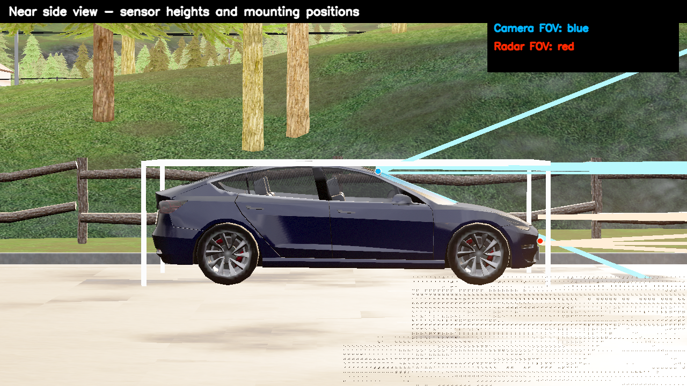

**Hình 2.1: Vị trí camera và radar trên Tesla Model 3 theo góc nhìn cạnh.**

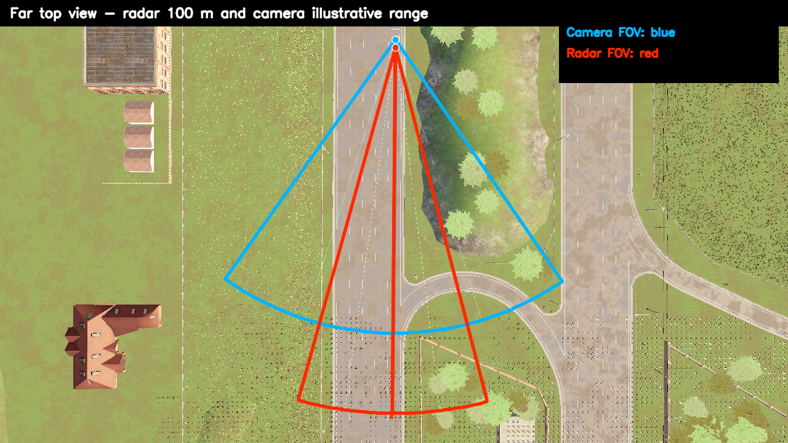

**Hình 2.2: Tầm phủ camera và radar theo góc nhìn từ trên xuống.**

**Bảng 2.5: Cấu hình camera trong đồ án.**

| Thuộc tính | Giá trị |
|---|---|
| Loại | `sensor.camera.rgb` |
| Vị trí | Sau kính lái |
| Transform | `x=0.43`, `y=0.0`, `z=1.35` |
| FOV | 70 độ |
| Độ phân giải | 1280x720 |
| Sensor tick | 0.05 s, tương đương 20 FPS |

**Bảng 2.6: Cấu hình radar trong đồ án.**

| Thuộc tính | Giá trị |
|---|---|
| Loại | `sensor.other.radar` |
| Vị trí | Mũi xe |
| Transform | `x=2.53`, `y=0.0`, `z=0.48` |
| Range | 100 m |
| FOV ngang/dọc | 30 độ / 6 độ |
| Points per second | 2000 |
| Sensor tick | 0.05 s, tương đương 20 FPS |

Khi chạy kiểm thử hàng loạt và ghi nhật ký, dự án ưu tiên synchronous mode với:

```text
fixed_delta_seconds = 0.05
```

Tức phần mô phỏng chạy logic ở 20 Hz. Phần hiển thị Pygame/video có thể chỉ đạt
17-18 FPS khi render nặng, nhưng nhật ký định lượng vẫn dựa trên thời gian mô
phỏng và tick cố định. Vì vậy, đánh giá đạt/không đạt dựa trên log dữ liệu,
không dựa trên độ mượt của video.

Giao diện minh họa cuối cùng gồm ba vùng:

- màn camera + YOLO + hợp nhất dữ liệu ở phía trên trái;
- màn quan sát xe/góc nhìn điều khiển phía dưới trái;
- màn radar bird-eye ở bên phải.

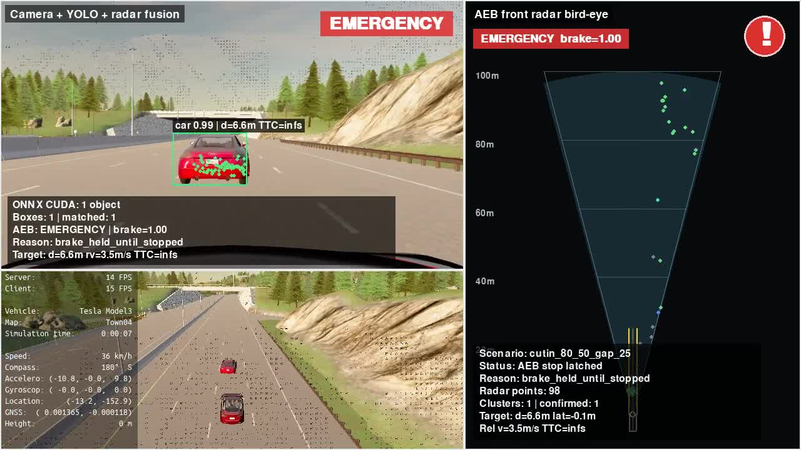

**Hình 2.3: Giao diện minh họa cuối cùng gồm 3 màn hình.**

Giao diện này giúp người xem thấy đồng thời ba lớp thông tin: ảnh camera/YOLO/fusion,
chuyển động xe trong CARLA và phân bố mục tiêu radar theo bird-eye view. Đây là
công cụ quan trọng để kiểm chứng trực quan các quyết định của AEB trước khi đưa
kết quả vào báo cáo.

# Chương 3. Triển Khai Thuật Toán AEB

Chương này trình bày pipeline thuật toán của hệ thống AEB: xử lý radar, xử lý
camera bằng YOLO, hợp nhất dữ liệu, chọn mục tiêu, tính TTC/khoảng cách dừng,
đánh giá mức nguy hiểm và điều khiển phanh bằng thuật toán PID. Phần thu dữ liệu v7 same-lane, huấn luyện và
đánh giá mô hình YOLO cũng được đưa vào chương này vì đây là một phần của thuật
toán nhận thức camera.

## 3.1. Quy Trình Phát Triển Và Lựa Chọn Phương Án Cuối

Hệ thống AEB trong đồ án không được xây dựng ngay từ phiên bản cuối cùng, mà
được phát triển theo từng bước để kiểm chứng từng khối chức năng. Cách làm này
giúp phát hiện lỗi sớm: trước khi đánh giá thuật toán phanh, cần chắc chắn giao
diện quan sát đúng; trước khi dùng fusion, cần kiểm tra radar và camera riêng;
trước khi dùng PID, cần có baseline phanh đơn giản để so sánh.

**Bảng 3.1: Quy trình phát triển hệ thống AEB trong đồ án.**

| Giai đoạn | Mục tiêu | Kết quả/Rút kinh nghiệm |
|---|---|---|
| Mở rộng `manual_control.py` | Giữ giao diện lái/quan sát gốc của CARLA, thêm cửa sổ phụ cho camera/radar | Tạo nền tảng debug trực quan, tránh mất khả năng quan sát như ví dụ gốc |
| Gắn camera và radar lên Tesla Model 3 | Kiểm tra vị trí camera sau kính lái và radar ở mũi xe | Phát hiện và chỉnh nhiều lần vị trí cảm biến bằng side view/top-down view |
| Chạy YOLO26n ban đầu | Kiểm tra khả năng nhận diện xe từ camera trước khi huấn luyện riêng | YOLO pretrained chạy được nhưng chưa tối ưu cho góc nhìn, môi trường và dữ liệu CARLA của dự án |
| Radar-only AEB | Xây dựng baseline chỉ dùng radar để tính mục tiêu, TTC và phanh | Phát hiện vấn đề phanh nhầm do điểm radar từ mặt đường, lan can, xe làn bên |
| Xử lý radar object-level | Lọc điểm, gom cụm, theo dõi và chọn target ổn định | Giảm nhiễu radar, chuyển từ điểm đo rời rạc sang danh sách đối tượng |
| Thu bộ dữ liệu v7 và fine-tune YOLO26n | Tạo mô hình nhận diện `car` phù hợp với camera của dự án | YOLO sau fine-tuning dùng để xác nhận mục tiêu trong fusion |
| Fusion camera-radar | Ghép radar object với bounding box camera bằng chiếu hình học | Radar giữ vai trò đo khoảng cách/vận tốc, camera xác nhận mục tiêu là xe |
| Binary brake | Có nguy hiểm thì phanh 1.0 | Dễ kiểm chứng nhưng phanh gắt, chưa giống hành vi thực tế |
| PID v1/v2 | Điều khiển lực phanh liên tục theo sai số khoảng cách | Êm hơn binary nhưng cần tầng trạng thái để kiểm soát rủi ro và nhả phanh hợp lý |
| Staged PID cuối cùng | Kết hợp mức rủi ro SAFE/WARNING/SOFT/HARD/EMERGENCY với PID | Phương án chính dùng trong kiểm thử cuối cùng |

Qua các bước trên, thuật toán cuối cùng được chốt theo hướng: radar là nguồn đo
động học chính, camera/YOLO xác nhận mục tiêu, quỹ đạo ego dùng để loại vật thể
ngoài đường đi, TTC/khoảng cách dừng dùng để đánh giá nguy hiểm và staged PID
điều khiển lực phanh. Các bản phanh trước đó vẫn được giữ trong dự án để làm
mốc so sánh khi đánh giá. Các mục tiếp theo của chương này tập trung mô tả bản
thuật toán cuối cùng.

## 3.2. Kiến Trúc Thuật Toán Tổng Thể

Về bản chất, AEB là một hệ thống điều khiển an toàn theo vòng kín: cảm biến quan
sát môi trường, thuật toán nhận thức xác định mục tiêu, khối đánh giá rủi ro
tính khả năng va chạm, bộ điều khiển tạo lệnh phanh, sau đó trạng thái xe thay
đổi và hệ thống tiếp tục cập nhật ở chu kỳ tiếp theo.

Một hệ thống AEB cần trả lời ba câu hỏi chính:

1. Ego đang chạy với vận tốc và gia tốc như thế nào?
2. Vật thể phía trước có nằm trên đường đi dự kiến của ego không?
3. Nếu giữ trạng thái hiện tại, còn bao lâu hoặc còn bao nhiêu mét trước khi va
   chạm?

Trong đồ án, pipeline được tổ chức như sau:

```text
CARLA world
  -> ego vehicle + camera + radar
  -> xử lý đối tượng radar
  -> phát hiện xe bằng YOLO
  -> hợp nhất dữ liệu camera-radar
  -> lựa chọn mục tiêu
  -> TTC + stopping distance
  -> AEB state + staged PID
  -> VehicleControl override
  -> nhật ký dữ liệu + biểu đồ + video
```

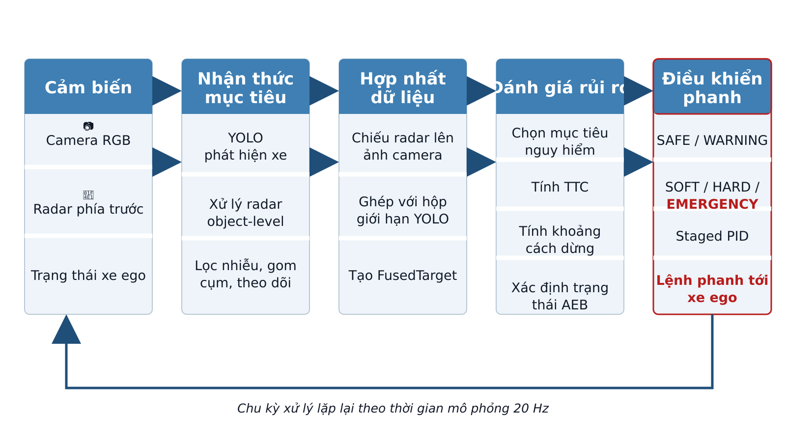

**Hình 3.1: Kiến trúc chức năng của hệ thống AEB.**

**Bảng 3.2: Các module chính trong mã nguồn.**

| Thư mục | Vai trò |
|---|---|
| `configs/` | Cấu hình cảm biến, bộ dữ liệu, mô hình, kịch bản |
| `control/` | Logic phanh, trạng thái AEB, PID/staged PID |
| `core/` | Các quy trình xử lý chính dùng chung |
| `perception/` | Xử lý radar, bộ theo dõi, hợp nhất dữ liệu cảm biến |
| `scripts/` | Thu bộ dữ liệu, huấn luyện, xuất ONNX, chạy kiểm thử hàng loạt, quay video |
| `ui/` | Giao diện camera, radar, hợp nhất dữ liệu, minh họa cuối cùng, launcher |
| `tests/` | Kiểm thử đơn vị cho logic xử lý |

Để thuận tiện cho việc đọc mã nguồn và bảo trì, dự án được tổ chức thành các
thư mục theo vai trò thay vì đặt toàn bộ script ở thư mục gốc. Cây thư mục rút
gọn của dự án như sau:

```text
aeb/
├── configs/                  # cấu hình cảm biến, dataset, model, scenario
│   ├── sensors.yaml           # ego, camera, radar, fusion, phanh
│   ├── model_training.yaml    # tham số train/evaluate/export YOLO
│   ├── dataset_collection*.yaml
│   └── scenarios/
│       ├── car_to_car/        # nhóm tình huống: CCRs, CCRm, CCRb, cut-in...
│       └── suites/            # bộ kiểm thử tổng hợp
├── control/
│   └── brake.py               # trạng thái AEB, TTC, stopping distance, PID
├── core/
│   ├── radar_aeb_pipeline.py  # pipeline radar/AEB dùng chung
│   ├── radar_object.py        # cấu trúc RadarObject
│   ├── target_selector.py     # chọn target AEB
│   └── ground_truth_labels.py # tạo nhãn từ ground truth CARLA
├── perception/
│   └── radar/
│       └── radar_object_tracker.py
├── scripts/
│   ├── collect_yolo_dataset.py
│   ├── check_yolo_dataset.py
│   ├── train_yolo26n.py
│   ├── export_yolo26n_onnx.py
│   ├── run_radar_aeb_scenarios.py
│   ├── run_fusion_aeb_scenarios.py
│   └── record_scenario_videos.py
├── ui/
│   ├── manual_control_common.py
│   ├── camera_view.py
│   ├── radar_view.py
│   ├── radar_aeb_view.py
│   ├── yolo_view.py
│   ├── fusion_view.py
│   └── aeb_demo_view.py
├── tests/
├── docs/
├── report/
└── laucher.py                 # giao diện khởi chạy dự án
```

**Bảng 3.3: Các file mã nguồn và cấu hình chính.**

| File/thư mục | Vai trò |
|---|---|
| `configs/sensors.yaml` | Cấu hình xe ego, camera, radar, fusion, target gate và các tham số phanh |
| `configs/scenarios/car_to_car/*.yaml` | Các nhóm kịch bản car-to-car như đường trống, CCRs, CCRm, CCRb, cut-in, cut-out |
| `configs/scenarios/suites/*.yaml` | Các bộ kiểm thử tổng hợp dùng cho kiểm tra nhanh, kiểm thử hồi quy và bộ minh chứng cuối cùng |
| `core/radar_aeb_pipeline.py` | Ghép các bước radar filtering, predicted path, chọn target và gọi logic phanh |
| `core/radar_object.py` | Định nghĩa object-level radar target dùng trong pipeline |
| `core/target_selector.py` | Chọn mục tiêu AEB từ danh sách radar object |
| `perception/radar/radar_object_tracker.py` | Gom cụm, theo dõi và xác nhận radar object qua nhiều frame |
| `control/brake.py` | Tính TTC/khoảng cách dừng, máy trạng thái AEB, PID và override phanh |
| `scripts/collect_yolo_dataset.py` | Thu dataset YOLO bằng ground truth CARLA |
| `scripts/check_yolo_dataset.py` | Kiểm tra chất lượng bộ dữ liệu trước khi huấn luyện |
| `scripts/train_yolo26n.py` | Huấn luyện YOLO26n cho lớp `car` |
| `scripts/export_yolo26n_onnx.py` | Xuất mô hình sang ONNX để chạy trong pipeline online |
| `scripts/run_*_aeb_scenarios.py` | Chạy hàng loạt scenario, sinh log định lượng và summary |
| `scripts/record_scenario_videos.py` | Ghi video minh họa từ giao diện Pygame |
| `ui/aeb_demo_view.py` | Giao diện minh họa cuối cùng gồm camera/fusion, góc nhìn điều khiển và radar bird-eye |
| `laucher.py` | Giao diện chọn app, scenario, chế độ phanh và lệnh chạy |

Cách tách module này giúp thuật toán chính không bị phụ thuộc quá chặt vào giao
diện. Giao diện chỉ có nhiệm vụ hiển thị dữ liệu và gọi pipeline; thuật toán xử lý radar
nằm trong `core/` và `perception/`; quyết định phanh nằm trong `control/`; còn
script trong `scripts/` dùng để thu dữ liệu, huấn luyện mô hình, chạy kiểm thử hàng loạt
và ghi video.

## 3.3. Xử Lý Dữ Liệu Radar

Radar ô tô thực tế thường là radar FMCW. Radar phát sóng điện từ, nhận tín hiệu
phản xạ từ vật thể, sau đó xử lý để suy ra khoảng cách, vận tốc tương đối và góc
của vật thể. Chuỗi xử lý radar thực tế có thể gồm FFT, phát hiện đỉnh, CFAR,
ước lượng góc, gom cụm, theo dõi và xuất danh sách đối tượng.

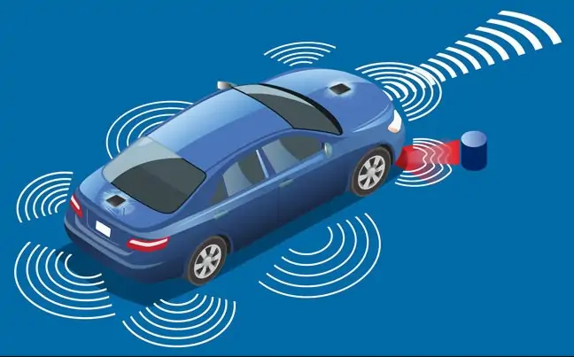

**Hình 3.2: Nguyên lý radar ô tô FMCW ở mức khái niệm.**

CARLA `sensor.other.radar` không trả tín hiệu radar thô như radar thật. Nó trả
các điểm phát hiện đã được mô phỏng sẵn. Mỗi điểm có độ sâu, góc phương vị, góc
cao và vận tốc tương đối. Vì vậy, đồ án bắt đầu từ đầu ra radar mức điểm đo của
CARLA, sau đó xây dựng tầng xử lý gần với object-level radar của xe thật.

Nếu dùng trực tiếp toàn bộ điểm radar để tính TTC, hệ thống dễ phanh nhầm do
radar có thể nhận điểm từ mặt đường, lan can, cây, biển báo hoặc xe ở làn bên.
Do đó, đồ án chuyển từ xử lý ở mức điểm đo sang xử lý ở mức đối tượng:

```text
RadarMeasurement
  -> đổi điểm đo sang hệ tọa độ ego
  -> lọc theo range, độ cao, hành lang dự kiến
  -> gom cụm theo vị trí và vận tốc
  -> theo dõi qua nhiều khung hình
  -> RadarObjectList
  -> chọn mục tiêu AEB
```

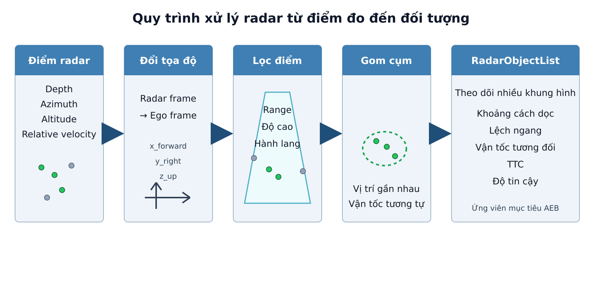

**Hình 3.3: Quy trình xử lý radar từ mức điểm đo đến mức đối tượng.**

### 3.3.1. Đầu Vào Và Hệ Tọa Độ

Một điểm radar sau khi được quy đổi về hệ tọa độ ego có các đại lượng chính:

- `x_forward_m`: khoảng cách theo phương tiến của xe, đơn vị mét;
- `y_right_m`: độ lệch ngang, dương sang phải;
- `z_up_m`: độ cao tương đối;
- `relative_velocity_mps`: vận tốc tương đối theo hướng radar;
- `world_location`: vị trí trong hệ tọa độ thế giới CARLA, dùng khi cần so sánh
  với mặt đường để lọc điểm thấp.

Hệ trục này giúp thuật toán không phụ thuộc trực tiếp vào góc radar ban đầu.
Các bước phía sau chỉ cần làm việc với khoảng cách dọc, lệch ngang, độ cao và
vận tốc tương đối. Phần xử lý chính nằm trong các file:

- `core/radar_aeb_pipeline.py`: lọc điểm radar, cập nhật quỹ đạo dự đoán, gọi
  gom cụm và chọn target;
- `perception/radar/radar_object_tracker.py`: gom cụm điểm radar và theo dõi
  qua nhiều frame;
- `core/radar_object.py`: chuyển cluster thành `RadarObject`;
- `core/target_selector.py`: chọn target radar cho AEB.

### 3.3.2. Các Hằng Số Và Ngưỡng Xử Lý Radar

Các hằng số chính được đọc từ `configs/sensors.yaml`. Bảng dưới đây ghi lại các
tham số quan trọng nhất trong bản cuối của đồ án.

**Bảng 3.4: Các hằng số chính trong xử lý dữ liệu radar.**

| Nhóm | Tham số | Giá trị | Ý nghĩa |
|---|---|---:|---|
| Radar sensor | `range` | 100 m | Giới hạn xa nhất của radar CARLA |
| Radar sensor | `horizontal_fov` | 30 độ | Góc quét ngang, tập trung vào vùng trước xe |
| Radar sensor | `vertical_fov` | 6 độ | Góc quét dọc, giảm điểm không cần thiết theo phương cao |
| Radar sensor | `points_per_second` | 2000 | Mật độ điểm radar mô phỏng |
| Radar sensor | `sensor_tick` | 0.05 s | Chu kỳ radar, tương đương 20 Hz |
| Lọc vùng quan tâm | `min_radar_forward_distance_m` | 0.5 m | Bỏ điểm quá gần mũi xe |
| Lọc độ cao | `min_radar_z_up_m` / `max_radar_z_up_m` | -0.35 / 2.5 m | Giới hạn độ cao điểm dùng cho AEB |
| Lọc mặt đường | `min_height_above_road_m` | 0.20 m | Điểm thấp hơn ngưỡng này so với mặt đường bị coi là mặt đường |
| Hành lang AEB | `max_lateral_offset_m` | 1.25 m | Giới hạn lệch ngang quanh quỹ đạo dự đoán |
| Gom cụm | `tolerance_m` | 1.0 m | Khoảng cách phẳng tối đa để hai điểm thuộc cùng cụm |
| Gom cụm | `velocity_tolerance_mps` | 2.0 m/s | Chênh vận tốc tối đa trong cùng cụm |
| Gom cụm | `vertical_tolerance_m` | 1.5 m | Chênh độ cao tối đa trong cùng cụm |
| Gom cụm | `min_points` | 2 | Cụm phải có ít nhất 2 điểm radar |
| Tracking | `confirm_frames` | 3 frame | Cụm phải xuất hiện đủ 3 frame để được xác nhận |
| Tracking | `release_frames` | 4 frame | Mất dấu 4 frame thì xóa track |
| Tracking | `match_distance_m` | 2.5 m | Khoảng cách tối đa để match measurement với track cũ |
| Tracking | `match_velocity_mps` | 3.0 m/s | Chênh vận tốc tối đa để match track |
| Target gate | `selected_confirm_frames` | 5 frame | Target được chọn phải ổn định đủ 5 frame, trừ trường hợp khẩn cấp |

### 3.3.3. Lọc Điểm Radar

Hàm chính dùng để quyết định một điểm radar có được đưa vào xử lý AEB hay không
là `valid_path_target(point)` trong `core/radar_aeb_pipeline.py`. Một điểm radar
được giữ lại nếu thỏa mãn đồng thời các điều kiện:

$$
x_{forward} \geq x_{min}
$$

$$
x_{forward} \leq R_{radar}
$$

$$
z_{min} \leq z_{up} \leq z_{max}
$$

$$
d_{path}(point) \leq y_{limit}
$$

Trong đó $d_{path}(point)$ là khoảng cách từ điểm radar tới quỹ đạo dự đoán của
ego, còn $y_{limit}$ là giới hạn lệch ngang cho phép. Điều kiện này giúp loại
điểm nằm ngoài hành lang di chuyển của ego.

Ngoài ra, hệ thống lọc điểm mặt đường bằng hàm `is_ground_point(point)`. Nếu có
`world_location`, hệ thống lấy waypoint gần nhất trên map CARLA, tính độ cao
điểm radar so với mặt đường:

$$
h = z_{point} - z_{road}
$$

Nếu $h < 0.20\,m$, điểm đó bị coi là điểm mặt đường và không được dùng để tạo
mục tiêu AEB. Bộ lọc này rất quan trọng vì trong thử nghiệm radar CARLA có thể
trả nhiều điểm thấp ở mặt đường hoặc gần lan can.

### 3.3.4. Gom Cụm Điểm Radar

Sau khi lọc điểm, các điểm còn lại được đưa vào hàm `cluster_radar_points()`.
Thuật toán gom cụm dùng cách duyệt thành phần liên thông: bắt đầu từ một điểm,
tìm các điểm lân cận thỏa mãn điều kiện gần nhau, đưa vào cùng cụm, rồi tiếp tục
mở rộng cụm.

Hai điểm radar $p_i$ và $p_j$ được coi là lân cận nếu:

$$
\sqrt{(x_i-x_j)^2 + (y_i-y_j)^2} \leq d_{tol}
$$

$$
|z_i-z_j| \leq z_{tol}
$$

$$
|v_i-v_j| \leq v_{tol}
$$

Với cấu hình hiện tại: $d_{tol}=1.0\,m$, $z_{tol}=1.5\,m$ và
$v_{tol}=2.0\,m/s$. Cụm chỉ được giữ nếu có ít nhất `min_points=2` điểm và chiều
cao lớn nhất so với mặt đường đủ lớn. Điều này giúp loại các cụm quá nhỏ hoặc
chỉ là phản xạ sát mặt đường.

Một cụm radar được biểu diễn bằng các đại lượng:

- $x$: percentile 20% của các giá trị `x_forward_m`, nhằm lấy phần gần ego hơn
  của cụm thay vì trung bình toàn cụm;
- $y$: median của các giá trị lệch ngang;
- $z$: median của độ cao;
- $v_{rel}$: median của vận tốc tương đối;
- `point_count`: số điểm trong cụm;
- `world_location`: vị trí đại diện của cụm.

Việc dùng median và percentile giúp cụm ít bị ảnh hưởng bởi điểm ngoại lai hơn
so với dùng trung bình đơn giản.

### 3.3.5. Theo Dõi Cụm Qua Nhiều Frame

Sau khi tạo measurement từ cụm điểm, `RadarClusterTracker.update()` ghép measurement
mới với các track cũ. Nếu bật prediction, vị trí dọc của track cũ được dự đoán:

$$
\hat{x}_{t} = x_{t-1} + v_{rel}\Delta t
$$

$$
\hat{y}_{t} = y_{t-1}
$$

Trong đó $\Delta t$ bị giới hạn bởi `max_prediction_time_s=0.30s`. Một measurement
mới được ghép với track cũ nếu:

$$
\sqrt{(\hat{x}-x_m)^2 + (\hat{y}-y_m)^2} \leq 2.5\,m
$$

và:

$$
|v_{track}-v_m| \leq 3.0\,m/s
$$

Khi track được match liên tục, `hit_streak` tăng. Track chỉ được coi là
`confirmed=True` khi `hit_streak >= confirm_frames`, tức ít nhất 3 frame. Nếu
track bị mất dấu, `missed_frames` tăng; khi `missed_frames >= release_frames`,
track bị xóa. Nhờ đó, nhiễu radar xuất hiện thoáng qua không lập tức trở thành
target AEB.

### 3.3.6. Tạo RadarObjectList Và Độ Tin Cậy

Mỗi cluster/track được chuyển thành `RadarObject` bằng hàm
`radar_object_from_cluster()`. Đầu ra ở mức object gồm:

- `object_id`: id track;
- `longitudinal_m`: khoảng cách dọc;
- `lateral_m`: lệch ngang;
- `height_m`: độ cao;
- `relative_velocity_mps`: vận tốc tương đối;
- `point_count`: số điểm radar trong cụm;
- `confirmed`, `age_frames`, `hit_streak`, `missed_frames`;
- `confidence`: độ tin cậy nội bộ của dự án;
- `ttc_s`: TTC tính từ khoảng cách dọc và vận tốc tương đối.

CARLA radar không cung cấp trực tiếp các đại lượng như RCS, SNR hoặc xác suất tồn
tại đối tượng như radar thật. Vì vậy, độ tin cậy trong đồ án là một điểm số nội
bộ, không phải confidence vật lý của radar thương mại. Hàm
`cluster_confidence()` tính:

$$
score = 0.4\,score_{points} + 0.4\,score_{hits} + 0.2\,score_{fresh}
$$

Trong đó:

$$
score_{points} = \min(1, \frac{point\_count}{6})
$$

$$
score_{hits} = \min(1, \frac{hit\_streak}{3})
$$

`score_fresh = 1` nếu track không stale, ngược lại bằng 0. Nếu track chưa được
xác nhận, score bị nhân với `0.5`; nếu đã xác nhận, nhân với `1.0`. Điểm số này
giúp biểu diễn mức ổn định của track trong mô phỏng.

### 3.3.7. Chọn Target Radar Cho AEB

Danh sách `RadarObjectList` được đưa vào `select_aeb_target()`. Ở tầng radar-only,
target được chọn theo nguyên tắc:

1. chỉ xét object đã `confirmed=True`;
2. bỏ object stale;
3. ưu tiên object có TTC hữu hạn nhỏ nhất;
4. nếu TTC tương đương hoặc không hữu hạn, ưu tiên object có khoảng cách dọc nhỏ
   hơn.

TTC tại tầng radar được tính bằng:

$$
TTC = \frac{x_{forward}}{-v_{rel}}
$$

với điều kiện $v_{rel}<0$, tức mục tiêu đang tiến lại gần ego. Nếu $v_{rel} \geq 0$,
TTC được coi là vô hạn và object ít được ưu tiên hơn.

Sau bước chọn radar target, hệ thống còn đi qua target gate và fusion ở các tầng
sau. Vì vậy, một object radar được chọn ở bước này chưa chắc đã lập tức gây
phanh; nó còn phải nằm trong hành lang dự đoán, đủ ổn định qua nhiều frame, và
trong bản fusion cuối cùng nên được camera/YOLO xác nhận là xe.

## 3.4. Tính Thời Gian Va Chạm Và Khoảng Cách Dừng

Sau khi đã chọn được mục tiêu phía trước, hệ thống cần đánh giá mức nguy hiểm
theo hai nhóm đại lượng:

- thời gian còn lại trước va chạm nếu hai xe tiếp tục chuyển động như hiện tại;
- khoảng cách tối thiểu cần có để ego dừng lại hoặc giảm tốc đủ an toàn.

Trong mã nguồn, hai phép tính chính nằm trong `control/brake.py`:

- `compute_ttc(distance_m, relative_velocity_mps)`;
- `BinaryAEB.required_stopping_distance(ego_speed_mps, relative_velocity_mps)`.

Kết quả của hai phép tính này được ghi vào `AEBDecision` dưới dạng `ttc_s`,
`required_distance_m` và `distance_margin_m`, sau đó được bộ điều khiển phanh
sử dụng để chuyển trạng thái `NORMAL`, `WARNING`, `BRAKE` hoặc `RELEASE`.

### 3.4.1. Quy Ước Vận Tốc Tương Đối Và Vận Tốc Đóng

Trong dự án, vận tốc tương đối `relative_velocity_mps` được dùng theo quy ước:

- $v_{rel} < 0$: mục tiêu đang tiến lại gần ego, nguy cơ va chạm tăng;
- $v_{rel} = 0$: khoảng cách giữa ego và mục tiêu gần như không đổi;
- $v_{rel} > 0$: mục tiêu đang rời xa ego hoặc ego không còn bắt kịp mục tiêu.

Do đó vận tốc đóng được tính:

$$
v_{closing} = -v_{rel}
$$

Vận tốc đóng chỉ có ý nghĩa kích hoạt AEB khi:

$$
v_{closing} > 0
$$

Trong cấu hình hiện tại, hệ thống còn dùng ngưỡng `min_closing_speed_mps=0.2`.
Nếu vận tốc đóng nhỏ hơn ngưỡng này, target không được coi là đang tiến lại đủ
rõ ràng để kích hoạt phanh. Điều kiện này giúp tránh trường hợp radar nhiễu
vận tốc rất nhỏ nhưng AEB vẫn phản ứng.

### 3.4.2. Công Thức TTC

TTC (Time To Collision) là thời gian còn lại trước va chạm nếu khoảng cách và
vận tốc tương đối hiện tại được giữ nguyên. Đây là đại lượng thường dùng trong
các hệ thống cảnh báo va chạm phía trước và đánh giá AEB vì dễ diễn giải trực
tiếp: TTC càng nhỏ thì thời gian còn lại để người lái hoặc hệ thống phản ứng
càng ít [13]. Hàm `compute_ttc()` triển khai theo các trường hợp sau:

$$
TTC =
\begin{cases}
0, & d \leq 0 \\
\frac{d}{-v_{rel}}, & d > 0 \text{ và } v_{rel}<0 \\
\infty, & v_{rel} \geq 0
\end{cases}
$$

Trong đó:

- $d$ là khoảng cách dọc từ ego tới mục tiêu, lấy từ radar/fusion target;
- $v_{rel}$ là vận tốc tương đối của mục tiêu so với ego;
- $TTC=\infty$ nghĩa là chưa có nguy cơ va chạm theo mô hình vận tốc hiện tại.

Ví dụ, nếu target cách ego $30\,m$ và có $v_{rel}=-10\,m/s$, khi đó:

$$
TTC = \frac{30}{10} = 3\,s
$$

TTC dễ hiểu và rất hữu ích, nhưng không đủ để quyết định phanh trong mọi trường
hợp. Cùng một TTC là 3 giây, xe chạy 30 km/h và xe chạy 100 km/h có yêu cầu
quãng đường dừng khác nhau. Vì vậy đồ án dùng thêm mô hình khoảng cách dừng.

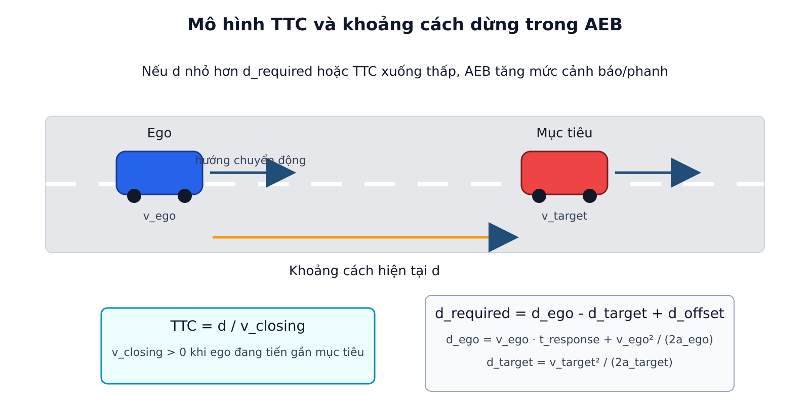

**Hình 3.4: Mô hình TTC và khoảng cách dừng giữa ego và mục tiêu.**

### 3.4.3. Công Thức Khoảng Cách Dừng

Khoảng cách dừng của ego gồm hai phần:

- quãng đường xe vẫn tiếp tục đi trong thời gian phản ứng/tính toán;
- quãng đường hãm phanh sau khi hệ thống bắt đầu phanh.

Công thức này xuất phát từ mô hình động học giảm tốc đều và được kết hợp với
thời gian phản ứng của hệ thống. Việc so sánh khoảng cách hiện có với khoảng
cách cần thiết để dừng cũng cùng tinh thần với các thuật toán AEB trong hệ thống
mã nguồn mở như Autoware [6], [13].

Trong code, khoảng cách dừng của ego được tính:

$$
d_{ego} = v_{ego}t_{response} + \frac{v_{ego}^{2}}{2a_{ego}}
$$

Trong đó:

- $v_{ego}$ là vận tốc hiện tại của xe ego;
- $t_{response}$ là thời gian phản ứng giả định của hệ thống;
- $a_{ego}$ là gia tốc hãm giả định của ego.

Nếu target cũng đang chạy, target có thể tiếp tục đi thêm một đoạn trước khi
dừng. Vì vậy hệ thống ước lượng khoảng cách dừng của target:

$$
d_{target} = \frac{v_{target}^{2}}{2a_{target}}
$$

Vận tốc target được suy ra từ vận tốc ego và vận tốc tương đối:

$$
v_{target} = \max(0, v_{ego} + v_{rel})
$$

Khoảng cách yêu cầu giữa ego và target được tính:

$$
d_{required} = d_{ego} - d_{target} + d_{offset}
$$

Cuối cùng, hệ thống giới hạn giá trị nhỏ nhất:

$$
d_{required} = \max(d_{offset}, d_{required})
$$

Việc trừ $d_{target}$ có ý nghĩa: nếu xe phía trước cũng đang chạy và chưa dừng
ngay, ego có thêm không gian để giảm tốc. Ngược lại, với tình huống xe phía
trước đứng yên, $v_{target}=0$ nên $d_{target}=0$, yêu cầu phanh sẽ nghiêm ngặt
hơn.

### 3.4.4. Các Hằng Số Được Sử Dụng

Các tham số chính được lấy từ nhóm `brake` trong `configs/sensors.yaml`.

**Bảng 3.5: Các biến và hằng số trong công thức TTC/khoảng cách dừng.**

| Ký hiệu/tham số | Giá trị hiện tại | Ý nghĩa | Đơn vị |
|---|---:|---|---|
| $d$ | Từ target | Khoảng cách dọc ego-mục tiêu | m |
| $v_{rel}$ | Từ radar/fusion | Vận tốc tương đối | m/s |
| $v_{closing}$ | $-v_{rel}$ | Vận tốc đóng | m/s |
| $TTC$ | Tính toán | Thời gian tới va chạm | s |
| `warning_ttc_s` | 3.0 | Ngưỡng cảnh báo sớm | s |
| `brake_ttc_s` | 1.5 | Ngưỡng bắt đầu phanh theo TTC | s |
| `release_ttc_s` | 3.5 | Ngưỡng nhả phanh khi nguy cơ giảm | s |
| `response_time_s` | 0.20 | Thời gian phản ứng/tính toán giả định | s |
| `ego_emergency_decel_mps2` | 8.0 | Gia tốc hãm giả định của ego | m/s² |
| `target_emergency_decel_mps2` | 6.0 | Gia tốc hãm giả định của target | m/s² |
| `stopping_distance_offset_m` | 1.0 | Khoảng đệm an toàn tối thiểu | m |
| `min_closing_speed_mps` | 0.2 | Vận tốc đóng tối thiểu để target hợp lệ | m/s |
| `min_valid_distance_m` | 0.5 | Khoảng cách target nhỏ nhất được xét | m |
| `max_valid_distance_m` | 100.0 | Khoảng cách target lớn nhất được xét | m |

### 3.4.5. Biên An Toàn Khoảng Cách

Sau khi có $d_{required}$, hệ thống tính biên an toàn khoảng cách:

$$
d_{margin} = d - d_{required}
$$

Ý nghĩa của $d_{margin}$:

- $d_{margin} > 0$: khoảng cách hiện tại còn lớn hơn khoảng cách cần thiết;
- $d_{margin} = 0$: ego vừa đủ khoảng cách dừng theo mô hình;
- $d_{margin} < 0$: khoảng cách hiện tại đã nhỏ hơn khoảng cách yêu cầu, cần
  phanh mạnh hơn hoặc chuyển sang trạng thái khẩn cấp.

Trong code, biến này là `distance_margin_m`. Nếu `use_stopping_distance=true`
và `distance_margin_m` nhỏ hơn ngưỡng cho phép, hệ thống có thể chuyển sang
trạng thái phanh ngay cả khi TTC chưa xuống quá thấp. Đây là điểm khác với cách
dùng TTC đơn thuần.

### 3.4.6. Vai Trò Trong Logic AEB

TTC và khoảng cách dừng được dùng song song:

```text
target radar/fusion
  -> distance_m, relative_velocity_mps, ego_speed_mps
  -> compute_ttc()
  -> required_stopping_distance()
  -> distance_margin_m
  -> đánh giá mức nguy hiểm
  -> chọn trạng thái AEB và lực phanh
```

Logic tổng quát:

1. nếu không có target hợp lệ, AEB ở `NORMAL` hoặc `RELEASE`;
2. nếu $TTC \leq warning\_ttc$, hệ thống chuyển sang vùng cảnh báo;
3. nếu $TTC \leq brake\_ttc$, hệ thống bắt đầu phanh;
4. nếu $d_{margin}$ âm hoặc rất nhỏ, hệ thống phanh dù TTC chưa quá thấp;
5. nếu target mất nguy hiểm và không bật chế độ giữ phanh đến khi dừng, hệ
   thống có thể nhả phanh.

Như vậy, TTC trả lời câu hỏi “còn bao lâu thì va chạm nếu giữ nguyên vận tốc?”,
còn khoảng cách dừng trả lời câu hỏi “với tốc độ hiện tại, xe còn đủ đường để
dừng an toàn không?”. Việc kết hợp hai đại lượng này giúp hệ thống phản ứng hợp
lý hơn trên dải vận tốc 50-80 km/h mà đồ án đặt làm mục tiêu chính.

## 3.5. Thu Dữ Liệu Và Fine-Tune YOLO26n

Camera đặt sau kính lái cung cấp ảnh RGB cho mô hình nhận dạng đối tượng. Trong
bài toán AEB của đồ án, camera không phải nguồn chính để đo khoảng cách và vận
tốc tương đối; hai đại lượng này vẫn do radar đảm nhiệm. Vai trò chính của
camera và YOLO là xác nhận ngữ nghĩa: mục tiêu radar phía trước có phải ô tô hay
không.

Đầu ra mong muốn của nhánh camera là danh sách bounding box:

```text
Camera RGB
  -> YOLO26n
  -> bbox 2D, class, confidence
  -> lọc/NMS
  -> xác nhận target radar trong bước fusion
```

### 3.5.1. Lý Do Chọn YOLO26n

Đồ án chọn YOLO26n vì các lý do sau:

- YOLO là họ mô hình one-stage detector, tức ảnh đầu vào được đưa qua mạng một
  lần để dự đoán trực tiếp bounding box, class và confidence. Cách này phù hợp
  với bài toán thời gian thực hơn các detector hai giai đoạn.
- Bản `n` là bản nano/nhẹ nhất trong nhóm model đang dùng, phù hợp laptop có GPU
  khoảng 4 GB VRAM và vẫn còn phải chạy CARLA, pygame, radar UI và fusion.
- Bài toán chỉ có một class `car`, môi trường mô phỏng tương đối sạch, nên không
  cần dùng model lớn. Model lớn có thể tăng độ chính xác trên tập khó hơn nhưng
  làm giảm FPS và tăng tải GPU.
- YOLO26n hỗ trợ tốt luồng fine-tune bằng Ultralytics và export sang ONNX. Bản
  ONNX được dùng trong UI/fusion để chạy suy luận nhanh hơn và dễ triển khai
  runtime.

Về nguyên lý, YOLO chia ảnh thành các đặc trưng ở nhiều mức tỷ lệ, dự đoán hộp
bao quanh đối tượng và xác suất class trên các đặc trưng đó. Khi huấn luyện,
loss gồm ba thành phần chính:

- `box_loss`: sai số vị trí/kích thước bounding box;
- `cls_loss`: sai số phân loại class;
- `dfl_loss`: hỗ trợ mô hình học phân bố vị trí cạnh box chính xác hơn.

Sau suy luận, các box trùng lặp được xử lý bằng NMS (Non-Maximum Suppression).
Trong dự án, NMS đặc biệt quan trọng vì nếu YOLO trả nhiều box chồng nhau cho
cùng một xe, bước fusion có thể ghép sai hoặc tạo nhiều target ảo.

### 3.5.2. Nguyên Tắc Tạo Nhãn Từ CARLA

Bộ dữ liệu YOLO được tạo bằng nhãn chuẩn từ CARLA, không vẽ tay từng ảnh. Script
chính là `scripts/collect_yolo_dataset.py`, sử dụng các hàm trong
`core/ground_truth_labels.py` để chiếu bounding box 3D của actor xe sang ảnh
camera.

Quy trình tạo nhãn:

```text
spawn ego Tesla Model 3
  -> spawn xe phía trước theo kịch bản thu data
  -> camera RGB, depth camera, semantic camera
  -> lấy bounding box 3D của actor vehicle từ CARLA
  -> chiếu 8 đỉnh bbox 3D sang mặt phẳng ảnh 2D
  -> kiểm tra visible ratio bằng depth/semantic
  -> fit box theo phần xe thật sự nhìn thấy
  -> lọc box quá nhỏ, quá xa, bị che khuất nặng hoặc chồng nhau
  -> ghi ảnh .jpg và label YOLO một class `car`
```

Việc dùng ground truth của CARLA chỉ được dùng trong giai đoạn tạo dataset. Khi
chạy AEB/fusion, hệ thống không dùng ground truth actor để quyết định phanh.
Runtime chỉ dùng ảnh camera, kết quả YOLO, radar và trạng thái ego.

### 3.5.3. Kịch Bản Thu Dữ Liệu

Các bộ dữ liệu đầu tiên có nhiều xe ở làn bên, nhiều box chồng nhau và nhiều ảnh
các xe nối thành một hàng dài. Sau khi kiểm tra gallery, đồ án chuyển sang bộ
`v7_same_lane`, tập trung vào xe cùng làn phía trước ego. Lý do là bài toán AEB
cuối cùng chỉ xét car-to-car trên cao tốc trong môi trường lý tưởng, nên dataset
same-lane giúp YOLO học đúng miền ảnh cần cho fusion.

Cấu hình chính khi thu v7:

- map: `Town04`;
- ego: `vehicle.tesla.model3`;
- camera: 1280x720, FOV 70 độ, vị trí sau kính lái theo `configs/sensors.yaml`;
- số xe phía trước cùng làn: 4;
- khoảng cách ban đầu xấp xỉ 30 m, 65 m, 100 m và 135 m;
- nhịp lưu: 40 frame/ảnh, tương đương khoảng 2 giây/ảnh ở synchronous 20 FPS;
- class duy nhất: `0 = car`;
- lọc xe xa trong vùng khoảng 100 m phía trước;
- giữ một tỷ lệ ảnh không có xe để giảm false positive.

Các bộ v3-v6 được dùng để thử nghiệm và phát hiện vấn đề dữ liệu. Bộ v7 là bộ
được chọn để train vì ít nhiễu xe làn bên hơn, box sạch hơn và phù hợp trực tiếp
với mục tiêu fusion của đồ án.

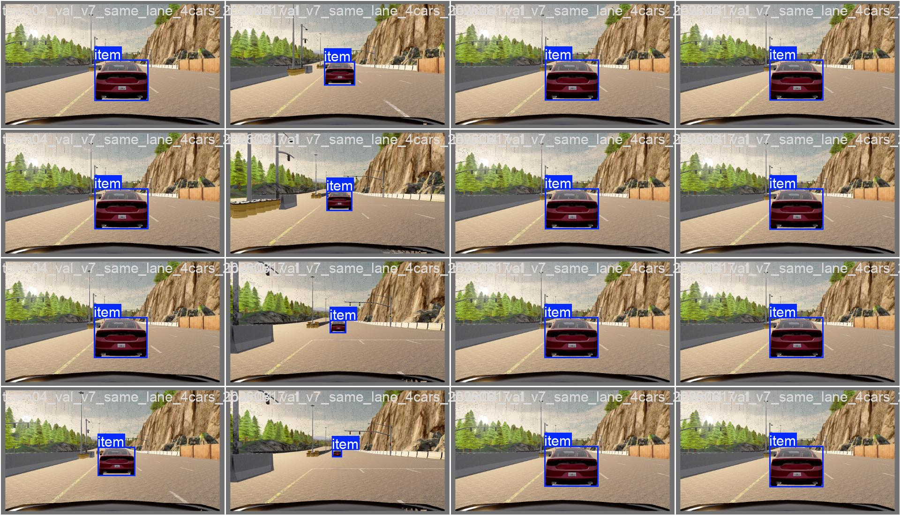

**Hình 3.5: Ví dụ ảnh validation có nhãn bounding box trong quá trình huấn luyện YOLO26n.**

### 3.5.4. Đánh Giá Bộ Dữ Liệu V7 Same-Lane

Bộ dữ liệu v7 được audit bằng `scripts/check_yolo_dataset.py` và báo cáo thống
kê `outputs/dataset_v7_same_lane_stats.json`. Các kiểm tra gồm: số lượng ảnh,
số instance, tỷ lệ ảnh empty, trùng lặp gần, label thiếu, label sai định dạng,
ảnh lỗi và trùng ảnh giữa các split.

**Bảng 3.6: Thống kê bộ dữ liệu v7 same-lane.**

| Tập dữ liệu | Số ảnh | Số box | Ảnh có xe | Ảnh không xe | Empty | Near-dup | Khoảng cách label | Số phiên | Số mẫu xe |
|---|---:|---:|---:|---:|---:|---:|---|---:|---:|
| Train | 1505 | 1872 | 1186 | 319 | 21.2% | 7.2% | 6.5-100.0 m | 28 | 21 |
| Validation | 300 | 379 | 251 | 49 | 16.3% | 10.4% | 6.8-100.0 m | 6 | 14 |
| Test | 200 | 264 | 164 | 36 | 18.0% | 8.5% | 6.9-99.2 m | 4 | 11 |

Nhận xét về dataset:

- Tỷ lệ ảnh empty 16-21% là cần thiết vì khi chạy thực tế không phải lúc nào
  phía trước xe cũng có target. Nếu dataset chỉ toàn ảnh có xe, model dễ sinh
  false positive.
- Near-duplicate dưới 11% cho thấy nhịp lưu 40 frame giúp ảnh thưa nhau hơn,
  giảm hiện tượng nhiều ảnh gần như giống hệt.
- Khoảng cách label trải từ khoảng 6-100 m, phù hợp với radar 100 m và bài toán
  cao tốc 50-80 km/h.
- Train có 21 mẫu xe khác nhau, giúp model không chỉ học một kiểu xe duy nhất.
- `visible_ratio` trung vị khoảng 0.54-0.55, nghĩa là phần lớn box còn đủ vùng
  xe nhìn thấy. Các xe bị che quá nặng đã được lọc bằng điều kiện visible pixels,
  fitted box area và suppress overlapping boxes.

Hạn chế của dataset:

- Dataset chủ yếu ở `Town04`, thời tiết và ánh sáng lý tưởng.
- Dataset tập trung vào xe cùng làn, chưa bao phủ đầy đủ xe cắt ngang, xe làn
  bên phức tạp hoặc nhiều điều kiện thời tiết.
- Metadata v7 chưa lưu màu xe đầy đủ, nên thống kê màu chưa dùng được trong báo
  cáo.

### 3.5.5. Quá Trình Fine-Tune YOLO26n

YOLO26n được fine-tune bằng môi trường Python 3.10 `.venv_yolo310`, vì CARLA
0.9.11 dùng Python 3.7 còn Ultralytics mới cần Python mới hơn. Luồng train được
tách thành ba bước:

```bash
.venv_yolo310/bin/python scripts/check_yolo_dataset.py
.venv_yolo310/bin/python scripts/train_yolo26n.py
.venv_yolo310/bin/python scripts/export_yolo26n_onnx.py
```

**Bảng 3.7: Cấu hình fine-tune YOLO26n.**

| Tham số | Giá trị | Ghi chú |
|---|---:|---|
| Base model | `models/yolo26n.pt` | Model pretrained trước khi fine-tune |
| Dataset | `dataset_v7_same_lane/dataset.yaml` | Một class `car` |
| Image size | 640 | Kích thước ảnh đưa vào mô hình khi huấn luyện |
| Epoch tối đa | 100 | Có `patience=20` để dừng sớm nếu metric không cải thiện |
| Batch size | 16 | Phù hợp GPU laptop 4 GB VRAM trong lần huấn luyện cuối |
| Optimizer | AdamW | Theo `configs/model_training.yaml` |
| Learning rate ban đầu | 0.001 | `lr0` |
| Mosaic | 0.5 | Tăng đa dạng bố cục trong quá trình huấn luyện |
| Mixup/copy-paste | 0.0 / 0.0 | Không dùng để tránh tạo ảnh quá xa miền CARLA thật |
| Seed | 2026 | Giúp kết quả lặp lại tốt hơn |
| Output run | `training_runs/detect/yolo26n_aeb_20260619_011359` | Lần huấn luyện cuối được dùng trong báo cáo |

Sau khi huấn luyện, bộ trọng số tốt nhất được export sang ONNX để dùng trong giao diện và fusion:

- `models/yolo26n_aeb_v7.pt`;
- `models/yolo26n_aeb_v7.onnx`.

### 3.5.6. Đánh Giá Mô Hình Sau Fine-Tune

Kết quả huấn luyện được ghi trong `results.csv` và minh họa bằng
`training_runs/detect/yolo26n_aeb_20260619_011359/results.png`.

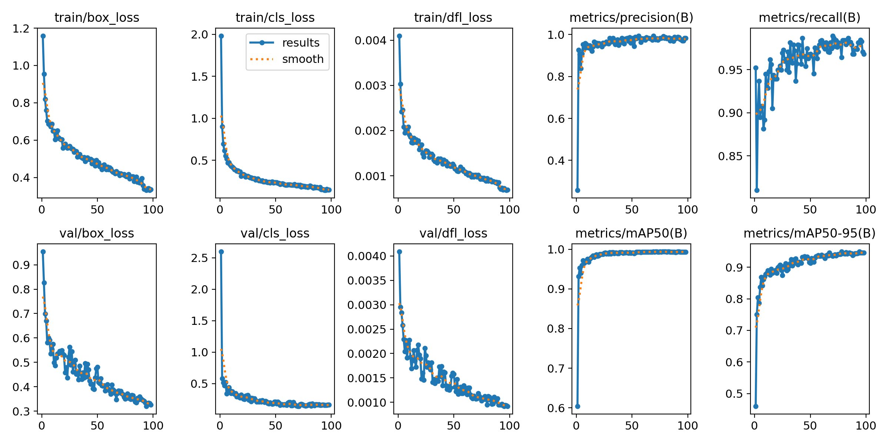

**Hình 3.6: Kết quả huấn luyện YOLO26n.**

**Bảng 3.8: Kết quả đánh giá YOLO26n trong lần fine-tune cuối.**

| Mốc | Epoch | Precision | Recall | mAP50 | mAP50-95 | Train box loss | Val box loss |
|---|---:|---:|---:|---:|---:|---:|---:|
| Best theo mAP50-95 | 78 | 0.9919 | 0.9642 | 0.9940 | 0.9495 | 0.4179 | 0.3527 |
| Epoch cuối | 98 | 0.9837 | 0.9683 | 0.9933 | 0.9466 | 0.3357 | 0.3256 |

Nhận xét từ các biểu đồ:

- `train/box_loss`, `train/cls_loss` và `train/dfl_loss` giảm theo thời gian,
  cho thấy model học được vị trí box và class `car`.
- `val/box_loss` cũng giảm và không tăng mạnh ở cuối quá trình train, vì vậy
  chưa thấy dấu hiệu overfit nghiêm trọng trên validation.
- Precision xấp xỉ 0.98-0.99 nghĩa là phần lớn box model dự đoán là đúng xe.
- Recall xấp xỉ 0.96-0.97 nghĩa là model ít bỏ sót xe trong miền dữ liệu đã
  thu.
- mAP50 khoảng 0.993 và mAP50-95 khoảng 0.947-0.950 là đủ tốt cho vai trò xác
  nhận mục tiêu trong fusion.

Các file `BoxPR_curve.png`, `BoxF1_curve.png`, `confusion_matrix.png` và
`val_batch*_pred.jpg` trong cùng thư mục train được dùng để kiểm tra bổ sung.
Trong runtime AEB, YOLO vẫn không quyết định phanh một mình; model chỉ xác nhận
target radar là xe, còn khoảng cách, vận tốc tương đối, TTC và khoảng cách dừng
vẫn lấy từ radar/fusion.

## 3.6. Hợp Nhất Dữ Liệu Cảm Biến Camera-Radar

Hợp nhất dữ liệu cảm biến trong đồ án được thực hiện theo hướng radar-first:
radar cung cấp khoảng cách, vận tốc tương đối và TTC; camera/YOLO xác nhận mục
tiêu đó là ô tô trong ảnh. Cách này phù hợp với vai trò của từng cảm biến:
radar mạnh về đo động học, camera mạnh về nhận dạng ngữ nghĩa.

Điểm quan trọng là hệ thống không dùng nhãn actor hoặc ground truth của CARLA để
biết sẵn radar target nằm trong pixel nào. Runtime chỉ dùng dữ liệu cảm biến:

- `RadarObject` hoặc radar point đã có `world_location`;
- ảnh RGB và pose camera;
- bounding box YOLO;
- ma trận chiếu camera.

### 3.6.1. Đầu Vào Và Đầu Ra Của Fusion

Đầu vào của khối fusion gồm:

- danh sách radar object/point sau lọc radar;
- ảnh RGB mới nhất từ camera sau kính lái;
- danh sách detection từ YOLO26n: `x1`, `y1`, `x2`, `y2`, `confidence`,
  `class_name`;
- transform camera tại thời điểm ảnh được chụp;
- cấu hình ngưỡng từ `configs/sensors.yaml`.

Đầu ra của khối fusion trong dự án có hai dạng:

- trong giao diện kiểm tra: danh sách điểm radar đã chiếu lên ảnh và danh sách
  bounding box YOLO được ghép;
- trong kiểm thử AEB tự động: trạng thái mục tiêu đã được camera xác nhận hay
  chưa, kèm lý do bằng văn bản như "mục tiêu radar nằm trong bounding box YOLO"
  hoặc "chặn phanh vì mục tiêu radar không nằm trong bounding box YOLO".

Luồng xử lý tổng quát:

```text
Radar target/object
  -> lấy world_location
  -> biến đổi world -> camera
  -> chiếu 3D -> pixel 2D
  -> kiểm tra pixel nằm trong ảnh
  -> kiểm tra pixel nằm trong YOLO bbox class car
  -> fusion confirmed / fusion blocked
```

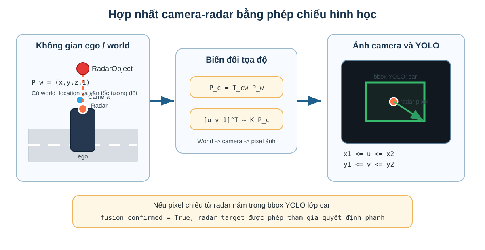

**Hình 3.7: Nguyên lý hợp nhất dữ liệu camera-radar bằng phép chiếu hình học.**

### 3.6.2. Ma Trận Nội Tại Camera

Ma trận nội tại camera được tính trong hàm `camera_intrinsic()` của
`ui/manual_control_common.py`. Với ảnh có chiều rộng $W$, chiều cao $H$ và góc
nhìn ngang $FOV$, tiêu cự theo pixel được tính:

$$
f = \frac{W}{2\tan(FOV/2)}
$$

Ma trận nội tại:

$$
K =
\begin{bmatrix}
f & 0 & W/2 \\
0 & f & H/2 \\
0 & 0 & 1
\end{bmatrix}
$$

Với cấu hình hiện tại, camera có ảnh 1280x720 và FOV 70 độ. Ma trận này biến
tọa độ điểm trong hệ camera thành pixel trên ảnh.

### 3.6.3. Biến Đổi Hệ Tọa Độ World Sang Camera

Radar target được xử lý ở hệ ego/radar, nhưng để chiếu lên ảnh camera cần tọa độ
trong hệ world. Các radar point và radar object trong dự án giữ thêm
`world_location`, nên fusion có thể dùng trực tiếp vị trí 3D này.

Hàm `project_world_to_camera()` thực hiện các bước:

1. tạo vector đồng nhất của điểm world:

$$
P_w = [X_w, Y_w, Z_w, 1]^T
$$

2. nhân với ma trận nghịch đảo transform camera:

$$
P_{ue} = T_{cw}P_w
$$

Trong đó $T_{cw}$ là ma trận từ world sang hệ camera theo quy ước CARLA/Unreal.

3. đổi trục từ hệ Unreal sang hệ camera chuẩn dùng cho phép chiếu:

$$
P_c = [Y_{ue}, -Z_{ue}, X_{ue}]^T
$$

Trong đó $P_c=[X_c,Y_c,Z_c]^T$. Nếu $Z_c \leq 0$, điểm nằm sau camera nên bị bỏ.

4. chiếu sang pixel:

$$
\begin{bmatrix}
\tilde{u} \\
\tilde{v} \\
\tilde{w}
\end{bmatrix}
=
K
\begin{bmatrix}
X_c \\
Y_c \\
Z_c
\end{bmatrix}
$$

$$
u = \frac{\tilde{u}}{\tilde{w}},\quad
v = \frac{\tilde{v}}{\tilde{w}}
$$

Điểm chỉ được giữ nếu:

$$
0 \leq u < W,\quad 0 \leq v < H
$$

### 3.6.4. Lọc Radar Trước Khi Chiếu

Không phải mọi radar point đều được chiếu lên ảnh để match. Trong UI/debug
`ui/fusion_view.py` và `ui/aeb_demo_view.py`, một điểm radar phải thỏa mãn:

$$
x_{forward} \geq x_{min}
$$

$$
x_{forward} \leq R_{radar}
$$

$$
|y_{right}| \leq y_{limit}
$$

$$
z_{min} \leq z_{up} \leq z_{max}
$$

Trong giao diện minh họa cuối cùng, nếu có `RadarAEBPipeline`, hàm `valid_path_target()` được ưu
tiên dùng lại để bảo đảm điểm radar cũng nằm trong hành lang quỹ đạo dự đoán.
Nhờ đó fusion không chỉ nhìn FOV camera, mà còn bám theo vùng di chuyển có khả
năng gây nguy hiểm cho ego.

**Bảng 3.9: Các hằng số chính trong hợp nhất dữ liệu camera-radar.**

| Nhóm | Tham số | Giá trị | Ý nghĩa |
|---|---|---:|---|
| YOLO | `model.confidence` | 0.25 | Ngưỡng confidence tối thiểu của bbox |
| YOLO | `model.nms_iou` | 0.50 | Ngưỡng NMS để loại bbox trùng |
| YOLO | `model.inference_interval_s` | 0.15 s | Chu kỳ suy luận YOLO trong UI |
| YOLO | `class_names[0]` | `car` | Class duy nhất dùng cho AEB |
| Fusion | `min_radar_forward_distance_m` | 0.5 m | Bỏ điểm radar quá gần |
| Fusion | `max_lateral_offset_m` | 2.4 m | Giới hạn lệch ngang khi chiếu/match debug |
| Fusion | `min_radar_z_up_m` / `max_radar_z_up_m` | -100 / 100 m | Không bó hẹp độ cao ở tầng fusion; radar pipeline đã lọc trước |
| Fusion gate | `confirmation_hold_s` | 0.35 s | Giữ xác nhận fusion ngắn hạn nếu camera/radar lệch frame |

### 3.6.5. Ghép Radar Với Bounding Box YOLO

Sau khi radar target được chiếu thành pixel $(u,v)$, hệ thống kiểm tra pixel đó
có nằm trong bbox YOLO class `car` hay không:

$$
x_1 \leq u \leq x_2
$$

$$
y_1 \leq v \leq y_2
$$

Nếu điều kiện đúng, radar target được camera xác nhận. Trong kiểm thử hàng loạt,
trạng thái này được ghi vào log dưới dạng mục tiêu radar đã nằm trong bounding
box YOLO của lớp `car`.

Nếu có nhiều điểm radar nằm trong cùng một bbox ở giao diện debug, hệ thống chọn
điểm có `x_forward_m` nhỏ nhất, tức điểm gần ego nhất trong bbox:

$$
p^* = \arg\min_{p \in bbox} x_{forward}(p)
$$

Cách chọn này phù hợp với AEB vì điểm gần nhất của xe phía trước thường quyết
định khoảng cách an toàn. Tuy nhiên trong pipeline phanh cuối, khoảng cách và
TTC vẫn lấy từ radar target/object đã chọn ở tầng radar, không lấy từ kích thước
bbox camera.

### 3.6.6. Fusion Gate Trong Quyết Định Phanh

Trong batch fusion AEB, radar vẫn tính quyết định phanh trước. Fusion gate chỉ
can thiệp khi radar muốn chuyển sang trạng thái phanh. Logic trong
`_fusion_gated_decision()` có thể mô tả:

```text
nếu radar_decision.state != BRAKE:
    giữ nguyên quyết định radar
ngược lại nếu fusion vừa xác nhận target:
    giữ nguyên quyết định phanh
ngược lại:
    chặn phanh, chuyển sang RELEASE với brake = 0
```

Nói cách khác, camera không tự tạo lệnh phanh. Camera chỉ có quyền xác nhận hoặc
chặn một lệnh phanh do radar đề xuất. Thiết kế này giảm nguy cơ phanh nhầm khi
radar nhìn thấy lan can, biển báo hoặc vật thể ngoài làn, nhưng vẫn giữ radar là
nguồn động học chính.

Để tránh mất xác nhận chỉ vì camera và radar lệch một vài frame, hệ thống dùng
`confirmation_hold_s=0.35s`. Nếu target vừa được xác nhận trong khoảng thời gian
ngắn này, fusion vẫn coi target là hợp lệ. Cách này phù hợp với hệ thống mô
phỏng 20 Hz, nơi radar/camera/YOLO không phải lúc nào cũng cập nhật đúng cùng
một tick.

### 3.6.7. Các Trường Hợp Không Xác Nhận Fusion

Fusion có thể không xác nhận target trong các trường hợp:

- không có mục tiêu radar hợp lệ;
- mục tiêu radar chưa có tọa độ 3D trong hệ world;
- camera chưa sẵn sàng hoặc chưa có ảnh mới;
- YOLO không phát hiện xe trong ảnh;
- mục tiêu radar nằm phía sau camera;
- điểm radar sau khi chiếu ra ngoài biên ảnh;
- điểm radar không nằm trong bounding box YOLO nào của lớp `car`.

Các lý do này được ghi vào log để phân tích lỗi. Ví dụ, nếu radar báo nguy hiểm
nhưng fusion chặn phanh vì điểm radar không nằm trong bounding box YOLO, có thể
mục tiêu radar là vật thể không phải xe, YOLO bỏ sót xe, hoặc sai số hiệu chỉnh
camera-radar làm điểm chiếu lệch khỏi bounding box.

### 3.6.8. Ưu Và Nhược Điểm Của Cách Fusion Này

Ưu điểm:

- không dùng ground truth trong runtime;
- giải thích được bằng hình học chiếu, dễ trình bày trong báo cáo;
- giảm phanh nhầm so với radar-only khi radar nhìn thấy vật thể không phải xe;
- tận dụng đúng vai trò của từng cảm biến: radar đo động học, camera xác nhận
  đối tượng.

Hạn chế:

- phụ thuộc vào độ chính xác vị trí gắn camera/radar và transform trong CARLA;
- nếu YOLO bỏ sót xe, fusion có thể chặn phanh dù radar đã thấy nguy hiểm;
- nếu bbox quá nhỏ hoặc target bị che khuất, điểm radar có thể không nằm trong
  bbox;
- thuật toán hiện mới là fusion hình học/gating, chưa phải tracking đa cảm biến
  đầy đủ kiểu Kalman filter hoặc object-level fusion xác suất.

Với phạm vi đồ án hiện tại, cách fusion này đủ phù hợp vì bài toán chỉ xét ô tô
trên cao tốc, thời tiết lý tưởng và mục tiêu chính là giảm phanh nhầm của
radar-only mà vẫn giữ được khả năng tránh va chạm trong dải vận tốc mong muốn.

## 3.7. Dự Đoán Quỹ Đạo Di Chuyển

Trong bài toán AEB, radar có thể nhìn thấy nhiều vật thể phía trước: lan can,
biển báo, mặt đường, xe ở làn bên hoặc xe nằm trong vùng quét nhưng không nằm
trên hướng đi của ego. Nếu chỉ chọn vật thể gần nhất trong FOV radar, hệ thống
dễ phanh nhầm khi xe đang chạy sát mép đường hoặc vào cua. Vì vậy dự án tạo
một quỹ đạo dự đoán ngắn hạn của ego và chỉ giữ các radar object nằm gần quỹ đạo
này.

Phần này được triển khai trong `core/radar_aeb_pipeline.py`, chủ yếu ở các hàm:

- `update_predicted_path()`;
- `constant_curvature_path()`;
- `distance_to_predicted_path(point)`;
- `valid_path_target(point)`.

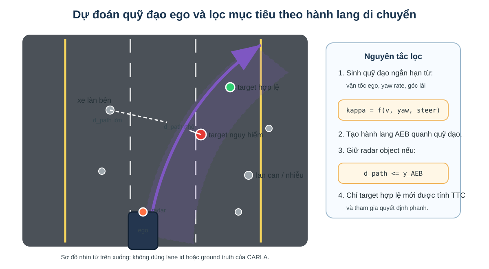

**Hình 3.8: Hành lang quỹ đạo dự đoán dùng để lọc mục tiêu radar.**

### 3.7.1. Đầu Vào Của Bước Dự Đoán Quỹ Đạo

Đầu vào không phải bản đồ HD, lane id hay ground truth của CARLA. Thuật toán chỉ
dùng trạng thái chuyển động hiện tại của ego:

- vận tốc ego $v_{ego}$ từ `ego.get_velocity()`;
- yaw rate $\omega_{yaw}$ từ `ego.get_angular_velocity().z`;
- lệnh lái hiện tại $\delta$ từ `ego.get_control().steer`;
- các hằng số cấu hình trong `configs/sensors.yaml`.

Điều này giúp thuật toán gần với tư duy xe thật hơn: xe tự dự đoán đường đi ngắn
hạn dựa trên chuyển động và góc lái của chính nó, không dựa vào thông tin “biết
sẵn” của simulator.

### 3.7.2. Ước Lượng Độ Cong Quỹ Đạo

Quỹ đạo được xấp xỉ bằng mô hình độ cong không đổi. Nếu ego đang chạy đủ nhanh
và yaw rate đủ rõ, độ cong từ yaw rate được tính:

$$
\kappa_{yaw} = \frac{\omega_{yaw}}{v_{ego}}
$$

Trong đó:

- $\kappa$ là độ cong, đơn vị $1/m$;
- $\omega_{yaw}$ là tốc độ quay thân xe quanh trục đứng, đơn vị rad/s;
- $v_{ego}$ là vận tốc ego, đơn vị m/s.

Song song, thuật toán ước lượng độ cong từ góc lái:

$$
\kappa_{steer} = k_{steer}\delta
$$

Với $\delta$ là lệnh lái chuẩn hóa trong CARLA và $k_{steer}$ là hệ số
`path_steer_curvature_per_unit`.

Trong code, nếu:

$$
v_{ego} \geq v_{min}
$$

và:

$$
|\omega_{yaw}| \geq \omega_{min}
$$

thì độ cong mong muốn được trộn từ yaw rate và góc lái:

$$
\kappa_{desired} = 0.75\kappa_{yaw} + 0.25\kappa_{steer}
$$

Nếu xe đi chậm hoặc yaw rate quá nhỏ, thuật toán dùng:

$$
\kappa_{desired} = \kappa_{steer}
$$

Cách trộn này giúp quỹ đạo bám theo chuyển động thật của xe khi đang cua, nhưng
vẫn có fallback từ lệnh lái khi yaw rate chưa đủ tin cậy.

### 3.7.3. Giới Hạn Và Làm Mượt Độ Cong

Độ cong mong muốn được giới hạn để tránh sinh quỹ đạo quá gắt:

$$
\kappa_{desired} =
\text{clip}(\kappa_{desired},-\kappa_{max},\kappa_{max})
$$

Sau đó thuật toán làm mượt theo thời gian:

$$
\kappa_t = \kappa_{t-1} + \alpha(\kappa_{desired}-\kappa_{t-1})
$$

Trong đó $\alpha$ là `path_curvature_smoothing`. Nếu $\alpha$ nhỏ, quỹ đạo đổi
chậm và ổn định hơn; nếu $\alpha$ lớn, quỹ đạo phản ứng nhanh hơn nhưng dễ rung
do nhiễu yaw rate/góc lái. Bản hiện tại dùng $\alpha=0.35$ để cân bằng hai yếu
tố này.

### 3.7.4. Sinh Các Điểm Quỹ Đạo Phía Trước

Sau khi có độ cong $\kappa_t$, hàm `constant_curvature_path()` sinh danh sách
điểm:

```text
(x_forward, y_right, heading)
```

theo từng bước khoảng cách $s$. Trong đó $s$ là chiều dài cung dọc theo quỹ đạo
dự đoán, tính từ vị trí hiện tại của ego về phía trước; $s=0$ tại vị trí hiện
tại của xe và tăng dần theo hướng xe dự kiến di chuyển. Với quỹ đạo cong:

$$
\theta(s) = \kappa s
$$

$$
x(s) = \frac{\sin(\theta)}{\kappa}
$$

$$
y(s) = \frac{1-\cos(\theta)}{\kappa}
$$

Khi $|\kappa|$ rất nhỏ, thuật toán coi ego đang đi thẳng:

$$
x(s)=s,\quad y(s)=0
$$

Để tránh quỹ đạo dự đoán kéo quá dài trong cua gắt, vòng lặp sinh điểm dừng nếu:

$$
|\theta(s)| > \theta_{max}
$$

hoặc:

$$
|y(s)| > y_{path,max}
$$

### 3.7.5. Tầm Dự Đoán

Tầm dự đoán phụ thuộc vào vận tốc ego:

$$
L = \min(R_{radar}, \max(L_{min}, v_{ego}T_{horizon}))
$$

Nếu ego chạy chậm, quỹ đạo vẫn có tối thiểu $L_{min}$ để lọc điểm gần phía
trước. Nếu ego chạy nhanh, quỹ đạo dài hơn nhưng không vượt quá tầm radar.

**Bảng 3.10: Các hằng số chính trong dự đoán quỹ đạo ego.**

| Tham số | Giá trị | Ý nghĩa |
|---|---:|---|
| `path_sample_step_m` | 1.0 m | Khoảng cách giữa hai điểm quỹ đạo liên tiếp |
| `path_horizon_time_s` | 2.5 s | Thời gian dự đoán phía trước theo vận tốc ego |
| `path_min_horizon_m` | 12.0 m | Tầm dự đoán tối thiểu |
| `path_max_lateral_deviation_m` | 6.0 m | Giới hạn lệch ngang tối đa của quỹ đạo |
| `path_min_speed_for_yaw_rate_mps` | 1.0 m/s | Vận tốc tối thiểu để tin yaw rate |
| `path_min_yaw_rate_deg_s` | 0.5 độ/s | Yaw rate tối thiểu để dùng công thức yaw |
| `path_steer_curvature_per_unit` | 0.06 1/m | Hệ số đổi lệnh lái sang độ cong |
| `path_max_abs_curvature_1pm` | 0.12 1/m | Giới hạn độ cong tuyệt đối |
| `path_curvature_smoothing` | 0.35 | Hệ số làm mượt độ cong |
| `path_max_heading_change_deg` | 75 độ | Giới hạn đổi hướng tối đa của path |

### 3.7.6. Tính Khoảng Cách Từ Radar Point Tới Quỹ Đạo

Sau khi có predicted path, hàm `distance_to_predicted_path(point)` tính khoảng
cách nhỏ nhất từ radar point tới các đoạn thẳng liên tiếp của quỹ đạo. Với một
đoạn path từ $A(x_a,y_a)$ tới $B(x_b,y_b)$ và radar point $P(x_p,y_p)$, hệ số
chiếu lên đoạn thẳng là:

$$
t =
\frac{(P-A)\cdot(B-A)}{\|B-A\|^2}
$$

Sau đó giới hạn:

$$
t = \text{clip}(t,0,1)
$$

Điểm gần nhất trên đoạn:

$$
Q = A + t(B-A)
$$

Khoảng cách tới đoạn:

$$
d_{path} = \sqrt{(x_p-x_q)^2+(y_p-y_q)^2}
$$

Thuật toán lấy giá trị nhỏ nhất qua toàn bộ các đoạn path. Radar point/object
chỉ được coi là ứng viên AEB nếu:

$$
d_{path} \leq y_{AEB}
$$

Trong đó $y_{AEB}$ lấy từ `max_lateral_offset_m=1.25m`. Đây là một trong các
bước quan trọng giúp loại xe làn bên và vật thể ngoài quỹ đạo.

### 3.7.7. Đầu Ra Và Vai Trò Trong Pipeline

Đầu ra của bước này gồm:

- `predicted_path`: danh sách điểm $(x_{forward}, y_{right}, heading)$;
- `path_curvature_1pm`: độ cong hiện tại;
- `path_horizon_m`: tầm dự đoán hiện tại;
- `path_description()`: mô tả debug như `straight`, `left R=...m`,
  `right R=...m`;
- kết quả lọc `valid_path_target(point)`.

Trong pipeline tổng thể:

```text
ego speed + yaw rate + steering
  -> update_predicted_path()
  -> predicted_path
  -> distance_to_predicted_path(point)
  -> valid_path_target(point)
  -> radar object candidates
```

Ưu điểm của cách này là giảm phanh nhầm so với chỉ dùng FOV radar. Hạn chế là
mô hình độ cong không đổi chỉ phù hợp dự đoán ngắn hạn. Nếu xe đánh lái đột ngột
hoặc gặp đường cong thay đổi nhanh, predicted path có thể lệch. Vì vậy đồ án chỉ
dùng path này như bộ lọc mục tiêu AEB trong vài giây phía trước xe, không dùng
như thuật toán lập kế hoạch chuyển động dài hạn.

## 3.8. Chọn Mục Tiêu, Đánh Giá Rủi Ro Va Chạm Và Điều Khiển Phanh PID

Sau khi đã có radar object, YOLO detection, fusion gate, TTC, khoảng cách dừng
và predicted path, hệ thống phải quyết định:

1. mục tiêu nào là mục tiêu AEB chính;
2. mức rủi ro hiện tại là gì;
3. có cần override lệnh điều khiển xe hay không;
4. nếu phanh thì phanh với lực bao nhiêu.

Luồng dữ liệu của khối quyết định/phanh có thể tóm tắt như sau:

```text
RadarObject đã xác nhận
  -> kiểm tra hành lang quỹ đạo dự đoán
  -> xác nhận bằng YOLO/fusion
  -> tính TTC và khoảng cách dừng
  -> đánh giá mức nguy hiểm
  -> staged PID giới hạn lực phanh theo tầng
  -> lệnh brake gửi tới xe ego
```

Phần này chủ yếu nằm trong:

- `core/target_selector.py::select_aeb_target`;
- `core/radar_aeb_pipeline.py::process`, `_target_ready_for_brake`;
- `control/brake.py::BinaryAEB.decide`;
- `control/brake.py::_desired_state`, `_apply_hysteresis`,
  `_pid_brake_command`, `_staged_pid_target`;
- `control/brake.py::make_brake_control`, `apply_brake_override`.

### 3.8.1. Chọn Mục Tiêu AEB

Sau radar clustering/tracking, hệ thống có thể có nhiều `RadarObject`. Mục tiêu
AEB không nhất thiết là object gần nhất tuyệt đối, mà là object có nguy cơ va
chạm cao nhất trên quỹ đạo dự đoán.

Hàm `select_aeb_target()` chọn mục tiêu theo thứ tự:

1. chỉ xét object đã `confirmed=True`;
2. bỏ object stale hoặc mất dấu;
3. tính TTC bằng `compute_ttc()`;
4. ưu tiên object có TTC hữu hạn nhỏ nhất;
5. nếu TTC không hữu hạn hoặc tương đương, ưu tiên object có khoảng cách dọc nhỏ
   hơn.

Có thể mô tả hàm ưu tiên:

$$
target = \arg\min_i \left(has\_finite\_ttc_i,\ TTC_i,\ x_i\right)
$$

Trong đó object có TTC hữu hạn được ưu tiên hơn object có $TTC=\infty$.

Ở bản có fusion, target radar còn phải được camera/YOLO xác nhận. Nếu radar
target không chiếu vào bbox `car`, fusion gate có thể chặn lệnh phanh để giảm
phanh nhầm.

### 3.8.2. Target Gate Trước Khi Phanh

Ngay cả khi radar đã chọn được target, hệ thống vẫn không phanh ngay lập tức
trong mọi trường hợp. `RadarAEBPipeline` có target gate để tránh object xuất
hiện thoáng qua gây phanh nhầm.

Target được coi là sẵn sàng phanh nếu một trong hai điều kiện đúng:

- target đã được chọn ổn định đủ `selected_confirm_frames=5` frame;
- tình huống đủ khẩn cấp để phanh ngay, ví dụ khoảng cách nhỏ hơn
  `immediate_brake_distance_m=22m` hoặc `distance_margin_m` thấp hơn ngưỡng
  `immediate_distance_margin_m=-4m`.

Như vậy hệ thống có hai lớp bảo vệ:

- radar object phải được tracking xác nhận qua nhiều frame;
- target đã chọn phải ổn định qua target gate, trừ trường hợp khẩn cấp.

### 3.8.3. Đánh Giá Trạng Thái Rủi Ro

Trong `control/brake.py`, máy trạng thái chính có bốn trạng thái logic:

- `NORMAL`: không có nguy cơ hợp lệ;
- `WARNING`: TTC thấp hơn ngưỡng cảnh báo nhưng chưa tới mức phanh;
- `BRAKE`: cần override phanh;
- `RELEASE`: nhả phanh sau khi nguy cơ giảm.

Hàm `_desired_state()` quyết định trạng thái mong muốn từ TTC:

$$
state =
\begin{cases}
BRAKE, & TTC \leq brake\_ttc \\
WARNING, & TTC \leq warning\_ttc \\
NORMAL, & TTC > warning\_ttc
\end{cases}
$$

Với cấu hình hiện tại:

- `warning_ttc_s = 3.0s`;
- `brake_ttc_s = 1.5s`;
- `release_ttc_s = 3.5s`.

Ngoài TTC, nếu `use_stopping_distance=true`, hệ thống cũng phanh khi:

$$
d_{margin} \leq d_{threshold}
$$

Trong đó $d_{margin}=d-d_{required}$ đã trình bày ở mục 3.4. Điều này giúp hệ
thống phản ứng sớm ở tốc độ cao, vì TTC đơn thuần có thể chưa phản ánh đủ quãng
đường cần để dừng.

### 3.8.4. Hysteresis Và Điều Kiện Nhả Phanh

Hệ thống dùng hysteresis để tránh trạng thái phanh nhấp nhả liên tục. Hàm
`_apply_hysteresis()` giữ trạng thái `BRAKE` nếu:

- thời gian giữ phanh tối thiểu chưa hết: `min_brake_hold_time_s=0.3s`;
- đang bật `hold_brake_until_stopped=true` và xe chưa dừng;
- TTC vẫn chưa vượt ngưỡng nhả `release_ttc_s`.

Nếu nguy cơ giảm và các điều kiện giữ phanh không còn đúng, trạng thái chuyển
sang `RELEASE`, lệnh phanh về 0. Tùy mục tiêu kiểm thử, dự án có thể chạy theo hai
kiểu:

- validation mode: giữ phanh đến khi xe dừng để đo khoảng cách cuối;
- driving-after-AEB mode: nhả phanh khi nguy cơ hết để mô phỏng xe thật tiếp tục
  chạy.

### 3.8.5. Các Chế Độ Phanh Đã Phát Triển

Đồ án giữ nhiều chế độ phanh để so sánh trong quá trình phát triển.

**Bảng 3.11: So sánh các chế độ phanh trong đồ án.**

| Chế độ | Nguyên lý | Vai trò |
|---|---|---|
| `binary` | Có nguy hiểm thì phanh 1.0 | Baseline đơn giản, dễ kiểm lỗi logic target |
| `staged` | Chia mức rủi ro, mỗi mức có lực phanh cố định | Kiểm tra máy trạng thái nhiều tầng |
| `pid_v1` | PID theo sai số khoảng cách/TTC | Bắt đầu điều khiển phanh liên tục |
| `pid_v2_comfort` | PID mềm hơn, có target margin và lateral gate | Giảm phanh nhầm, tăng độ êm |
| `staged_pid` | Chia tầng rủi ro + PID và giới hạn lực theo tầng | Bản chính hiện tại |

### 3.8.6. Công Thức PID

Trong chế độ PID, lệnh phanh không còn là 0 hoặc 1 tuyệt đối. Thuật toán tạo sai
số từ hai thành phần: thiếu khoảng cách an toàn và TTC thấp.

Sai số khoảng cách:

$$
e_d = \max(0,\ d_{threshold} - d_{margin} - d_{deadband})
$$

Sai số TTC:

$$
e_{ttc} = \max(0,\ brake\_ttc - TTC)
$$

Sai số tổng:

$$
e = e_d + k_{ttc}e_{ttc}
$$

Trong code, $k_{ttc}$ là `pid_ttc_kp`. Thành phần tích phân:

$$
I_t = \text{clip}(I_{t-1}+e\Delta t,\ -I_{max},\ I_{max})
$$

Thành phần đạo hàm chỉ lấy phần tăng sai số, không cho đạo hàm âm làm giảm
phanh quá nhanh:

$$
D_t = \max(0,\frac{e_t-e_{t-1}}{\Delta t})
$$

Lệnh phanh mục tiêu:

$$
b_{target} = b_{min} + K_p e + K_i I_t + K_d D_t
$$

Sau đó giới hạn:

$$
b_{target} = \text{clip}(b_{target}, b_{min}, b_{max})
$$

### 3.8.7. Staged PID

Staged PID là bản chính hiện tại. Ý tưởng là PID tính mức phanh liên tục, nhưng
mức phanh đó bị giới hạn bởi tầng rủi ro. Tầng rủi ro quyết định "được phép
phanh mạnh tới đâu", PID quyết định "trong giới hạn đó nên phanh bao nhiêu".

```text
SAFE/NORMAL -> không phanh
WARNING     -> cảnh báo, chưa override phanh
SOFT        -> PID bị giới hạn ở vùng phanh nhẹ
MEDIUM      -> PID được phép phanh trung bình
HARD        -> PID được phép phanh mạnh
EMERGENCY   -> cho phép phanh 1.0
RELEASE     -> nhả phanh khi nguy cơ giảm
```

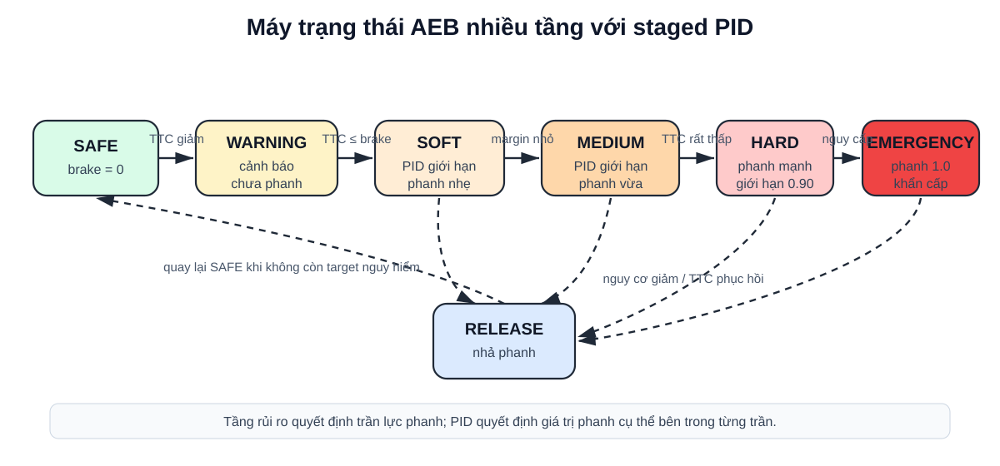

**Hình 3.9: Máy trạng thái AEB nhiều tầng.**

Trong code, `_staged_pid_target()` giới hạn phanh theo các điều kiện:

- nếu khoảng cách rất gần, $d \leq staged\_emergency\_distance$, phanh emergency;
- nếu $d_{margin} \leq staged\_emergency\_margin$, phanh emergency;
- nếu $TTC \leq staged\_emergency\_ttc$, phanh emergency;
- nếu $d_{margin} \leq staged\_hard\_margin$ hoặc
  $TTC \leq staged\_hard\_ttc$, cho phép vùng hard;
- nếu $d_{margin} \leq 0$ hoặc $TTC \leq brake\_ttc$, cho phép vùng medium;
- nếu chưa tới các ngưỡng trên, chỉ cho phép vùng soft.

**Bảng 3.12: Các hằng số chính của thuật toán staged PID.**

| Nhóm | Tham số | Giá trị | Ý nghĩa |
|---|---|---:|---|
| State | `warning_ttc_s` | 3.0 s | Bắt đầu cảnh báo |
| State | `brake_ttc_s` | 1.5 s | Bắt đầu phanh theo TTC |
| State | `release_ttc_s` | 3.5 s | Nhả phanh khi TTC phục hồi |
| Staged brake | `staged_soft_brake` | 0.55 | Trần/giá trị phanh vùng soft |
| Staged brake | `staged_medium_brake` | 0.75 | Trần/giá trị phanh vùng medium |
| Staged brake | `staged_hard_brake` | 0.90 | Trần/giá trị phanh vùng hard |
| Staged brake | `staged_emergency_brake` | 1.00 | Phanh khẩn cấp tối đa |
| Staged risk | `staged_hard_ttc_s` | 1.10 s | Ngưỡng hard theo TTC |
| Staged risk | `staged_emergency_ttc_s` | 0.80 s | Ngưỡng emergency theo TTC |
| Staged risk | `staged_hard_margin_m` | -2.0 m | Ngưỡng hard theo thiếu khoảng cách |
| Staged risk | `staged_emergency_margin_m` | -5.0 m | Ngưỡng emergency theo thiếu khoảng cách |
| PID | `pid_kp`, `pid_ki`, `pid_kd` | 0.12 / 0.01 / 0.0 | Hệ số PID |
| PID | `pid_ttc_kp` | 0.12 | Trọng số sai số TTC |
| PID | `pid_min_brake`, `pid_max_brake` | 0.25 / 1.0 | Biên lệnh phanh PID |
| PID | `pid_target_margin_m` | 4.0 m | Biên khoảng cách mong muốn cho PID |
| PID | `pid_target_margin_max_lateral_m` | 0.95 m | Chỉ cộng target margin khi target gần tâm làn ego |
| Rate limit | `pid_brake_rise_rate_per_s` | 3.0 /s | Tốc độ tăng phanh thường |
| Rate limit | `pid_brake_fall_rate_per_s` | 1.5 /s | Tốc độ giảm phanh |
| Rate limit | `pid_emergency_rise_rate_per_s` | 20.0 /s | Tốc độ tăng phanh khẩn cấp |

### 3.8.8. Giới Hạn Tốc Độ Tăng/Giảm Phanh

Sau khi có $b_{target}$, hệ thống không nhảy ngay tới giá trị đó trong điều kiện
thường. Hàm `_rate_limited_brake()` giới hạn tốc độ tăng/giảm lệnh phanh:

$$
b_t =
\min(b_{target}, b_{t-1}+r_{rise}\Delta t)
$$

khi target lớn hơn phanh hiện tại, và:

$$
b_t =
\max(b_{target}, b_{t-1}-r_{fall}\Delta t)
$$

khi target nhỏ hơn phanh hiện tại. Trong emergency, tốc độ tăng dùng
`pid_emergency_rise_rate_per_s=20.0/s`, cho phép phanh lên nhanh gần như tức
thời. Trong điều kiện thường, `pid_brake_rise_rate_per_s=3.0/s` giúp lệnh phanh
mượt hơn.

### 3.8.9. Override Lệnh Điều Khiển Xe

Khi `AEBDecision.state == BRAKE`, hàm `make_brake_control()` ghi đè lệnh điều
khiển:

```text
throttle = 0
brake    = decision.brake
hand_brake = false
```

Khi `state == RELEASE`, brake được trả về 0 để tài xế hoặc scenario controller
có thể tiếp tục điều khiển. Như vậy output cuối của thuật toán là:

- `state`: trạng thái AEB;
- `brake`: lệnh phanh 0-1;
- `throttle`: thường bằng 0 khi AEB can thiệp;
- `should_override`: có ghi đè điều khiển xe hay không;
- `reason`: lý do quyết định, dùng cho log và báo cáo;
- `ttc_s`, `required_distance_m`, `distance_margin_m`: các đại lượng đánh giá.

### 3.8.10. Nhận Xét Về Thuật Toán Cuối

Staged PID giống thực tế hơn binary brake vì có cảnh báo, phanh tăng dần và
phanh khẩn cấp. Tuy nhiên nó vẫn là mô hình điều khiển đơn giản trong mô phỏng:

- chưa mô phỏng sâu hệ thống thủy lực/phanh thật;
- jerk trong CARLA có spike và chỉ nên dùng để so sánh tương đối;
- chất lượng phụ thuộc vào target selection, radar object tracking và YOLO
  confirmation;
- ngoài dải vận tốc/khoảng cách thiết kế, hệ thống vẫn có thể không tránh được
  va chạm, đây chính là giới hạn cần báo cáo.

Trong phạm vi đồ án, staged PID được chọn làm bản cuối vì cân bằng giữa an toàn
và độ êm: đủ mạnh để tránh va chạm trong dải mục tiêu 50-80 km/h, nhưng giảm
được hiện tượng phanh nhầm/phanh gắt không cần thiết so với binary brake.

# Chương 4. Kiểm Thử Và Đánh Giá

Chương này trình bày các kịch bản kiểm thử, tiêu chí pass/fail, kết quả cuối
cùng của hệ thống staged PID và các giới hạn tìm được. Khác với Chương 3, chương
này không tập trung vào cách huấn luyện mô hình hay xây dựng thuật toán, mà tập
trung trả lời câu hỏi: hệ thống hoạt động tốt trong dải nào, không đạt ở đâu và
kết quả có đáng tin cậy không.

Để tránh hiểu nhầm rằng mọi kịch bản đều có cùng ý nghĩa, kết quả kiểm thử trong
đồ án được chia thành hai lớp. Lớp thứ nhất là các kịch bản trong dải thiết kế,
dùng để xác nhận hệ thống đạt mục tiêu ban đầu. Lớp thứ hai là các kịch bản
stress test, cố tình tăng tốc độ, giảm khoảng cách hoặc tạo tình huống khó để
tìm giới hạn hệ thống. Vì vậy, các trường hợp không đạt ở stress test không được
xem là phủ định kết quả chính, mà là bằng chứng xác định vùng hoạt động an toàn
của hệ thống.

## 4.1. Thiết Kế Kịch Bản Và Cách Chia Nhóm Đánh Giá

Kịch bản được chia theo nhóm car-to-car:

- `clear_road`: đường trống, kiểm tra phanh nhầm;
- `ccrs`: xe phía trước đứng yên;
- `ccrm`: xe phía trước chạy chậm hơn;
- `ccrb`: xe phía trước phanh gấp;
- `cut_in`: xe làn bên nhập làn trước ego;
- `cut_out`: xe phía trước rời làn;
- `adjacent_vehicle`: xe làn bên, kiểm tra chọn sai mục tiêu;
- `curve_cases`: đường cong, kiểm tra hành lang dự kiến;
- `multi_actor`: nhiều xe, kiểm tra chọn đúng mục tiêu.

Các kịch bản này lấy cảm hứng từ cách đánh giá AEB car-to-car của NCAP, đặc
biệt các tình huống xe phía trước đứng yên, xe phía trước chạy chậm hơn và xe
phía trước phanh gấp. Ngoài ra, dự án bổ sung cut-in, adjacent lane, multi-actor
và curve để tìm giới hạn thuật toán trong môi trường CARLA.

Tiêu chí đánh giá:

- kịch bản nguy hiểm: đạt nếu AEB can thiệp và không va chạm;
- kịch bản không nguy hiểm: đạt nếu không phanh nhầm;
- trường hợp tốc độ/khoảng cách quá khó được giữ lại để xác định giới hạn hệ thống.

**Bảng 4.1: Hai lớp kịch bản kiểm thử trong đồ án.**

| Lớp kiểm thử | Mục đích | Điều kiện điển hình | Cách diễn giải kết quả |
|---|---|---|---|
| Dải thiết kế | Chứng minh hệ thống đạt mục tiêu đồ án | Cao tốc, chỉ ô tô, thời tiết lý tưởng, chủ yếu 50-80 km/h, khoảng cách đủ hợp lý | Cần đạt ổn định; đây là kết quả chính để kết luận hệ thống hoàn thành mục tiêu |
| Stress test/tìm giới hạn | Tìm biên hoạt động của hệ thống | Tốc độ 95-110 km/h, gap rất ngắn, xe trước phanh gấp, cut-in gần, nhiều xe hoặc xe làn bên | Có thể có pass/fail; fail giúp xác định giới hạn chứ không phải lỗi của toàn bộ hệ thống |

Kết quả không nên được hiểu đơn giản là "càng nhiều pass càng tốt". Với một hệ
thống kỹ thuật, các trường hợp fail ở vùng ngoài phạm vi thiết kế cũng có giá
trị vì chúng chỉ ra biên hoạt động. Do đó, đồ án tách hai nhóm: bộ test mục tiêu
dùng để chứng minh hệ thống hoạt động tốt trong dải mong muốn, và bộ test giới
hạn dùng để xem khi tăng tốc độ hoặc giảm khoảng cách thì hệ thống bắt đầu thất
bại ở đâu.

## 4.2. Kết Quả Đánh Giá Cuối Cùng Với Staged PID

Bộ đánh giá cuối cùng dùng:

- nhận thức môi trường/hợp nhất dữ liệu: camera YOLO ONNX + quy trình xử lý đối tượng radar;
- phanh: `staged_pid`;
- cấu hình kịch bản: `configs/scenarios/suites/system_limit_extended_sweep.yaml`;
- nhật ký dữ liệu: `../logs/final_evidence_staged_pid_20260628`;
- video minh họa, log chi tiết và biểu đồ: lưu trong thư mục Google Drive chung
  ở Phụ lục A.

**Bảng 4.2: Kết quả tổng quan của staged PID trên 66 kịch bản.**

| Tổng số trường hợp | Đạt | Không đạt | Thiếu kết quả | Tỷ lệ đạt |
|---:|---:|---:|---:|---:|
| 66 | 63 | 3 | 0 | 95.45% |

**Bảng 4.3: Kết quả theo dải thiết kế và nhóm stress test.**

| Nhóm đánh giá | Số trường hợp | Đạt | Không đạt | Nhận xét |
|---|---:|---:|---:|---|
| Dải thiết kế | 38 | 38 | 0 | Dải vận tốc ưu tiên 50-80 km/h, hệ thống hoạt động ổn định |
| Stress test/tìm giới hạn | 28 | 25 | 3 | Mở rộng tới 95-110 km/h hoặc cut-in khó để tìm biên hoạt động |

Kết quả cần được đọc theo hai tầng. Trong dải thiết kế, hệ thống đạt 38/38 trường
hợp, tức là đạt mục tiêu chính của đồ án. Khi mở rộng sang stress test, hệ thống
đạt 25/28 trường hợp và không đạt 3 trường hợp. Nhóm stress test không dùng để
kết luận hệ thống "đạt" hay "không đạt" toàn bộ, mà dùng để xác định biên: ở tốc
độ cao, khoảng cách quá ngắn hoặc cut-in quá gần, AEB bắt đầu không còn đủ thời
gian/quãng đường để tránh va chạm.

## 4.3. Kết Quả Theo Nhóm Scenario

Các bảng heatmap dưới đây trộn cả dải thiết kế và stress test để thấy rõ biên
hoạt động. Các hàng 50-80 km/h hoặc gap hợp lý thường thuộc dải thiết kế; các
hàng 95-110 km/h, gap 20 m hoặc cut-in ở tốc độ cao được xem là stress test.

**Bảng 4.4: Heatmap kết quả CCRb - xe trước phanh gấp.**

| Speed \ Gap | 20 m | 30 m | 40 m | 50 m | 60 m | 80 m |
|---|---|---|---|---|---|---|
| 50 km/h | Đạt | Đạt | Đạt | Đạt | Đạt | Đạt |
| 65 km/h | Đạt | Đạt | Đạt | Đạt | Đạt | Đạt |
| 80 km/h | Đạt | Đạt | Đạt | Đạt | Đạt | Đạt |
| 95 km/h | **Va chạm** | Đạt | Đạt | Đạt | Đạt | Đạt |
| 110 km/h | **Va chạm** | Đạt | Đạt | Đạt | Đạt | Đạt |

**Bảng 4.5: Heatmap kết quả CCRm - xe trước chạy chậm hơn.**

| Ego/Target \ Gap | 20 m | 30 m | 40 m | 50 m | 60 m | 80 m |
|---|---|---|---|---|---|---|
| 60/30 km/h | Đạt | Đạt | Đạt | Đạt | Đạt | Đạt |
| 80/50 km/h | Đạt | Đạt | Đạt | Đạt | Đạt | Đạt |
| 100/70 km/h | Đạt | Đạt | Đạt | Đạt | Đạt | Đạt |
| 110/80 km/h | Đạt | Đạt | Đạt | Đạt | Đạt | Đạt |

**Bảng 4.6: Heatmap kết quả cut-in - xe cắt làn vào trước ego.**

| Ego/Target \ Gap | 25 m | 35 m | 45 m | 60 m |
|---|---|---|---|---|
| 60/40 km/h | Đạt | Đạt | Đạt | Đạt |
| 80/50 km/h | Đạt | Đạt | Đạt | Đạt |
| 100/60 km/h | **Va chạm** | Đạt | Đạt | Đạt |

**Bảng 4.7: Một số trường hợp đại diện theo nhóm kiểm thử.**

| Nhóm | Lớp kiểm thử | Hai kịch bản đại diện | Trạng thái | Tốc độ khi bắt đầu phanh | Khoảng cách khi bắt đầu phanh | Khoảng cách nhỏ nhất | Nhận xét |
|---|---|---|---|---:|---:|---:|---|
| Đường trống | Dải thiết kế | `clear_road_80` | Đạt | -- | -- | -- | Ego chạy 80 km/h, không có mục tiêu nguy hiểm và không phanh nhầm |
| Xe làn bên | Dải thiết kế | `adjacent_stationary_80` | Đạt | -- | -- | -- | Có xe đứng yên làn bên, hệ thống không chọn nhầm target |
| CCRs | Dải thiết kế | `ccrs_80` | Đạt | 69.72 km/h | 32.12 m | 7.70 m | Xe đứng yên cùng làn, ego dừng an toàn |
| CCRs | Dải thiết kế | `ccrs_60_gap_200` | Đạt | 60.30 km/h | 25.34 m | 7.06 m | Xe đứng yên cách xa 200 m, hệ thống chỉ phanh khi vào vùng nguy hiểm |
| CCRm | Dải thiết kế | `ccrm_80_50_gap_20` | Đạt | 78.36 km/h | 18.97 m | 14.45 m | Xe trước chạy chậm hơn, chênh lệch tốc độ vừa phải nên còn dư khoảng cách |
| CCRm | Stress test | `ccrm_110_80_gap_20` | Đạt | 108.00 km/h | 18.96 m | 15.01 m | Dù tốc độ cao, relative speed chỉ khoảng 30 km/h nên vẫn kiểm soát được |
| CCRb | Dải thiết kế | `ccrb_80_gap_20` | Đạt | 79.92 km/h | 18.56 m | 1.96 m | Xe trước phanh gấp trong dải mục tiêu, AEB tránh va chạm |
| CCRb | Stress test | `ccrb_95_gap_20` | Không đạt | 94.90 km/h | 18.56 m | 0.013 m | Tốc độ cao, gap 20 m không đủ cho tình huống xe trước phanh gấp |
| Cut-in | Dải thiết kế | `cutin_80_50_gap_25` | Đạt | 79.92 km/h | 10.46 m | 5.51 m | Xe nhập làn, radar và YOLO xác nhận đủ sớm để phanh |
| Cut-in | Stress test | `cutin_100_60_gap_25` | Không đạt | 99.90 km/h | 7.26 m | 0.48 m | Xe nhập làn quá gần ở tốc độ cao, nằm ngoài vùng hoạt động tốt |
| Đường cong | Dải thiết kế | `curve_ccrs_65` | Đạt | 56.12 km/h | 23.17 m | 4.07 m | Xe đứng yên cùng làn trên đường cong, hành lang dự đoán vẫn chọn đúng target |
| Đường cong | Dải thiết kế | `curve_adjacent_stationary_65` | Đạt | -- | -- | -- | Xe đứng yên làn bên trên đường cong, không phanh nhầm |
| Nhiều xe | Dải thiết kế | `multi_adjacent_decoy_65` | Đạt | 63.49 km/h | 20.49 m | 13.48 m | Có xe mồi làn bên, hệ thống chọn xe chậm cùng làn |
| Nhiều xe | Dải thiết kế | `multi_two_leads_80` | Đạt | 70.70 km/h | 26.38 m | 8.19 m | Có hai xe cùng làn, hệ thống chọn xe gần đang chạy chậm |

## 4.4. Phân Tích Các Trường Hợp Đại Diện

Mỗi nhóm kiểm thử được chọn hai trường hợp đại diện: một trường hợp thể hiện
hệ thống hoạt động đúng trong dải mục tiêu và một trường hợp kiểm tra biên hoặc
dễ gây nhầm mục tiêu. Các biểu đồ trong mục này được tạo từ log từng tick, gồm
lệnh phanh `brake_cmd`, vận tốc ego, khoảng cách bumper gap và TTC. Màu nền trong
biểu đồ tương ứng các giai đoạn SAFE, WARNING, BRAKE, HOLD_STOP hoặc RELEASE.

### 4.4.1. Xe Đứng Yên Cùng Làn

`ccrs_80` kiểm tra trường hợp ego chạy khoảng 80 km/h tới xe đứng yên cùng làn.
AEB bắt đầu phanh khi vận tốc ego còn 69,72 km/h, bumper gap khoảng 32,12 m và
TTC nhỏ nhất ghi nhận khoảng 1,22 s. Khoảng cách nhỏ nhất còn 7,70 m nên đây là
một trường hợp đạt rõ ràng trong dải mục tiêu.


**Hình 4.1: Biểu đồ phanh PID của trường hợp xe đứng yên cùng làn `ccrs_80`.**

`ccrs_60_gap_200` dùng khoảng cách ban đầu 200 m để kiểm tra hệ thống có phanh
sớm quá hay không. Kết quả cho thấy ego vẫn chạy ổn định cho tới khi radar target
đi vào vùng nguy hiểm; AEB bắt đầu phanh tại gap 25,34 m và dừng với khoảng cách
nhỏ nhất 7,06 m. Trường hợp này chứng minh thuật toán không phanh chỉ vì thấy xe
ở rất xa phía trước, mà cần target thỏa điều kiện TTC/khoảng cách dừng.


**Hình 4.2: Biểu đồ phanh PID của trường hợp xe đứng yên từ xa `ccrs_60_gap_200`.**

### 4.4.2. Xe Phía Trước Chạy Chậm Hơn

Với `ccrm_80_50_gap_20`, ego chạy khoảng 80 km/h còn xe trước chạy khoảng 50 km/h.
Hệ thống phanh ngay khi gap còn 18,97 m, nhưng vì vận tốc tương đối không quá
lớn nên khoảng cách nhỏ nhất vẫn còn 14,45 m. Điều này cho thấy chỉ xét tốc độ
ego là chưa đủ; relative speed đóng vai trò rất quan trọng.


**Hình 4.3: Biểu đồ phanh PID của trường hợp xe trước chạy chậm hơn `ccrm_80_50_gap_20`.**

`ccrm_110_80_gap_20` là trường hợp tốc độ ego cao hơn, nhưng xe trước cũng chạy
nhanh. Dù ego gần 108 km/h tại thời điểm phanh, khoảng cách nhỏ nhất vẫn còn
15,01 m. Kết quả này hợp lý vì nguy cơ va chạm phụ thuộc vào tốc độ đóng lại
giữa hai xe, không chỉ phụ thuộc vận tốc tuyệt đối của ego.


**Hình 4.4: Biểu đồ phanh PID của stress test xe trước chạy chậm hơn `ccrm_110_80_gap_20`.**

### 4.4.3. Xe Phía Trước Phanh Gấp

`ccrb_80_gap_20` là tình huống khó nhưng vẫn nằm trong dải vận tốc mục tiêu. Hai
xe ban đầu cùng chạy khoảng 80 km/h, xe phía trước phanh gấp sau 1,5 s. AEB bắt
đầu phanh tại gap 18,56 m, TTC nhỏ nhất 0,62 s và dừng còn 1,96 m. Khoảng cách
dừng khá sát, nhưng không có va chạm nên được xem là đạt.


**Hình 4.5: Biểu đồ phanh PID của trường hợp CCRb đạt `ccrb_80_gap_20`.**

`ccrb_95_gap_20` dùng cùng gap 20 m nhưng tăng tốc độ lên 95 km/h. Hệ thống vẫn
phanh mạnh, tuy nhiên khoảng cách nhỏ nhất chỉ còn 0,013 m và CARLA ghi nhận va
chạm. Đây là case quan trọng để chỉ ra biên hệ thống: với xe trước phanh gấp,
gap 20 m chỉ phù hợp tới khoảng 80 km/h; khi lên 95 km/h cần gap lớn hơn, ít
nhất khoảng 30 m theo sweep hiện tại.


**Hình 4.6: Biểu đồ phanh PID của trường hợp CCRb không đạt `ccrb_95_gap_20`.**

### 4.4.4. Xe Cắt Làn Vào Trước Ego

Cut-in khó hơn CCRm vì target ban đầu nằm ở làn bên, sau đó mới đi vào hành lang
dự đoán của ego. Ở `cutin_80_50_gap_25`, ego chạy khoảng 80 km/h, xe cắt làn
chạy khoảng 50 km/h. Khi xe cắt làn đủ gần đường đi dự kiến, hệ thống bắt đầu
phanh tại gap 10,46 m và tránh va chạm với khoảng cách nhỏ nhất 5,51 m.


**Hình 4.7: Biểu đồ phanh PID của trường hợp cut-in đạt `cutin_80_50_gap_25`.**

Trong `cutin_100_60_gap_25`, ego chạy gần 100 km/h, target cắt làn với gap ban
đầu tương tự. Do target chỉ trở thành nguy hiểm sau khi đi vào làn ego, thời gian
phản ứng thực tế ngắn hơn nhiều so với CCRm. AEB bắt đầu phanh ở gap 7,26 m,
nhưng không còn đủ quãng đường để tránh va chạm. Đây là một giới hạn tự nhiên
của hệ thống một camera + một radar trong mô phỏng.


**Hình 4.8: Biểu đồ phanh PID của trường hợp cut-in không đạt `cutin_100_60_gap_25`.**

### 4.4.5. Đường Cong Và Xe Làn Bên

Hai case đường cong dùng để kiểm tra vai trò của quỹ đạo dự đoán. Trong
`curve_ccrs_65`, xe đứng yên nằm cùng làn trên đoạn cong. Nếu chỉ dùng FOV radar,
target có thể bị lẫn với lan can hoặc vật thể ở mép đường. Thuật toán hành lang
dự đoán giúp giữ target cùng hướng đi, hệ thống phanh tại gap 23,17 m và dừng
còn 4,07 m.


**Hình 4.9: Biểu đồ phanh PID của trường hợp xe cùng làn trên đường cong `curve_ccrs_65`.**

Ngược lại, `curve_adjacent_stationary_65` đặt xe đứng yên ở làn bên trên đường
cong. Đây là tình huống dễ gây phanh nhầm vì radar vẫn nhìn thấy vật thể phía
trước. Kết quả cho thấy `brake_cmd` luôn bằng 0, trạng thái AEB giữ NORMAL và
không có va chạm. Điều này chứng minh quỹ đạo dự đoán đã loại được mục tiêu
không nằm trên đường đi của ego.


**Hình 4.10: Biểu đồ phanh PID của trường hợp xe làn bên trên đường cong `curve_adjacent_stationary_65`.**

### 4.4.6. Nhiều Xe Trong Vùng Quét

`multi_adjacent_decoy_65` có một xe mồi ở làn bên và một xe chậm cùng làn. Nếu
chọn target chỉ theo khoảng cách gần nhất, hệ thống có thể chọn sai xe làn bên.
Kết quả cho thấy radar target match với hazard 100%, AEB phanh tại gap 20,49 m
và khoảng cách nhỏ nhất còn 13,48 m.


**Hình 4.11: Biểu đồ phanh PID của trường hợp nhiều xe có xe mồi làn bên `multi_adjacent_decoy_65`.**

`multi_two_leads_80` đặt hai xe cùng làn phía trước ego. Hệ thống phải chọn xe
gần hơn đang chạy chậm làm target chính. Kết quả phanh tại gap 26,38 m, khoảng
cách nhỏ nhất còn 8,19 m, không va chạm. Hai case này cho thấy bước gom cụm,
theo dõi object và chọn target theo TTC/khoảng cách đã hoạt động đúng trong môi
trường nhiều đối tượng.


**Hình 4.12: Biểu đồ phanh PID của trường hợp hai xe cùng làn `multi_two_leads_80`.**

## 4.5. So Sánh Các Phương Án Phanh

**Bảng 4.8: So sánh các phương án phanh trong quá trình phát triển.**

| Phương án phanh | Đặc điểm | Ưu điểm | Hạn chế | Vai trò trong đồ án |
|---|---|---|---|---|
| Binary brake | Khi nguy hiểm thì phanh 1.0 | Dễ cài đặt, dễ kiểm chứng | Gắt, dễ nhấp nhả hoặc dừng thiếu tự nhiên | Mốc ban đầu để kiểm tra pipeline |
| Staged fixed brake | Chia mức SAFE/WARNING/SOFT/HARD/EMERGENCY với lực phanh cố định | Dễ giải thích theo logic thực tế | Lực phanh chưa thích ứng tốt với khoảng cách/tốc độ | Bước trung gian để kiểm tra nhiều tầng rủi ro |
| PID v1/v2 | Tính lực phanh liên tục từ sai số khoảng cách | Êm hơn binary, có thể tinh chỉnh | Nếu thiếu tầng rủi ro dễ nhả/phanh chưa đúng ngữ cảnh | Thử nghiệm điều khiển liên tục |
| Staged PID | Chia tầng rủi ro rồi dùng PID trong từng tầng | Cân bằng giữa dễ giải thích, giảm phanh nhầm và tránh va chạm | Còn cần tuning sâu về độ êm/jerk | Phương án chính hiện tại |

Kết quả cuối cùng chọn staged PID vì phương án này gần với cách suy nghĩ của
một hệ thống AEB thực tế hơn: không chỉ có "phanh hoặc không phanh", mà có cảnh
báo, phanh nhẹ, phanh mạnh, phanh khẩn cấp và nhả phanh khi nguy cơ không còn.

## 4.6. Phân Tích Trường Hợp Không Đạt Và Giới Hạn

**Bảng 4.9: Các trường hợp không đạt và giới hạn hệ thống.**

| Kịch bản | Va chạm | Khoảng cách nhỏ nhất | Nhận xét |
|---|---:|---:|---|
| `ccrb_95_gap_20` | **Có** | 0.0134 m | Xe trước phanh gấp, tốc độ cao, khoảng cách đầu nhỏ |
| `ccrb_110_gap_20` | **Có** | 0.0806 m | Vượt dải vận tốc/khoảng cách an toàn của hệ thống |
| `cutin_100_60_gap_25` | **Có** | 0.4763 m | Xe nhập làn ở tốc độ cao và khoảng cách đầu nhỏ |

Các trường hợp không đạt này cho thấy staged PID hiện tại hoạt động tốt ở dải
50-80 km/h, và vẫn xử lý được nhiều trường hợp 95-110 km/h nếu khoảng cách ban
đầu đủ lớn. Tuy nhiên, ở tốc độ cao kèm khoảng cách đầu nhỏ, thời gian phản ứng
và quãng đường phanh không còn đủ. Đây là giới hạn hợp lý của hệ thống, giống
cách các hệ thống AEB thực tế cũng chỉ đảm bảo trong một dải vận tốc/điều kiện
nhất định.

Một điểm cần lưu ý khi đọc kết quả là `maximum_abs_jerk_mps3` trong CARLA có thể
rất lớn do đạo hàm gia tốc theo từng tick bị nhiễu số và do mô hình va chạm/tiếp
xúc trong simulator. Vì vậy đồ án dùng jerk như chỉ báo tương đối để so sánh các
phiên bản phanh, không xem giá trị tuyệt đối trong CARLA là giá trị tương đương
xe thật.

## 4.7. Video Minh Họa Và Kết Quả Lưu Trữ

Video được ghi trực tiếp từ khung hình Pygame bằng bộ ghi nội bộ, tránh lỗi video
đen do quay màn hình ngoài. Trong bản báo cáo nộp chính thức, video, log chi
tiết và biểu đồ được lưu trong một thư mục Google Drive chung ở Phụ lục A.

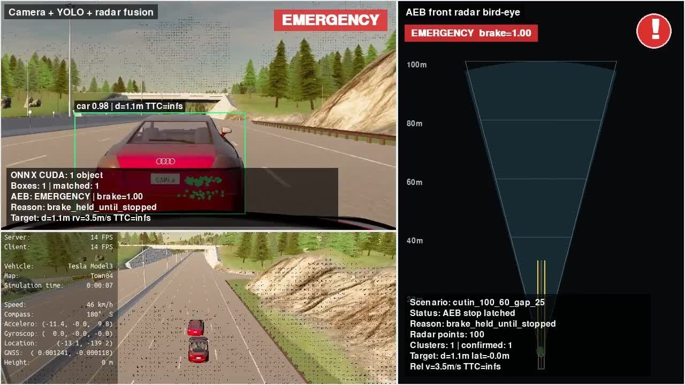

**Hình 4.13: Ảnh đại diện video minh họa cuối cùng.**

**Bảng 4.10: Danh sách video minh họa dự kiến đưa vào phụ lục.**

| Kịch bản | Ý nghĩa | Nơi lưu |
|---|---|---|
| `clear_road_50` | Đường trống 50 km/h, không phanh nhầm | Thư mục Drive chung ở Phụ lục A |
| `ccrs_80_gap_30` | Xe đứng yên phía trước, phanh thành công | Thư mục Drive chung ở Phụ lục A |
| `ccrb_95_gap_20` | Xe trước phanh gấp, trường hợp giới hạn/va chạm | Thư mục Drive chung ở Phụ lục A |
| `cutin_80_50_gap_25` | Xe cắt làn, hệ thống xử lý thành công | Thư mục Drive chung ở Phụ lục A |
| `cutin_100_60_gap_25` | Xe cắt làn, trường hợp giới hạn/va chạm | Thư mục Drive chung ở Phụ lục A |

## 4.8. Nhận Xét Về Độ Tin Cậy Kết Quả

Kết quả đánh giá định lượng dựa trên nhật ký mô phỏng, gồm trạng thái va chạm,
khoảng cách nhỏ nhất, TTC, vận tốc tại thời điểm phanh, lệnh phanh và trạng thái
AEB. Video chỉ dùng để minh họa trực quan. Khi phần hiển thị Pygame chỉ đạt
17-18 FPS, phần mô phỏng vẫn chạy theo tick 20 Hz nếu synchronous mode được bật.

CARLA server đôi khi không ổn định khi chạy nhiều kịch bản liên tục. Để giảm
ảnh hưởng này, dự án bổ sung reload/restart world/server giữa các lần chạy và
ưu tiên đọc nhật ký dữ liệu sau từng kịch bản. Đây là hạn chế thực nghiệm cần
ghi rõ khi báo cáo.

Một số yếu tố có thể ảnh hưởng tới độ tin cậy gồm: sai khác giữa radar CARLA và
radar thật, chất lượng mô hình động học của xe trong simulator, độ ổn định FPS
hiển thị, nhiễu đồ họa của camera và sai khác giữa kịch bản mô phỏng với đường
thật. Để giảm các yếu tố này, dự án sử dụng synchronous mode cho kiểm thử, log
chi tiết từng tick, biểu đồ phanh, video minh họa và lặp lại nhiều nhóm kịch bản.
Tuy nhiên, kết quả vẫn cần được diễn giải là kết quả mô phỏng, chưa phải kết quả
kiểm định trên xe thật.

# Chương 5. Kết Luận Và Hướng Phát Triển

## 5.1. Kết Quả Đạt Được

Đồ án đã xây dựng được một hệ thống phanh khẩn cấp tự động AEB trong môi trường
mô phỏng CARLA theo hướng tương đối hoàn chỉnh, từ thiết lập cảm biến, xử lý dữ
liệu, hợp nhất camera-radar, điều khiển phanh đến kiểm thử và ghi nhận kết quả.
Các kết quả chính gồm:

- thiết lập môi trường CARLA 0.9.11 với ego Tesla Model 3, camera RGB phía sau
  kính lái, radar phía trước xe và các kịch bản cao tốc trên Town04;
- xây dựng quy trình xử lý radar từ điểm đo rời rạc sang mức đối tượng, gồm lọc
  nhiễu, lọc theo hành lang quỹ đạo, gom cụm, theo dõi qua nhiều khung hình và
  chọn mục tiêu nguy hiểm;
- thu dữ liệu từ CARLA, xây dựng bộ dữ liệu v7 same-lane và fine-tune YOLO26n
  cho bài toán phát hiện một lớp `car`;
- xây dựng hợp nhất dữ liệu camera-radar bằng phép chiếu hình học, ghép điểm
  radar/object radar với bounding box YOLO để tăng độ tin cậy mục tiêu;
- xây dựng logic đánh giá nguy hiểm dựa trên TTC, khoảng cách dừng, trạng thái
  mục tiêu và hành lang di chuyển dự kiến của xe ego;
- triển khai nhiều phiên bản điều khiển phanh để so sánh: phanh nhị phân, PID
  v1, PID v2 và staged PID;
- xây dựng giao diện minh họa 3 màn, launcher, hệ thống log chi tiết, biểu đồ
  phanh PID và video minh họa phục vụ kiểm chứng và báo cáo.

Kết quả kiểm thử cuối cùng không chỉ được nhìn theo một con số tổng, mà được
tách thành hai lớp: dải thiết kế mong muốn và nhóm stress test tìm giới hạn.
Cách tách này phù hợp hơn với tư duy đánh giá một hệ thống kỹ thuật thực tế: hệ
thống cần có vùng hoạt động tốt, đồng thời phải chỉ ra vùng bắt đầu mất hiệu quả.

**Bảng 5.1: Tổng hợp kết quả kiểm thử cuối cùng của hệ thống staged PID.**

| Nhóm kiểm thử | Mục đích | Kết quả | Nhận xét |
|---|---:|---:|---|
| Dải thiết kế | Đánh giá vùng hoạt động mong muốn của đồ án | 38/38 PASS | Hệ thống hoạt động ổn định trong các tình huống cao tốc, only-car, thời tiết lý tưởng, vận tốc chủ yếu 50-80 km/h. |
| Stress test/tìm giới hạn | Mở rộng tốc độ, khoảng cách và tình huống khó hơn | 25/28 PASS | Ba trường hợp không đạt dùng để xác định giới hạn hiện tại của hệ thống. |
| Tổng toàn bộ | Đánh giá chung trên 66 kịch bản | 63/66 PASS | Tỷ lệ đạt 95,45%, nhưng kết luận chính vẫn dựa trên dải thiết kế và phân tích giới hạn. |

Ba trường hợp không đạt trong stress test gồm các tình huống tốc độ cao, khoảng
cách ban đầu nhỏ hoặc xe cắt làn khó. Đây không nên xem là lỗi cần che giấu, mà
là bằng chứng giúp xác định biên hoạt động của hệ thống AEB trong phạm vi mô
phỏng.

## 5.2. Nhận Xét Về Phạm Vi Hoạt Động

Trong phạm vi đã đặt ra, hệ thống đạt được mục tiêu của đồ án: phát hiện nguy cơ
va chạm, chọn đúng mục tiêu chính, kích hoạt cảnh báo/phanh nhiều tầng và sinh
dữ liệu đánh giá có thể kiểm tra lại. Phạm vi hoạt động tốt nhất hiện tại có thể
tóm tắt như sau:

- môi trường cao tốc trong CARLA Town04;
- đối tượng tham gia là ô tô, chưa xét người đi bộ, xe máy hoặc xe đạp;
- thời tiết và ánh sáng lý tưởng;
- vận tốc ego chủ yếu trong khoảng 50-80 km/h;
- radar có tầm đo khoảng 100 m, camera dùng YOLO26n fine-tune trên dữ liệu cùng
  miền mô phỏng;
- bộ điều khiển phanh cuối cùng là staged PID, có các trạng thái SAFE, WARNING,
  SOFT_BRAKE, HARD_BRAKE, EMERGENCY và HOLD_STOP/nhả phanh tùy chế độ chạy.

Ở ngoài dải trên, hệ thống vẫn có thể hoạt động trong nhiều trường hợp, nhưng
không nên khẳng định là đạt tuyệt đối. Các bài stress test cho thấy khi vận tốc
tăng cao, gap nhỏ hoặc xe mục tiêu xuất hiện muộn do cắt làn, thời gian còn lại
để nhận biết và phanh giảm mạnh. Đây là giới hạn hợp lý của một cấu hình cảm
biến và thuật toán còn ở mức mô phỏng đồ án môn học.

## 5.3. Hạn Chế

Các hạn chế chính của đồ án được tổng hợp trong Bảng 5.2.

**Bảng 5.2: Hạn chế hiện tại và hướng xử lý dự kiến.**

| Hạn chế | Ảnh hưởng | Hướng xử lý |
|---|---|---|
| CARLA radar trả về điểm đo đã mô phỏng sẵn, không mô phỏng đầy đủ chuỗi tín hiệu FMCW thô | Thuật toán chưa đánh giá được các bước xử lý tín hiệu radar thấp như beat signal, FFT, Doppler map | Khi mở rộng nghiên cứu, bổ sung mô phỏng radar signal-level hoặc dùng dataset radar thực tế. |
| Bài toán mới xét car-to-car trên cao tốc | Chưa bao phủ người đi bộ, xe máy, xe đạp, đô thị phức tạp | Mở rộng ODD và thêm lớp đối tượng trong dataset/model. |
| Dataset YOLO chủ yếu ở Town04 và điều kiện lý tưởng | Model có thể giảm chất lượng khi đổi map, ánh sáng hoặc thời tiết | Thu thêm dữ liệu đa map, đa thời tiết, ban đêm/mưa/sương. |
| Fusion đang dùng chiếu hình học và điều kiện ghép ngưỡng | Chưa phải bộ theo dõi đa mục tiêu xác suất như hệ thống thương mại | Bổ sung Kalman filter, xác suất liên kết dữ liệu, quản lý track mất/hiện lại. |
| Controller phanh chưa mô hình hóa đầy đủ actuator delay, ABS, tire model và mặt đường | Giá trị jerk/gia tốc trong CARLA chỉ nên dùng để so sánh tương đối | Thêm mô hình trễ phanh, giới hạn jerk và điều kiện bám đường khi nghiên cứu sâu hơn. |
| Một số lỗi kỹ thuật của môi trường mô phỏng như artifact camera, FPS hiển thị hoặc CARLA server không ổn định khi chạy nhiều scenario liên tiếp | Có thể ảnh hưởng video minh họa hoặc thời gian chạy batch dài | Chạy synchronous mode, reset world giữa scenario, ghi log phần mô phỏng 20 Hz và tách riêng FPS hiển thị. |

Một điểm cần nhấn mạnh là jerk trong đồ án không được xem như giá trị đại diện
tuyệt đối cho độ êm của xe thật. CARLA cho phép lấy vận tốc/gia tốc và tính jerk
từ sai phân theo thời gian, nhưng mô hình lốp, mặt đường, ABS và cơ cấu phanh
không đầy đủ như xe thực. Vì vậy, jerk phù hợp để so sánh tương đối giữa các
phiên bản phanh trong cùng môi trường mô phỏng hơn là để kết luận trực tiếp về
độ êm tuyệt đối ngoài đời.

## 5.4. Hướng Phát Triển

Từ kết quả hiện tại, các hướng phát triển tiếp theo gồm:

- mở rộng bộ kịch bản theo cấu trúc gần Euro NCAP/ISO hơn, có lặp lại nhiều lần
  cho cùng một scenario để đánh giá độ ổn định thống kê;
- mở rộng dataset và fine-tune model trên nhiều map, thời tiết, thời điểm trong
  ngày và nhiều loại xe hơn;
- nâng cấp fusion từ ghép ngưỡng hình học sang theo dõi đa mục tiêu có độ tin
  cậy, ví dụ Kalman filter hoặc bộ lọc xác suất tương đương;
- bổ sung mô hình trễ hệ thống phanh, giới hạn jerk và điều kiện mặt đường để
  điều khiển staged PID sát thực tế hơn;
- thêm chế độ đánh giá tự động sinh báo cáo: bảng pass/fail, biểu đồ phanh,
  ảnh đại diện, video và nhận xét ngắn cho từng scenario;
- mở rộng bài toán từ car-to-car sang pedestrian/cyclist nếu phạm vi đồ án tiếp
  theo yêu cầu đánh giá AEB trong đô thị;
- kiểm tra khả năng triển khai model YOLO ONNX/TensorRT và tối ưu tốc độ xử lý
  nếu muốn đưa pipeline gần bài toán thời gian thực hơn.

## 5.5. Kết Luận Chung

Với phạm vi cao tốc, only-car và thời tiết lý tưởng, hệ thống AEB mô phỏng đã
đạt mục tiêu chính của đồ án. Pipeline cuối cùng có đầy đủ các khối quan trọng:
cảm biến camera-radar, xử lý radar object-level, YOLO26n, hợp nhất dữ liệu, dự
đoán quỹ đạo, tính TTC/khoảng cách dừng và phanh staged PID. Kết quả kiểm thử
cho thấy hệ thống đạt toàn bộ dải thiết kế mong muốn và xác định được một số
giới hạn khi tăng độ khó của kịch bản.

So với phanh nhị phân, staged PID là hướng phù hợp hơn vì nó gần logic AEB thực
tế: có cảnh báo, có nhiều tầng can thiệp, lực phanh thay đổi theo mức nguy hiểm
và có thể nhả phanh khi nguy cơ không còn trong chế độ chạy thực tế. Các trường
hợp fail trong stress test được giữ lại như một phần của kết quả kỹ thuật, giúp
báo cáo không chỉ trình bày hệ thống "chạy được", mà còn chỉ ra hệ thống chạy tốt
trong điều kiện nào và bắt đầu giới hạn ở đâu.

# Tài Liệu Tham Khảo

1. CARLA Simulator, trang chính thức: https://carla.org/
2. CARLA documentation: https://carla.readthedocs.io/
3. CARLA 0.9.11 release: https://github.com/carla-simulator/carla/releases/tag/0.9.11
4. CARLA sensors reference: https://carla.readthedocs.io/en/0.9.11/ref_sensors/
5. Dosovitskiy et al., CARLA: An Open Urban Driving Simulator: https://arxiv.org/abs/1711.03938
6. Autoware Universe documentation: https://autowarefoundation.github.io/autoware.universe/
7. openpilot GitHub repository: https://github.com/commaai/openpilot
8. ApolloAuto GitHub repository: https://github.com/ApolloAuto/apollo
9. Ultralytics YOLO documentation: https://docs.ultralytics.com/
10. Euro NCAP protocols: https://www.euroncap.com/safety-assist/
11. Euro NCAP AEB Car-to-Car Test Protocol v4.2.
12. NHTSA Automatic Emergency Braking final rule: https://www.nhtsa.gov/press-releases/nhtsa-fmvss-127-automatic-emergency-braking-reduce-crashes
13. ISO 15623, Transport information and control systems - Forward vehicle collision warning systems.
14. GitHub repository của đồ án: https://github.com/mvhoang92/aeb
15. Toyota Safety Sense: https://www.toyota.com/safety-sense/
16. Honda Sensing - Collision Mitigation Braking System: https://automobiles.honda.com/sensing
17. Subaru EyeSight Driver Assist Technology: https://www.subaru.com/eyesight.html
18. Mobileye ADAS: https://www.mobileye.com/solutions/adas/
19. ZF Smart Camera 4.8: https://www.zf.com/products/en/cars/products_64256.html
20. Bosch Mobility radar sensor: https://www.bosch-mobility.com/en/solutions/sensors/radar-sensor/
21. Continental long-range radar information: https://www.continental-automotive.com/en/components/radars/long-range-radars/
22. CARLA releases page: https://github.com/carla-simulator/carla/releases
23. CARLA download page: https://carla.org/download/

# Phụ Lục A. Liên Kết Mã Nguồn Và Kết Quả Minh Họa

Phụ lục này gom các liên kết bên ngoài dùng khi chuyển báo cáo sang bản `.docx`
cuối cùng. Các video, log chi tiết và biểu đồ dung lượng lớn không nên đưa trực
tiếp vào repository, mà được lưu trong một thư mục Google Drive chung.

| Nội dung | Liên kết/Ghi chú |
|---|---|
| Mã nguồn đồ án | https://github.com/mvhoang92/aeb |
| Video, log và biểu đồ đánh giá | https://drive.google.com/drive/folders/12cPKJKFeiSwI8vx67RviL3VIx_lmOstq?usp=drive_link |
| File báo cáo `.docx` sau khi chuyển từ Markdown | Cập nhật đường dẫn trong bản nộp cuối |

# Phụ Lục B. Các Thư Mục Minh Chứng Chính Trong Dự Án

Các thư mục dưới đây là nơi lưu dữ liệu minh chứng đã dùng để viết Chương 4.
Khi kiểm tra lại kết quả, nên ưu tiên các thư mục cuối cùng thay vì các log thử
nghiệm trung gian.

| Thành phần | Đường dẫn trong dự án | Nội dung |
|---|---|---|
| Log đánh giá staged PID cuối cùng | `logs/final_evidence_staged_pid_20260628/` | File CSV từng scenario, `summary.csv`, `aggregate_summary.json`, heatmap và biểu đồ phanh. |
| Biểu đồ phanh PID | `logs/final_evidence_staged_pid_20260628/plots/` | Biểu đồ lực phanh, vận tốc, khoảng cách, TTC và dải màu trạng thái AEB. |
| Log so sánh PID/staged PID trước đó | `logs/staged_pid_validation_full_20260627_02/` | Dữ liệu trung gian dùng để so sánh quá trình tune phanh. |
| Video minh họa cuối cùng | `outputs/scenario_videos/final_evidence_videos_20260628_internal/` | Video màn hình 3 vùng và ảnh đại diện một số scenario tiêu biểu. |
| Ảnh và sơ đồ dùng trong báo cáo | `report/assets/` | Hình minh họa AEB, CARLA, radar, fusion, quỹ đạo dự đoán. |
| Bộ dữ liệu v7 same-lane cho YOLO | `dataset_v7_same_lane/` | Ảnh, nhãn và file `dataset.yaml` dùng fine-tune YOLO26n. |
| Kết quả huấn luyện YOLO | `training_runs/detect/yolo26n_aeb_20260619_011359/` | Trọng số, biểu đồ huấn luyện và kết quả đánh giá mô hình. |

# Phụ Lục C. Lệnh Chạy Chính

## C.1. Chạy CARLA server

```bash
cd /home/mvhoang/CARLA_0.9.11
__NV_PRIME_RENDER_OFFLOAD=1 __GLX_VENDOR_LIBRARY_NAME=nvidia ./CarlaUE4.sh -quality-level=Low
```

Lệnh trên dùng GPU NVIDIA offload và quality Low. Trong quá trình thử nghiệm,
cờ `-opengl` đã được bỏ vì có thể làm cửa sổ Pygame/manual control hiển thị
không ổn định trên máy dùng Ubuntu.

## C.2. Chạy giao diện khởi chạy

```bash
cd /home/mvhoang/CARLA_0.9.11/aeb
python3 laucher.py
```

Launcher dùng để chọn nhóm kịch bản, scenario cụ thể, chế độ điều khiển, loại
phanh và mở nhanh giao diện minh họa hoặc chạy test.

## C.3. Chạy minh họa cuối cùng bằng dòng lệnh

```bash
cd /home/mvhoang/CARLA_0.9.11/aeb
../venv/bin/python ui/aeb_demo_view.py \
  --res 1600x900 \
  --map-name Town04 \
  --scenario-config configs/scenarios/suites/system_limit_extended_sweep.yaml \
  --scenario cutin_80_50_gap_25 \
  --control-mode physics \
  --scenario-warmup-s 2
```

Giao diện minh họa cuối cùng gồm ba vùng: camera + YOLO/fusion, góc nhìn manual
control và bird-eye radar. Giao diện này dùng để quan sát trực quan trạng thái
AEB, target được chọn, lực phanh và các điểm radar trong thời gian chạy.

## C.4. Kiểm tra dataset YOLO

```bash
cd /home/mvhoang/CARLA_0.9.11/aeb
.venv_yolo310/bin/python scripts/check_yolo_dataset.py
```

## C.5. Fine-tune YOLO26n

```bash
cd /home/mvhoang/CARLA_0.9.11/aeb
.venv_yolo310/bin/python scripts/train_yolo26n.py
```

## C.6. Export YOLO26n sang ONNX

```bash
cd /home/mvhoang/CARLA_0.9.11/aeb
.venv_yolo310/bin/python scripts/export_yolo26n_onnx.py
```

## C.7. Tạo lại biểu đồ phanh PID

```bash
cd /home/mvhoang/CARLA_0.9.11/aeb
python3 scripts/plot_brake_profile.py \
  --run-dir logs/final_evidence_staged_pid_20260628 \
  --output-dir logs/final_evidence_staged_pid_20260628/plots
```

## C.8. Build lại báo cáo Markdown tổng

```bash
cd /home/mvhoang/CARLA_0.9.11/aeb/report
python3 build_report.py
```

Lệnh này ghép các file trong `report/chapters/` thành `report/report.md`.

# Phụ Lục D. Các File Cấu Hình Và Mã Nguồn Quan Trọng

| File/Thư mục | Vai trò |
|---|---|
| `configs/sensors.yaml` | Cấu hình vị trí, độ phân giải, FOV và tần số của camera/radar. |
| `configs/model_training.yaml` | Cấu hình fine-tune và export YOLO26n. |
| `configs/dataset_collection_v7_same_lane.yaml` | Cấu hình thu bộ dữ liệu v7 same-lane cho YOLO26n. |
| `configs/scenarios/car_to_car/` | Các nhóm kịch bản theo tình huống: clear road, CCRs, CCRm, CCRb, cut-in, cut-out, curve, multi-actor. |
| `configs/scenarios/suites/system_limit_extended_sweep.yaml` | Bộ kịch bản stress test dùng tìm giới hạn hệ thống. |
| `control/brake.py` | Các thuật toán phanh: binary, PID v1/v2 và staged PID. |
| `core/radar_aeb_pipeline.py` | Pipeline AEB từ radar/object/fusion tới trạng thái phanh. |
| `perception/radar/` | Các module xử lý radar, gom cụm, theo dõi và chọn mục tiêu. |
| `perception/fusion/` | Hợp nhất camera-radar và tạo mục tiêu hợp nhất. |
| `ui/aeb_demo_view.py` | Giao diện minh họa cuối cùng 3 màn. |
| `scripts/run_fusion_aeb_scenarios.py` | Chạy batch scenario cho AEB/fusion và sinh log. |
| `scripts/record_scenario_videos.py` | Quay video minh họa scenario. |
| `scripts/plot_brake_profile.py` | Sinh biểu đồ phanh, vận tốc, khoảng cách, TTC và dải trạng thái AEB. |

# Phụ Lục E. Ghi Chú Khi Chuyển Sang DOCX

- Các dòng bắt đầu bằng `Hình x.y:` nên được chuyển thành Caption hình trong
  Word để tạo danh mục hình tự động.
- Các dòng bắt đầu bằng `Bảng x.y:` nên được chuyển thành Caption bảng.
- Link Google Drive ở Phụ lục A chứa chung video, log chi tiết và biểu đồ đánh
  giá. Khi chuyển sang Word, có thể giữ một link chung này để tránh bảng phụ lục
  quá dài.
- Các thư mục dataset, training run và video có dung lượng lớn không nên nhúng
  trực tiếp vào repository nếu không cần thiết; chỉ cần giữ mã nguồn, cấu hình,
  log tóm tắt và link minh chứng.
